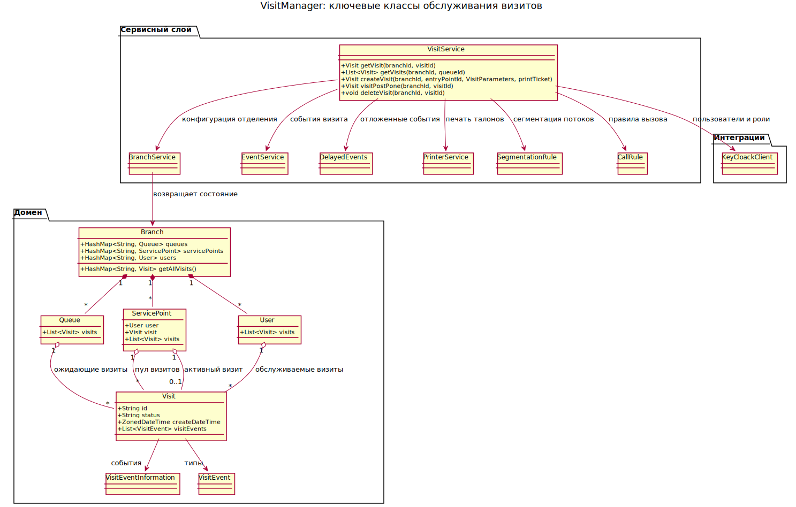
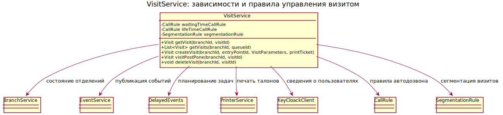
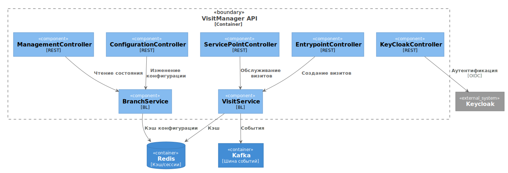
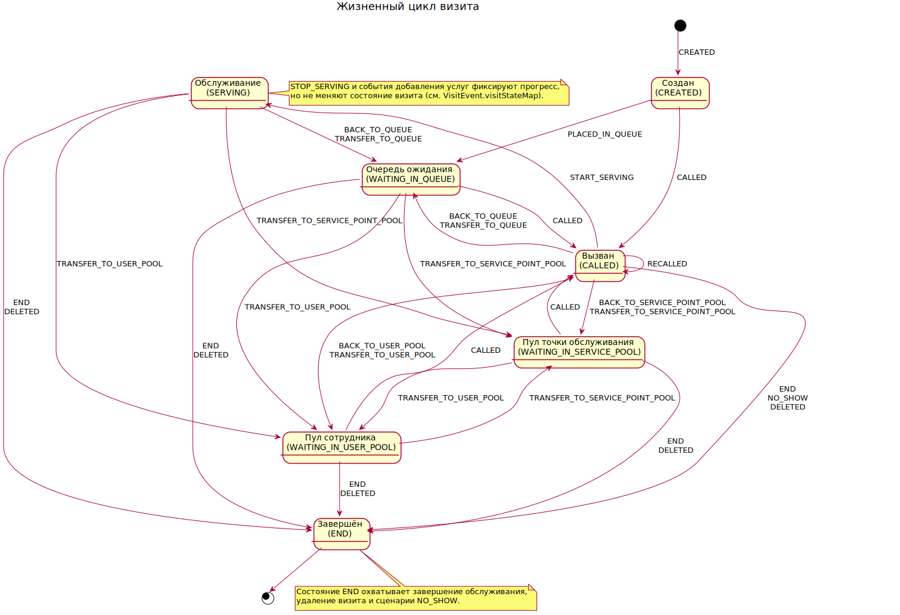
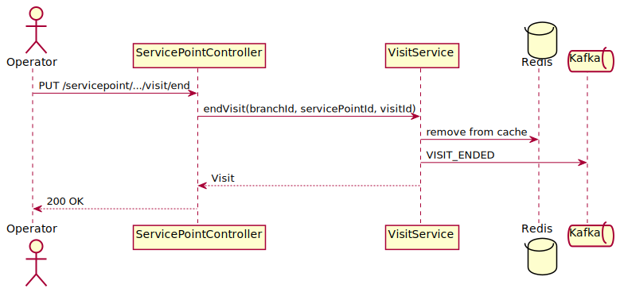
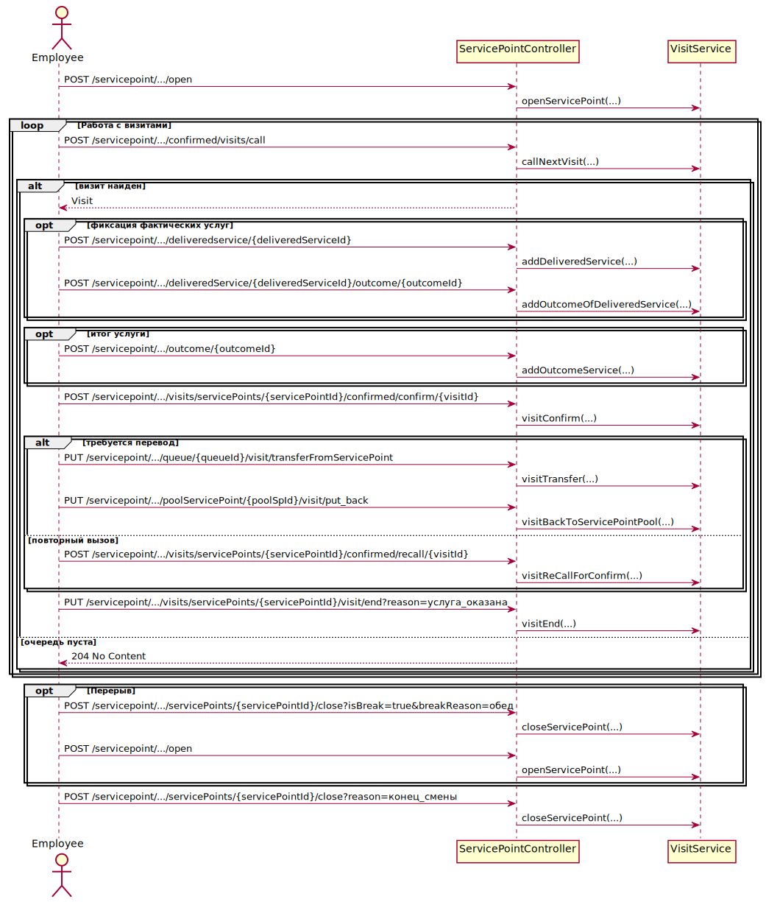

Служба управления визитами и клиентопотоком, построенная на Micronaut 4.7.6 и Java 17. Сервис управляет очередями, точками обслуживания, сотрудниками и визитами клиентов в отделениях.


[](#-тестирование)
[](docs/use-cases.md)
[](#-тестирование)

[](#-лицензия)
[](#-contributing)

## 📑 Содержание
- [🧾 Обзор](#-обзор)
- [⚙️ Настройка окружения](#-настройка-окружения)
  - [🧰 Требования](#-требования)
  - [🚀 Сборка и запуск](#-сборка-и-запуск)
  - [🧪 Micronaut профиль `local-no-docker`](#-micronaut-профиль-local-no-docker)
  - [🌐 Работа за прокси](#-работа-за-прокси)
  - [🗑️ Временные файлы](#-временные-файлы)
- [🏗️ Архитектура](#-архитектура)
- [🔄 Логика работы](#-логика-работы)
- [🗂️ Структура проекта](#-структура-проекта)
- [👥 Инструкции по ролям](#-инструкции-по-ролям)
  - [🛠️ DevOps](#-devops)
  - [🏛️ Архитектор](#-архитектор)
  - [📊 Аналитик](#-аналитик)
  - [🧪 Тестировщик](#-тестировщик)
  - [💻 Front End разработчик](#-front-end-разработчик)
  - [🧰 Back End разработчик](#-back-end-разработчик)
  - [🔗 Интегратор](#-интегратор)
- [📡 REST API](#-rest-api)
  - [📬 Варианты ответа сервера](#-варианты-ответа-сервера)
  - [🧭 ManagementController](#-managementcontroller)
  - [🎫 EntrypointController](#-entrypointcontroller)
  - [🏢 ServicePointController](#-servicepointcontroller)
  - [📌 Дополнительные примеры](#-дополнительные-примеры)
- [🏧 Работа терминала клиента](#-работа-терминала-клиента)
  - [🎯 Назначение и доступ терминала](#-назначение-и-доступ-терминала)
  - [🏁 Подготовка и запуск терминала](#-подготовка-и-запуск-терминала)
  - [⚙️ Основные операции терминала](#-основные-операции-терминала)
  - [➕ Дополнительные возможности терминала](#-дополнительные-возможности-терминала)
  - [🔚 Завершение работы терминала](#-завершение-работы-терминала)
  - [📋 Типовые сценарии терминала](#-типовые-сценарии-терминала)
- [🕹️ Работа пульта оператора](#-работа-пульта-оператора)
  - [🎯 Назначение и доступ пульта](#-назначение-и-доступ-пульта)
  - [🏁 Подготовка и запуск пульта](#-подготовка-и-запуск-пульта)
  - [⚙️ Основные операции пульта](#-основные-операции-пульта)
  - [➕ Дополнительные возможности пульта](#-дополнительные-возможности-пульта)
  - [🔚 Завершение работы пульта](#-завершение-работы-пульта)
  - [📋 Типовые сценарии пульта](#-типовые-сценарии-пульта)
- [🖥️ Работа приемной (ресепшен)](#-работа-приемной-ресепшен)
  - [🎯 Назначение и доступ ресепшена](#-назначение-и-доступ-ресепшена)
  - [🏁 Подготовка и запуск ресепшена](#-подготовка-и-запуск-ресепшена)
  - [⚙️ Основные операции ресепшена](#-основные-операции-ресепшена)
  - [➕ Дополнительные возможности ресепшена](#-дополнительные-возможности-ресепшена)
  - [🔚 Завершение работы ресепшена](#-завершение-работы-ресепшена)
  - [📋 Типовые сценарии ресепшена](#-типовые-сценарии-ресепшена)
- [📦 Примеры кода](#-примеры-кода)
  - [🧩 Использование сервиса](#-использование-сервиса)
  - [🌐 REST‑клиент Micronaut](#-rest-клиент-micronaut)
  - [🔌 Работа с `HttpClient`](#-работа-с-httpclient)
- [📊 Диаграммы](#-диаграммы)
  - [🧱 Класс VisitService и доменная модель](#-класс-visitservice-и-доменная-модель)
  - [🧩 Фрагмент: сервисный слой](#-фрагмент-сервисный-слой)
  - [🏢 Фрагмент: доменная модель отделения](#-фрагмент-доменная-модель-отделения)
- [🧑‍💼 Сценарии работы сотрудника](#-сценарии-работы-сотрудника)
  - [🟢 Открытие рабочего места](#-открытие-рабочего-места)
  - [🔔 Вызов визита](#-вызов-визита)
  - [🛎️ Начало обслуживания визита](#-начало-обслуживания-визита)
  - [🔁 Перевод и возвращение визита](#-перевод-и-возвращение-визита)
  - [🔂 Повторный вызов визита](#-повторный-вызов-визита)
  - [✅ Завершение визита](#-завершение-визита)
  - [🚪 Закрытие рабочего места](#-закрытие-рабочего-места)
- [🤖 Документация для автотестеров](#-документация-для-автотестеров)
  - [🗂️ Файлы настроек](#-файлы-настроек)
  - [👥 Кейсы клиентов](#-кейсы-клиентов)
  - [🧑‍💼 Кейсы операторов](#-кейсы-операторов)
  - [🔐 Кейсы аутентификации](#-кейсы-аутентификации)
- [🧪 Тестирование](#-тестирование)
  - [🧬 Модульные тесты](#-модульные-тесты)
  - [🔗 Интеграционные тесты](#-интеграционные-тесты)
- [🆘 Траблшутинг](#-траблшутинг)
  - [🧩 Kafka: `java.net.ConnectException` (connection refused)](#-kafka-javanetconnectexception-connection-refused)
  - [🪫 Redis: `NOAUTH Authentication required`](#-redis-noauth-authentication-required)
  - [🛡️ Keycloak: `invalid_grant`](#-keycloak-invalid_grant)
  - [🔐 Maven: `PKIX path building failed`](#-maven-pkix-path-building-failed)
- [🌐 Переменные окружения](#-переменные-окружения)
- [🔗 Полезные ссылки](#-полезные-ссылки)
- [🤝 Contributing](#-contributing)
- [📄 Лицензия](#-лицензия)


## 🧾 Обзор
VisitManager предоставляет REST‑интерфейсы для создания визитов, управления очередями и обслуживания клиентов. Сервис обрабатывает события асинхронно через Kafka, кеширует конфигурацию в Redis и интегрируется с Keycloak как внешним источником пользовательских данных, сохраняя авторизационные проверки внутри Micronaut Security.【F:src/main/java/ru/aritmos/keycloack/service/KeyCloackClient.java†L101-L399】【F:src/main/java/ru/aritmos/keycloack/customsecurity/CustomSecurityRule.java†L16-L40】 Поддерживает горизонтальное масштабирование и расширяемую модель домена.

## ⚙️ Настройка окружения

### 🧰 Требования
- JDK 17
- Maven 3 (локально установленный `mvn`, поддерживающий сохранение настроек и работу через прокси)
- Подключение к Maven Central или зеркалу
- Docker 20+ и Docker Compose для локального стенда

### 🚀 Сборка и запуск
```bash
# полная сборка
JAVA_TOOL_OPTIONS='-Djava.net.preferIPv4Stack=true' mvn -s .mvn/settings.xml clean verify
# запуск приложения
java -jar target/visitmanager.jar
# запуск в Docker
docker compose -f docker-compose.local.yml up -d --build
```

### 🧪 Micronaut профиль `local-no-docker`
Используется для локальной разработки без Docker и внешних сервисов. Подменяет интеграции заглушками.
```bash
MICRONAUT_ENVIRONMENTS=local-no-docker \
JAVA_TOOL_OPTIONS='-Djava.net.preferIPv4Stack=true' mvn -s .mvn/settings.xml mn:run
```


### 🌐 Работа за прокси
Проект уже содержит файл `.mvn/settings.xml` с настройками прокси, поэтому достаточно запускать Maven с опцией `-s .mvn/settings.xml`.
Если нужно переопределить настройки, добавьте в `~/.m2/settings.xml`:
```xml
<settings xmlns="http://maven.apache.org/SETTINGS/1.0.0"
          xmlns:xsi="http://www.w3.org/2001/XMLSchema-instance"
          xsi:schemaLocation="http://maven.apache.org/SETTINGS/1.0.0 https://maven.apache.org/xsd/settings-1.0.0.xsd">
  <proxies>
    <proxy>
      <id>http</id>
      <active>true</active>
      <protocol>http</protocol>
      <host>proxy</host>
      <port>8080</port>
      <nonProxyHosts>localhost|127.0.0.1</nonProxyHosts>
    </proxy>
    <proxy>
      <id>https</id>
      <active>true</active>
      <protocol>https</protocol>
      <host>proxy</host>
      <port>8080</port>
      <nonProxyHosts>localhost|127.0.0.1</nonProxyHosts>
    </proxy>
  </proxies>
</settings>
```

### 🗑️ Временные файлы
JVM может создавать файлы `hs_err_pid*.log` и другие временные дампы при аварийных остановках.
Они исключены через `.gitignore` и не должны попадать в репозиторий.

## 🏗️ Архитектура
Сервис построен по слоистой архитектуре:

- **API** (`ru.aritmos.api`) — REST‑контроллеры.
- **Сервисный слой** (`ru.aritmos.service`) — бизнес‑логика.
- **Модели** (`ru.aritmos.model`) — доменные объекты.
- **Интеграции** (`ru.aritmos.clients`, `ru.aritmos.keycloack`, `ru.aritmos.events`) — взаимодействие с внешними сервисами.

Внешние компоненты: Keycloak, Redis, Kafka, PrinterService, DataBus. Keycloak подключён как административный источник сведений о филиалах, ролях и пользовательских сессиях, которые забирает `KeyCloackClient`, тогда как решения о доступе принимаются внутри сервиса VisitManager без делегирования Keycloak конечной авторизации.【F:src/main/java/ru/aritmos/keycloack/service/KeyCloackClient.java†L101-L399】【F:src/main/java/ru/aritmos/keycloack/customsecurity/CustomSecurityRule.java†L16-L40】

Запросы проходят через контроллеры, затем бизнес‑логика обращается к сервисам и события публикуются в Kafka. Кэширование конфигурации и визитов выполняется в Redis, что позволяет уменьшить нагрузку на базовые системы.


## 🔄 Логика работы
1. **Создание визита** — контроллер `EntrypointController` проверяет доступные услуги и создаёт визит через `VisitService`.
2. **Обслуживание** — `ServicePointController` управляет вызовом, подтверждением, переводом и завершением визитов, фиксируя результат в Redis.
3. **Конфигурация** — `ConfigurationController` обновляет настройки отделений и синхронизирует их между узлами через Kafka.
4. **Мониторинг** — `ManagementController` предоставляет сведения об отделениях, очередях и пользователях, формирует отчёты.
5. **События** — `EventService` публикует изменения визитов в Kafka, планирует отложенные события и отправляет нотификации внешним системам.

Подробный разбор сценариев приведён в файле [docs/use-cases.md](docs/use-cases.md).

## 🗂️ Структура проекта
Основные каталоги и их назначение:
```
src/
  main/java/ru/aritmos/
    api/           REST-контроллеры
    clients/       HTTP-клиенты конфигурации, печати и шины данных
    config/        профильные бины и заглушки (например, local-no-docker)
    docs/          генераторы документации и вспомогательные утилиты
    events/        модели, клиенты и сервисы событий
    exceptions/    бизнес- и системные исключения
    handlers/      регистрация обработчиков событий
    keycloack/     интеграция с Keycloak (клиенты, модели, безопасность)
    model/         доменные сущности (Branch, Service, Visit и т.д.)
    service/       бизнес-логика и правила вызова
  main/resources/  конфигурация Micronaut, схемы GraphQL, настройки логирования
  test/            модульные и интеграционные тесты
docs/              документация, диаграммы, curl-примеры
scripts/           демо-сценарии и утилиты для локального запуска
```

## 👥 Инструкции по ролям

### 🛠️ DevOps
- Используйте `docker-compose.yml` для запуска зависимостей (Redis, Kafka, Keycloak).
- Параметры среды задаются через переменные окружения и `.env.*` файлы.
- Для CI выполняйте `mvn -s .mvn/settings.xml clean verify` и публикуйте артефакт `visitmanager.jar`.
- Логи пишутся через Logback; для централизованного сбора можно использовать Loki (`loki.properties`).
- Мониторинг метрик и здоровья сервисов ведите через Prometheus/Grafana.

### 🏛️ Архитектор
- Архитектура модульна: контроллеры → сервисы → модели.
- Расширение функциональности выполняется через добавление сервисов и контроллеров.
- Правила вызова и сегментации реализованы как внедряемые стратегии (`ru.aritmos.service.rules`).
- При изменениях обновляйте диаграммы в [docs/diagrams](docs/diagrams) и следите за совместимостью API.

### 📊 Аналитик
- Доменные объекты находятся в `ru.aritmos.model`.
- Бизнес‑процессы: создание визита, обслуживание, перевод, завершение.
- Дополнительные артефакты: [REST-Examples.md](docs/REST-Examples.md), [ASCII-Overview.md](docs/ASCII-Overview.md).
- Документируйте новые сценарии и отчёты в [docs/use-cases.md](docs/use-cases.md).

### 🧪 Тестировщик
- Тесты: `JAVA_TOOL_OPTIONS='-Djava.net.preferIPv4Stack=true' mvn -s .mvn/settings.xml test`.
- Интеграционные тесты с внешними службами: `mvn -s .mvn/settings.xml -Pit-external verify`.
- Интеграционные тесты с тестовыми ресурсами: `mvn -s .mvn/settings.xml -Pit-resources verify`.
- Для ручной проверки используйте примеры curl из раздела [REST API](#-rest-api).
- При сложных сценариях применяйте Testcontainers или мок‑сервисы.

### 💻 Front End разработчик
- Swagger UI доступен по `/swagger-ui`.
- Используйте REST API для отображения очередей, создания и обслуживания визитов.
- Авторизация запросов выполняется внутри VisitManager (Micronaut Security и кастомные правила), фронтенд использует сервисные токены без прямой интеграции с Keycloak; его данные подтягиваются backend-ом для ролей и атрибутов пользователей.【F:src/main/java/ru/aritmos/keycloack/customsecurity/CustomSecurityRule.java†L16-L40】【F:src/main/java/ru/aritmos/keycloack/service/UserMapper.java†L49-L117】
- Моки и регрессионное тестирование можно выполнять в Postman или через WireMock.

### 🧰 Back End разработчик
- Код контроллеров в `ru.aritmos.api`.
- Бизнес‑логика — `ru.aritmos.service`.
- Перед добавлением функциональности пишите модульные тесты и обновляйте REST‑примеры.
- Используйте Lombok и реактивные клиенты Micronaut при необходимости.

### 🔗 Интегратор
- Внешние вызовы: `ConfigurationClient`, `PrinterClient`, клиент Keycloak (`ru.aritmos.keycloack.service.KeyCloackClient`), `DataBusClient`.
- Помните, что обращение к Keycloak используется для синхронизации данных пользователей и отделений; авторизация конечных запросов остаётся в VisitManager, поэтому интеграционные контракты не должны требовать передачи клиентам токенов Keycloak.【F:src/main/java/ru/aritmos/keycloack/service/KeyCloackClient.java†L101-L399】【F:src/main/java/ru/aritmos/keycloack/customsecurity/CustomSecurityRule.java†L16-L40】
- События публикуются в Kafka (топики конфигурируются в `application.yml`).
- Для stub‑режима используйте профиль `local-no-docker`, который подменяет клиенты заглушками.
- Перед выкладкой проверяйте интеграции в тестовом стенде и документируйте контракты.

## 📡 REST API
Обзор основных контроллеров и типичных вызовов.

### 📬 Варианты ответа сервера
Все контроллеры возвращают стандартные HTTP-коды:


- `200 OK` — успешный запрос.
- `204 No Content` — успешный запрос без содержимого.
- `207 Multi-Status` — режим автоматического вызова уже активен или отключён.
- `400 Bad Request` — некорректный запрос.
- `401 Unauthorized` — пользователь не авторизован.
- `403 Forbidden` — доступ запрещён.
- `404 Not Found` — ресурс не найден.
- `405 Method Not Allowed` — HTTP-метод не поддерживается для ресурса.
- `409 Conflict` — конфликт данных или состояния.
- `415 Unsupported Media Type` — неподдерживаемый тип данных.
- `500 Internal Server Error` — внутренняя ошибка сервера.


### 🧭 ManagementController
```bash
# список отделений
curl http://localhost:8080/managementinformation/branches
# короткий список
curl http://localhost:8080/managementinformation/branches/tiny
```

### 🎫 EntrypointController
```bash
# создание визита
curl -X POST \
  'http://localhost:8080/entrypoint/branches/{branchId}/entryPoints/{entryPointId}/visit' \
  -H 'Content-Type: application/json' \
  -d '["serviceId1","serviceId2"]'
```

### 🏢 ServicePointController
```bash
# открыть точку обслуживания
curl -X POST 'http://localhost:8080/servicepoint/branches/{branchId}/servicePoints/{spId}/workProfiles/{wpId}/users/{user}/open'

# вызов визита и подтверждение
VISIT_ID=$(curl -s -X POST 'http://localhost:8080/servicepoint/branches/{branchId}/servicePoints/{spId}/confirmed/visits/call' | jq -r '.id')
curl -X POST "http://localhost:8080/servicepoint/branches/{branchId}/visits/servicePoints/{spId}/confirmed/confirm/${VISIT_ID}"
```

### 📌 Дополнительные примеры
- добавление заметки: `POST /servicepoint/branches/{branchId}/visits/servicePoints/{spId}/notes`
- завершение визита: `PUT /servicepoint/branches/{branchId}/visits/servicePoints/{spId}/visit/end`
- перевод в очередь: `PUT /servicepoint/branches/{branchId}/visits/servicePoints/{spId}/queue/{queueId}/visit/transferFromQueue/{visitId}`

Полный список запросов см. в [docs/curl-examples.md](docs/curl-examples.md) и Swagger UI.

## 🏧 Работа терминала клиента

### 🎯 Назначение и доступ терминала
Терминал самообслуживания помогает клиенту выбрать услуги и оформить визит, а также показывает актуальную информацию по очередям. Все запросы выполняются от имени сервисного пользователя терминала; при отсутствии авторизации backend вернёт `401 Unauthorized` или `403 Forbidden`.

### 🏁 Подготовка и запуск терминала
- `GET /entrypoint/branches/{branchId}/services` — перечень услуг, доступных для оформления талона в отделении.
  - Контроллер: `EntrypointController#getAllAvailableServices` 【F:src/main/java/ru/aritmos/api/EntrypointController.java†L410-L433】
  - Ответы: `200 OK` — услуги найдены, `404 Not Found` — отделение отсутствует или недоступно, `500 Internal Server Error` — внутренняя ошибка сервера.

### ⚙️ Основные операции терминала
- **Создание талона без дополнительных параметров** — `POST /entrypoint/branches/{branchId}/entryPoints/{entryPointId}/visit`.
  - Контроллер: `EntrypointController#createVisit` 【F:src/main/java/ru/aritmos/api/EntrypointController.java†L123-L198】
  - Ответы: `200 OK` — визит создан, `400 Bad Request` — некорректные данные (например, пустой список услуг), `404 Not Found` — не найдены отделение, услуги, точка терминала или очередь, `500 Internal Server Error` — внутренняя ошибка сервера.
- **Создание талона с пользовательскими параметрами** — `POST /entrypoint/branches/{branchId}/entryPoints/{entryPointId}/visitWithParameters`.
  - Контроллер: `EntrypointController#createVisit` (перегрузка с параметрами) 【F:src/main/java/ru/aritmos/api/EntrypointController.java†L201-L285】
  - Ответы: `200 OK` — визит сформирован с указанными параметрами, `400 Bad Request` — нарушены требования к телу запроса, `404 Not Found` — отсутствуют отделение, услуги, точка терминала, очередь или правило сегментации, `500 Internal Server Error` — внутренняя ошибка сервера.

### ➕ Дополнительные возможности терминала
- `GET /servicepoint/branches/{branchId}/queues/{queueId}/visits/` — список визитов в очереди с сортировкой по времени ожидания.
  - Контроллер: `ServicePointController#getVisits` 【F:src/main/java/ru/aritmos/api/ServicePointController.java†L647-L676】
  - Ответы: `200 OK` — очередь получена, `404 Not Found` — отделение или очередь отсутствуют, `500 Internal Server Error` — внутренняя ошибка сервера.

### 🔚 Завершение работы терминала
Терминал не закрывает смену самостоятельно: сессия завершается при выходе пользователя или истечении токена, а повторная авторизация выполняется автоматически на уровне киоска.

### 📋 Типовые сценарии терминала
1. **Печать талона по выбранным услугам**
   1. `GET /entrypoint/branches/{branchId}/services` — загрузка перечня услуг отделения.【F:src/main/java/ru/aritmos/api/EntrypointController.java†L410-L433】
   2. `POST /entrypoint/branches/{branchId}/entryPoints/{entryPointId}/visit` — оформление визита и выдача талона клиенту.【F:src/main/java/ru/aritmos/api/EntrypointController.java†L123-L198】
2. **Оформление визита с параметрами и оценка времени ожидания**
   1. `POST /entrypoint/branches/{branchId}/entryPoints/{entryPointId}/visitWithParameters` — регистрация клиента с учётом анкетных данных.【F:src/main/java/ru/aritmos/api/EntrypointController.java†L201-L285】
   2. `GET /servicepoint/branches/{branchId}/queues/{queueId}/visits/` — отображение ожидающих визитов и времени ожидания на экране терминала.【F:src/main/java/ru/aritmos/api/ServicePointController.java†L647-L676】

## 🕹️ Работа пульта оператора

### 🎯 Назначение и доступ пульта
Пульт оператора объединяет данные о сотрудниках, очередях и визитах, обеспечивая полный цикл обслуживания клиента: от открытия рабочего места до завершения визита. Все операции требуют авторизации; при отсутствии токена система вернёт `401 Unauthorized` или `403 Forbidden`.

### 🏁 Подготовка и запуск пульта
- **Выбор отделения и рабочего места**
  - `GET /managementinformation/branches/tiny` — компактный список отделений (`200 OK`; `400 Bad Request`/`500 Internal Server Error` при ошибках).
  - `GET /managementinformation/branches/{id}` — подробная информация об отделении (`200 OK`; `404 Not Found`; `500 Internal Server Error`).
  - `GET /servicepoint/branches/{branchId}/servicePoints` — доступные точки обслуживания и их статус (`200 OK`; `404 Not Found`; `500 Internal Server Error`).
  - `GET /servicepoint/branches/{branchId}/servicePoints/detailed` — расширенные данные по точкам с учётом пулов и занятости (`200 OK`; `404 Not Found`; `500 Internal Server Error`).
  - `GET /servicepoint/branches/{branchId}/servicePoints/user/{userName}` — поиск точки для конкретного сотрудника (`200 OK`; `404 Not Found`; `500 Internal Server Error`).
  - `GET /servicepoint/servicePoints/user/{userName}` — глобальный поиск точки обслуживания по логину (`200 OK`; `404 Not Found`; `500 Internal Server Error`).
- **Настройка профиля и оборудования**
  - `GET /servicepoint/branches/{branchId}/workProfiles` — перечень рабочих профилей отделения (`200 OK`; `404 Not Found`; `500 Internal Server Error`).
  - `GET /servicepoint/branches/{branchId}/workProfile/{workProfileId}/services` — услуги профиля (`200 OK`; `404 Not Found`; `500 Internal Server Error`).
  - `GET /servicepoint/branches/{branchId}/users` — состав смены и статусы сотрудников (`200 OK`; `404 Not Found`; `500 Internal Server Error`).
  - `GET /servicepoint/branches/{branchId}/printers` — доступные принтеры для печати талонов (`200 OK`; `404 Not Found`; `500 Internal Server Error`).
  - `GET /entrypoint/branches/{branchId}/services` — клиентские услуги отделения (`200 OK`; `404 Not Found`; `500 Internal Server Error`).
  - `GET /entrypoint/branches/{branchId}/services/all` — полный каталог услуг отделения (`200 OK`; `404 Not Found`; `500 Internal Server Error`).
- **Открытие точки обслуживания**
  - `POST /servicepoint/branches/{branchId}/servicePoints/{servicePointId}/workProfiles/{workProfileId}/users/{userName}/open` — закрепление рабочего места за сотрудником (`200 OK`; `404 Not Found`; `409 Conflict`; `500 Internal Server Error`).

### ⚙️ Основные операции пульта
- **Мониторинг сотрудников и очередей**
  - `GET /servicepoint/branches/{branchId}/workingusers` — активные сотрудники смены (`200 OK`; `404 Not Found`; `500 Internal Server Error`).
  - `GET /servicepoint/branches/{branchId}/queues` — очереди отделения (`200 OK`; `404 Not Found`; `500 Internal Server Error`).
  - `GET /servicepoint/branches/{branchId}/queues/full` — агрегированное состояние очередей с талонами (`200 OK`; `404 Not Found`; `500 Internal Server Error`).
  - `GET /servicepoint/branches/{branchId}/queues/{queueId}/visits/` — талоны внутри очереди (`200 OK`; `404 Not Found`; `500 Internal Server Error`).
  - `GET /servicepoint/branches/{branchId}/servicePoints/{servicePointId}/queues` — очереди, доступные конкретной точке (`200 OK`; `403 Forbidden`; `404 Not Found`; `500 Internal Server Error`).
  - `GET /servicepoint/branches/{branchId}/servicePoints/{servicePointId}` — текущее состояние рабочей точки (`200 OK`; `404 Not Found`; `500 Internal Server Error`).
  - `GET /configuration/branches/{branchId}/break/reasons` — справочник причин перерыва (`200 OK`; `404 Not Found`; `500 Internal Server Error`).
- **Вызов и управление талонами**
  - `POST /servicepoint/branches/{branchId}/servicePoints/{servicePointId}/call` — вызов талона с максимальным ожиданием (`200 OK`; `204 No Content`; `207 Multi-Status`; `403 Forbidden`; `404 Not Found`; `500 Internal Server Error`).
  - `POST /servicepoint/branches/{branchId}/servicePoints/{servicePointId}/confirmed/visits/call` — вызов с подтверждением прихода (`200 OK`; `204 No Content`; `207 Multi-Status`; `403 Forbidden`; `404 Not Found`; `500 Internal Server Error`).
  - `POST /servicepoint/branches/{branchId}/servicePoints/{servicePointId}/confirmed/call/visit` — вызов конкретного визита с объектом `Visit` в теле (`200 OK`; `207 Multi-Status`; `403 Forbidden`; `404 Not Found`; `500 Internal Server Error`).
  - `POST /servicepoint/branches/{branchId}/visits/servicePoints/{servicePointId}/confirmed/call/{visitId}` — вызов по идентификатору с подтверждением (`200 OK`; `207 Multi-Status`; `403 Forbidden`; `404 Not Found`; `500 Internal Server Error`).
  - `POST /servicepoint/branches/{branchId}/visits/servicePoints/{servicePointId}/visits/{visitId}/call` — вызов талона без подтверждения (`200 OK`; `404 Not Found`; `409 Conflict`; `500 Internal Server Error`).
  - `POST /servicepoint/branches/{branchId}/visits/servicePoints/{servicePointId}/confirmed/confirm/{visitId}` — фиксация прихода клиента (`200 OK`; `404 Not Found`; `409 Conflict`; `500 Internal Server Error`).
  - `POST /servicepoint/branches/{branchId}/visits/servicePoints/{servicePointId}/confirmed/recall/{visitId}` — повторный вызов клиента (`200 OK`; `404 Not Found`; `409 Conflict`; `500 Internal Server Error`).
  - `POST /servicepoint/branches/{branchId}/visits/servicePoints/{servicePointId}/confirmed/noshow/{visitId}` — отметка о неявке (`200 OK`; `404 Not Found`; `500 Internal Server Error`).
  - `PUT /servicepoint/branches/{branchId}/servicePoints/{servicePointId}/visit/put_back` — вернуть текущий визит в очередь (`200 OK`; `404 Not Found`; `500 Internal Server Error`).
  - `PUT /servicepoint/branches/{branchId}/visits/{visitId}/put_back` — вернуть вызванный визит в очередь (`200 OK`; `404 Not Found`; `500 Internal Server Error`).
  - `PUT /servicepoint/branches/{branchId}/servicePoints/{servicePointId}/postpone` — отложить визит (`200 OK`; `404 Not Found`; `500 Internal Server Error`).
  - `DELETE /servicepoint/branches/{branchId}/visits/{visitId}` — отмена визита (`204 No Content`; `404 Not Found`; `409 Conflict`; `500 Internal Server Error`).
  - `PUT /servicepoint/branches/{branchId}/servicePoints/{servicePointId}/cancelAutoCall` — отключение режима авто-вызова (`200 OK`; `207 Multi-Status`; `404 Not Found`; `500 Internal Server Error`).
- **Обслуживание визита**
  - `POST /entrypoint/branches/{branchId}/servicePoint/{servicePointId}/virtualVisit` — создание виртуального талона (`200 OK`; `404 Not Found`; `409 Conflict`; `500 Internal Server Error`).
  - `PUT /servicepoint/branches/{branchId}/visits/servicePoints/{servicePointId}/visit/end` — завершение обслуживания визита (`200 OK`; `404 Not Found`; `500 Internal Server Error`).
  - `POST /servicepoint/branches/{branchId}/visits/servicePoints/{servicePointId}/services` — пакетное добавление услуг (`200 OK`; `404 Not Found`; `500 Internal Server Error`).
  - `POST /servicepoint/branches/{branchId}/visits/servicePoints/{servicePointId}/services/{serviceId}` — добавление отдельной услуги (`200 OK`; `404 Not Found`; `500 Internal Server Error`).
  - `POST /servicepoint/branches/{branchId}/visits/servicePoints/{servicePointId}/deliveredservice/{deliveredServiceId}` — назначение фактической услуги (`200 OK`; `404 Not Found`; `500 Internal Server Error`).
  - `GET /servicepoint/branches/{branchId}/services/{serviceId}/deliveredServices` — справочник фактических услуг (`200 OK`; `404 Not Found`; `500 Internal Server Error`).
  - `DELETE /servicepoint/branches/{branchId}/visits/servicePoints/{servicePointId}/deliveredServices/{deliveredServiceId}` — удаление фактической услуги (`200 OK`; `404 Not Found`; `500 Internal Server Error`).
  - `POST /servicepoint/branches/{branchId}/visits/servicePoints/{servicePointId}/outcome/{outcomeId}` — итог по текущей услуге (`200 OK`; `404 Not Found`; `409 Conflict`; `500 Internal Server Error`).
  - `POST /servicepoint/branches/{branchId}/visits/servicePoints/{servicePointId}/deliveredService/{deliveredServiceId}/outcome/{outcomeId}` — итог по фактической услуге (`200 OK`; `404 Not Found`; `500 Internal Server Error`).
  - `DELETE /servicepoint/branches/{branchId}/visits/servicePoints/{servicePointId}/service/{serviceId}/outcome` — удаление итога услуги (`200 OK`; `404 Not Found`; `500 Internal Server Error`).
  - `DELETE /servicepoint/branches/{branchId}/visits/servicePoints/{servicePointId}/deliveredServices/{deliveredServiceId}/outcome` — удаление итога фактической услуги (`200 OK`; `404 Not Found`; `500 Internal Server Error`).
  - `GET /servicepoint/branches/{branchId}/visits/{visitId}/notes` — заметки визита (`200 OK`; `404 Not Found`; `500 Internal Server Error`).
  - `POST /servicepoint/branches/{branchId}/visits/servicePoints/{servicePointId}/notes` — добавление заметки (`200 OK`; `404 Not Found`; `500 Internal Server Error`).

### ➕ Дополнительные возможности пульта
- **Переводы между очередями и пулами**
  - `PUT /servicepoint/branches/{branchId}/visits/servicePoints/{servicePointId}/queue/{queueId}/visit/transferFromQueueToStartOrToEnd/{visitId}` — перемещение талона между очередями с выбором позиции (`200 OK`; `404 Not Found`; `500 Internal Server Error`).
  - `PUT /servicepoint/branches/{branchId}/users/{userId}/visits/{visitId}` — отправка визита в пул сотрудника (`200 OK`; `404 Not Found`; `500 Internal Server Error`).
  - `PUT /servicepoint/branches/{branchId}/servicePoints/{servicePointId}/users/{userId}/transfer` — возврат визита из точки в пул сотрудника (`200 OK`; `404 Not Found`; `500 Internal Server Error`).
  - `PUT /servicepoint/branches/{branchId}/visits/servicePoints/{servicePointId}/poolServicePoint/{poolServicePointId}/visits/{visitId}/transferFromQueue` — перенос из очереди в пул точки (`200 OK`; `404 Not Found`; `500 Internal Server Error`).
  - `PUT /servicepoint/branches/{branchId}/visits/servicePoints/{servicePointId}/poolServicePoint/{poolServicePointId}/visit/transfer` — отправка визита в пул точки обслуживания (`200 OK`; `404 Not Found`; `500 Internal Server Error`).
  - `PUT /servicepoint/branches/{branchId}/visits/servicePoints/{servicePointId}/queue/{queueId}/visit/transferFromServicePoint` — возврат визита из точки в очередь (`200 OK`; `404 Not Found`; `500 Internal Server Error`).

### 🔚 Завершение работы пульта
- `POST /servicepoint/branches/{branchId}/servicePoints/{servicePointId}/close` — закрытие рабочей станции (`200 OK`; `404 Not Found`; `409 Conflict`; `500 Internal Server Error`).
- `POST /servicepoint/branches/{branchId}/servicePoints/{servicePointId}/logout` — завершение сессии сотрудника и закрытие точки (`200 OK`; `404 Not Found`; `409 Conflict`; `500 Internal Server Error`).

### 📋 Типовые сценарии пульта
1. **Создание виртуального талона и завершение обслуживания**
   1. `POST /entrypoint/branches/{branchId}/servicePoint/{servicePointId}/virtualVisit` — оператор создаёт талон.
   2. `PUT /servicepoint/branches/{branchId}/visits/servicePoints/{servicePointId}/visit/end` — визит закрывается после обслуживания.
2. **Создание виртуального талона с итогами и дополнительными услугами**
   1. `POST /entrypoint/branches/{branchId}/servicePoint/{servicePointId}/virtualVisit` — формирование визита.
   2. `GET /servicepoint/branches/{branchId}/services/{serviceId}/deliveredServices` — выбор фактических услуг.
   3. `POST /servicepoint/branches/{branchId}/visits/servicePoints/{servicePointId}/outcome/{outcomeId}` — фиксация результата основной услуги.
   4. `POST /servicepoint/branches/{branchId}/visits/servicePoints/{servicePointId}/deliveredservice/{deliveredServiceId}` — добавление фактической услуги.
   5. `POST /servicepoint/branches/{branchId}/visits/servicePoints/{servicePointId}/deliveredService/{deliveredServiceId}/outcome/{outcomeId}` — итог по фактической услуге.
   6. `PUT /servicepoint/branches/{branchId}/visits/servicePoints/{servicePointId}/visit/end` — завершение визита.
3. **Вызов талона по времени ожидания и завершение**
   1. `POST /servicepoint/branches/{branchId}/servicePoints/{servicePointId}/confirmed/visits/call` — выбор талона с максимальным временем ожидания.
   2. `PUT /servicepoint/branches/{branchId}/visits/servicePoints/{servicePointId}/visit/end` — закрытие визита после обслуживания.

## 🖥️ Работа приемной (ресепшен)

### 🎯 Назначение и доступ ресепшена
Приёмная регистрирует посетителей, управляет печатью талонов и распределяет визиты по очередям и пулам обслуживания. Все вызовы выполняются с авторизацией сервиса ресепшена; при отсутствии токена backend вернёт `401 Unauthorized` или `403 Forbidden`.

### 🏁 Подготовка и запуск ресепшена
- **Выбор отделения и контроль состояния**
  - `GET /managementinformation/branches/tiny` — компактный список отделений для выбора филиала (`200 OK`; `400 Bad Request`/`500 Internal Server Error`). 【F:src/main/java/ru/aritmos/api/ManagementController.java†L127-L142】
  - `GET /servicepoint/branches/{branchId}` — сводные данные отделения (`200 OK`; `404 Not Found`; `500 Internal Server Error`). 【F:src/main/java/ru/aritmos/api/ManagementController.java†L65-L71】
- **Настройка рабочих мест и ресурсов**
  - `GET /servicepoint/branches/{branchId}/servicePoints` — список точек обслуживания для выбора рабочего места (`200 OK`; `404 Not Found`; `500 Internal Server Error`). 【F:src/main/java/ru/aritmos/api/ServicePointController.java†L168-L193】
  - `GET /servicepoint/branches/{branchId}/users` — сотрудники отделения и их статусы (`200 OK`; `404 Not Found`; `500 Internal Server Error`). 【F:src/main/java/ru/aritmos/api/ServicePointController.java†L268-L291】
  - `GET /servicepoint/branches/{branchId}/printers` — доступные принтеры для печати талонов (`200 OK`; `404 Not Found`; `500 Internal Server Error`). 【F:src/main/java/ru/aritmos/api/ServicePointController.java†L102-L117】
  - `GET /entrypoint/branches/{branchId}/services/all` — полный каталог услуг отделения (`200 OK`; `404 Not Found`; `500 Internal Server Error`). 【F:src/main/java/ru/aritmos/api/EntrypointController.java†L442-L457】

### ⚙️ Основные операции ресепшена
- **Мониторинг очередей** — `GET /servicepoint/branches/{branchId}/queues/full` возвращает очереди и талоны отделения (`200 OK`; `404 Not Found`; `500 Internal Server Error`). 【F:src/main/java/ru/aritmos/api/ServicePointController.java†L150-L165】
- **Регистрация визита с печатью** — `POST /entrypoint/branches/{branchId}/printer/{printerId}/visitWithParameters?printTicket=true` (`200 OK`; `400 Bad Request`; `404 Not Found`; `500 Internal Server Error`). 【F:src/main/java/ru/aritmos/api/EntrypointController.java†L302-L372】
- **Регистрация виртуального визита** — `POST /entrypoint/branches/{branchId}/printer/{printerId}/visitWithParameters?printTicket=false` (`200 OK`; `400 Bad Request`; `404 Not Found`; `500 Internal Server Error`). 【F:src/main/java/ru/aritmos/api/EntrypointController.java†L302-L372】
- **Отмена визита** — `DELETE /servicepoint/branches/{branchId}/visits/{visitId}` (`204 No Content`; `404 Not Found`; `409 Conflict`; `500 Internal Server Error`). 【F:src/main/java/ru/aritmos/api/ServicePointController.java†L2334-L2363】

### ➕ Дополнительные возможности ресепшена
- **Перераспределение между очередями и пулами**
  - `PUT /servicepoint/branches/{branchId}/queue/{queueId}/visits/{visitId}/externalService/transfer?isAppend=true` — перенос визита внешней службой в конец очереди (`200 OK`; `404 Not Found`; `500 Internal Server Error`). 【F:src/main/java/ru/aritmos/api/ServicePointController.java†L2724-L2764】
  - `PUT /servicepoint/branches/{branchId}/queue/{queueId}/visits/{visitId}/externalService/transfer?isAppend=false` — перенос визита в начало очереди (`200 OK`; `404 Not Found`; `500 Internal Server Error`). 【F:src/main/java/ru/aritmos/api/ServicePointController.java†L2724-L2764】
  - `PUT /servicepoint/branches/{branchId}/servicePoint/{servicePointId}/pool/visits/{visitId}/externalService/transfer?isAppend=true` — добавление визита в конец пула точки (`200 OK`; `404 Not Found`; `500 Internal Server Error`). 【F:src/main/java/ru/aritmos/api/ServicePointController.java†L2994-L3034】
  - `PUT /servicepoint/branches/{branchId}/servicePoint/{servicePointId}/pool/visits/{visitId}/externalService/transfer?isAppend=false` — постановка визита в начало пула точки (`200 OK`; `404 Not Found`; `500 Internal Server Error`). 【F:src/main/java/ru/aritmos/api/ServicePointController.java†L2994-L3034】
  - `PUT /servicepoint/branches/{branchId}/users/{userId}/pool/visits/{visitId}/externalService/transfer?isAppend=true` — перенос визита в конец пула сотрудника (`200 OK`; `404 Not Found`; `500 Internal Server Error`). 【F:src/main/java/ru/aritmos/api/ServicePointController.java†L3295-L3321】
  - `PUT /servicepoint/branches/{branchId}/users/{userId}/pool/visits/{visitId}/externalService/transfer?isAppend=false` — перенос визита в начало пула сотрудника (`200 OK`; `404 Not Found`; `500 Internal Server Error`). 【F:src/main/java/ru/aritmos/api/ServicePointController.java†L3295-L3321】

### 🔚 Завершение работы ресепшена
Отдельного закрытия смены для приёмной не требуется: завершение рабочего дня выполняется на пульте оператора, после чего новые визиты ресепшн не создаёт.

### 📋 Типовые сценарии ресепшена
1. **Регистрация клиента с печатью талона**
   1. `GET /entrypoint/branches/{branchId}/services/all` — выбор услуги для клиента.【F:src/main/java/ru/aritmos/api/EntrypointController.java†L442-L457】
   2. `POST /entrypoint/branches/{branchId}/printer/{printerId}/visitWithParameters?printTicket=true` — оформление визита и печать талона.【F:src/main/java/ru/aritmos/api/EntrypointController.java†L302-L372】
2. **Создание виртуального визита и передача в пул точки**
   1. `POST /entrypoint/branches/{branchId}/printer/{printerId}/visitWithParameters?printTicket=false` — оформление визита без печати.【F:src/main/java/ru/aritmos/api/EntrypointController.java†L302-L372】
   2. `PUT /servicepoint/branches/{branchId}/servicePoint/{servicePointId}/pool/visits/{visitId}/externalService/transfer?isAppend=true` — добавление визита в конец пула выбранной точки.【F:src/main/java/ru/aritmos/api/ServicePointController.java†L2994-L3034】
3. **Перенос талона в приоритетную очередь**
   1. `GET /servicepoint/branches/{branchId}/queues/full` — проверка текущей загрузки очередей.【F:src/main/java/ru/aritmos/api/ServicePointController.java†L150-L165】
   2. `PUT /servicepoint/branches/{branchId}/queue/{queueId}/visits/{visitId}/externalService/transfer?isAppend=false` — перемещение визита в начало целевой очереди.【F:src/main/java/ru/aritmos/api/ServicePointController.java†L2724-L2764】

## 📦 Примеры кода

### 🧩 Использование сервиса
```java
import jakarta.inject.Inject;
import ru.aritmos.model.visit.Visit;
import ru.aritmos.service.VisitService;

class VisitFacade {

    @Inject
    VisitService visitService;

    Visit load(String branchId, String visitId) {
        return visitService.getVisit(branchId, visitId);
    }

    void disableAutoCall(String branchId, String servicePointId) {
        visitService.cancelAutoCallModeOfServicePoint(branchId, servicePointId);
    }
}
```

### 🌐 REST‑клиент Micronaut
Зависимость: `io.micronaut:micronaut-http-client`
```java
import io.micronaut.http.annotation.Post;
import io.micronaut.http.client.annotation.Client;
import java.util.List;
import ru.aritmos.model.visit.Visit;

@Client("/")
interface VisitClient {
    @Post("/entrypoint/branches/{branchId}/entryPoints/{entryPointId}/visit")
    Visit create(String branchId, String entryPointId, List<String> services);
}
```
```java
import jakarta.inject.Inject;
import java.util.List;
import ru.aritmos.clients.VisitClient;
import ru.aritmos.model.visit.Visit;

class VisitCreator {

    @Inject
    VisitClient visitClient;

    Visit createVisit() {
        return visitClient.create("001", "01", List.of("serviceId1"));
    }
}
```

### 🔌 Работа с `HttpClient`
```java
import io.micronaut.http.client.BlockingHttpClient;
import io.micronaut.http.client.HttpClient;
import io.micronaut.http.HttpRequest;
import lombok.extern.slf4j.Slf4j;

import java.net.MalformedURLException;
import java.net.URL;


@Slf4j
class HttpExample {

    void fetchBranches() throws MalformedURLException {
        try (HttpClient client = HttpClient.create(new URL("http://localhost:8080"))) {
            BlockingHttpClient blocking = client.toBlocking();
            HttpRequest<?> req = HttpRequest.GET("/managementinformation/branches");
            String body = blocking.retrieve(req);
            log.info("Ответ: {}", body);
        }
    }
}
```

## 📊 Диаграммы

Диаграммы доступны в формате SVG (исходники — в `docs/diagrams/*.puml`).

### 🧱 Класс VisitService и доменная модель

*Исходник: `docs/diagrams/class-visitmanager-core.puml`.*【F:docs/diagrams/class-visitmanager-core.puml†L1-L45】

### 🧩 Фрагмент: сервисный слой

*Исходник: `docs/diagrams/class-visitmanager-service-fragment.puml`.*【F:docs/diagrams/class-visitmanager-service-fragment.puml†L1-L33】

### 🏢 Фрагмент: доменная модель отделения

*Исходник: `docs/diagrams/class-visitmanager-branch-fragment.puml`.*【F:docs/diagrams/class-visitmanager-branch-fragment.puml†L1-L36】

Также доступны существующие диаграммы, дополняющие описание процесса обслуживания:







Дополнительные диаграммы и анализ сценариев см. в [docs/use-cases.md](docs/use-cases.md).

## 🧑‍💼 Сценарии работы сотрудника



### 🟢 Открытие рабочего места
1. `GET /managementinformation/branches/tiny` — пульт загружает компактный список отделений (`200 OK` + массив `{ id, name }`; `400/500` при ошибках). 【F:src/main/java/ru/aritmos/api/ManagementController.java†L127-L142】
2. `GET /managementinformation/branches/{branchId}` — актуализирует состояние выбранного отделения перед началом смены (`200 OK`; `404/500` при проблемах). 【F:src/main/java/ru/aritmos/api/ManagementController.java†L65-L71】
3. `GET /servicepoint/branches/{branchId}/servicePoints` — показывает доступные рабочие места и их статус (`200 OK`; `404/500` при ошибках). 【F:src/main/java/ru/aritmos/api/ServicePointController.java†L168-L193】
4. `GET /servicepoint/branches/{branchId}/users` — отображает сотрудников отделения и их занятость (`200 OK`; `404/500`). 【F:src/main/java/ru/aritmos/api/ServicePointController.java†L268-L291】
5. `GET /servicepoint/branches/{branchId}/printers` — перечень принтеров для выбора устройства печати (`200 OK`; `404/500`). 【F:src/main/java/ru/aritmos/api/ServicePointController.java†L102-L117】
6. `POST /servicepoint/branches/{branchId}/servicePoints/{servicePointId}/workProfiles/{workProfileId}/users/{userName}/open` — оператор занимает точку обслуживания (`200 OK`; `404/409` при конфликтах). 【F:src/main/java/ru/aritmos/api/ServicePointController.java†L492-L511】


### 🔔 Вызов визита
1. `GET /servicepoint/branches/{branchId}/queues/full` — обновляет состояние очередей в дашборде (`200 OK`; `404/500` при сбое). 【F:src/main/java/ru/aritmos/api/ServicePointController.java†L150-L165】
2. `POST /servicepoint/branches/{branchId}/servicePoints/{servicePointId}/confirmed/visits/call` — запрос следующего визита (`200 OK` + JSON талона, `204 No Content` если очередь пуста, `207 Multi-Status` при активном авто-вызове). 【F:src/main/java/ru/aritmos/api/ServicePointController.java†L973-L982】


### 🛎️ Начало обслуживания визита
1. `GET /entrypoint/branches/{branchId}/services/all` — обновляет полный список услуг и их параметров перед началом обслуживания (`200 OK`; `404/500` при ошибках). 【F:src/main/java/ru/aritmos/api/EntrypointController.java†L442-L457】
2. `POST /servicepoint/branches/{branchId}/visits/servicePoints/{servicePointId}/confirmed/confirm/{visitId}` — подтверждение прихода клиента (`200 OK`; `404 Not Found`; `409 Conflict`). 【F:src/main/java/ru/aritmos/api/ServicePointController.java†L1386-L1434】
3. `POST /servicepoint/branches/{branchId}/visits/servicePoints/{servicePointId}/deliveredservice/{deliveredServiceId}` — добавление фактической услуги. 【F:src/main/java/ru/aritmos/api/ServicePointController.java†L1700-L1741】
4. `POST /servicepoint/branches/{branchId}/visits/servicePoints/{servicePointId}/deliveredService/{deliveredServiceId}/outcome/{outcomeId}` — фиксация исхода фактической услуги. 【F:src/main/java/ru/aritmos/api/ServicePointController.java†L2055-L2093】
5. `POST /servicepoint/branches/{branchId}/visits/servicePoints/{servicePointId}/outcome/{outcomeId}` — итог обслуженной услуги. 【F:src/main/java/ru/aritmos/api/ServicePointController.java†L1939-L1969】


### 🔁 Перевод и возвращение визита
1. `PUT /servicepoint/branches/{branchId}/visits/servicePoints/{servicePointId}/queue/{queueId}/visit/transferFromServicePoint?isAppend=true` — перевод визита в другую очередь (`200 OK`; `404/500`). 【F:src/main/java/ru/aritmos/api/ServicePointController.java†L2366-L2414】
2. `PUT /servicepoint/branches/{branchId}/visits/servicePoints/{servicePointId}/poolServicePoint/{poolServicePointId}/visit/transfer` — отправка визита в пул точки обслуживания. 【F:src/main/java/ru/aritmos/api/ServicePointController.java†L2468-L2517】
3. `PUT /servicepoint/branches/{branchId}/visits/servicePoints/{servicePointId}/poolServicePoint/{poolServicePointId}/visit/put_back` — возврат визита из пула. 【F:src/main/java/ru/aritmos/api/ServicePointController.java†L2418-L2465】
4. `PUT /servicepoint/branches/{branchId}/queue/{queueId}/visits/{visitId}/externalService/transfer?isAppend=false|true` — внешняя служба (ресепшен, MI) меняет позицию визита в очереди, передавая `serviceInfo` и `transferTimeDelay` (`200 OK`; `404/500`). 【F:src/main/java/ru/aritmos/api/ServicePointController.java†L2724-L2764】
5. `PUT /servicepoint/branches/{branchId}/servicePoint/{servicePointId}/pool/visits/{visitId}/externalService/transfer?isAppend=false|true` — перевод визита во внешний пул точки обслуживания с учетом `serviceInfo` и `sid`. 【F:src/main/java/ru/aritmos/api/ServicePointController.java†L2994-L3034】
6. `PUT /servicepoint/branches/{branchId}/users/{userId}/pool/visits/{visitId}/externalService/transfer?isAppend=false|true` — помещение визита во внешний пул конкретного сотрудника (`200 OK`; `404/500`). 【F:src/main/java/ru/aritmos/api/ServicePointController.java†L3295-L3321】


### 🔂 Повторный вызов визита
1. `POST /servicepoint/branches/{branchId}/visits/servicePoints/{servicePointId}/confirmed/recall/{visitId}` — повторное приглашение клиента (`ServicePointController#visitReCallForConfirm`). 【F:src/main/java/ru/aritmos/api/ServicePointController.java†L1292-L1360】

### ✅ Завершение визита
1. `PUT /servicepoint/branches/{branchId}/visits/servicePoints/{servicePointId}/visit/end?isForced=false` — фиксация завершения обслуживания (`ServicePointController#visitEnd`). 【F:src/main/java/ru/aritmos/api/ServicePointController.java†L3138-L3163】

### 🚪 Закрытие рабочего места
- Перерыв: `POST /servicepoint/branches/{branchId}/servicePoints/{servicePointId}/close?isBreak=true&breakReason=...` (метод `ServicePointController#closeServicePoint`). 【F:src/main/java/ru/aritmos/api/ServicePointController.java†L540-L551】
- Выход из системы: `POST /servicepoint/branches/{branchId}/servicePoints/{servicePointId}/logout` (метод `ServicePointController#logoutUser`). 【F:src/main/java/ru/aritmos/api/ServicePointController.java†L560-L592】

## 🤖 Документация для автотестеров

### 🗂️ Файлы настроек
- `src/test/resources/application.yml` — базовая конфигурация Micronaut для тестов;
- `src/test/resources/application-test.yml` — профиль `test` для автотестов;
- `src/test/resources/application-dev.yml` — конфигурация dev при локальном запуске;
- `src/test/resources/logback-test.xml` — настройки логирования в тестах;
- `src/test/resources/loki.properties` — параметры отправки логов;
- `src/test/resources/keycloak.json` — конфигурация Keycloak для тестов.

### 👥 Кейсы клиентов

- **Создание визита**
  - Запрос: `POST /entrypoint/branches/{branchId}/entryPoints/{entryPointId}/visit`.
  - Описание: клиент регистрирует талон на выбранные услуги через пульт или терминал.
  - Ответы:
    - `200 OK` — JSON визита.
    - `400 Bad Request` — некорректное тело запроса (например, пустой набор услуг).
    - `404 Not Found` — отделение, точка создания визита, услуга или очередь не найдены.
    - `500 Internal Server Error` — внутренняя ошибка сервера.
- **Визит на несколько услуг**
  - Запрос: `POST /entrypoint/branches/{branchId}/entryPoints/{entryPointId}/visit`.
  - Описание: в теле запроса передаются несколько идентификаторов услуг — `["serviceId1","serviceId2"]`.
  - Ответы:
    - `200 OK` — JSON визита со списком услуг.
    - `400 Bad Request` — некорректные данные запроса.
    - `404 Not Found` — отделение, точка создания визита, услуга или очередь не найдены.
    - `500 Internal Server Error` — внутренняя ошибка сервера.
- **Визит с параметрами**
  - Запрос: `POST /entrypoint/branches/{branchId}/entryPoints/{entryPointId}/visitWithParameters`.
  - Описание: создание талона с передачей объекта `{ "serviceIds": [], "parameters": {} }`.
  - Ответы:
    - `200 OK` — JSON визита с указанными параметрами.
    - `400 Bad Request` — некорректные данные или пустой список услуг.
    - `404 Not Found` — отделение, точка создания визита, услуга, очередь или правило сегментации не найдены, либо отсутствуют данные для выбранного правила сегментации.
    - `500 Internal Server Error` — внутренняя ошибка сервера.
- **Печать талона**
  - Запрос: `POST /entrypoint/branches/{branchId}/printer/{printerId}/visitWithParameters?printTicket=true`.
  - Описание: регистрация визита с одновременной печатью талона на выбранном принтере.
  - Ответы:
    - `200 OK` — JSON визита, талон отправлен на принтер.
    - `400 Bad Request` — некорректные данные (например, пустой список услуг).
    - `404 Not Found` — отделение, услуга, очередь или правило сегментации не найдены, либо отсутствуют данные для выбранного правила сегментации.
    - `500 Internal Server Error` — внутренняя ошибка сервера.
- **Отмена визита**
  - Запрос: `DELETE /servicepoint/branches/{branchId}/visits/{visitId}`.
  - Описание: клиент или оператор удаляет талон по идентификатору.
  - Ответы:
    - `204 No Content` — визит удалён.
    - `404 Not Found` — визит не найден.
    - `409 Conflict` — нарушено бизнес-ограничение.
    - `500 Internal Server Error` — внутренняя ошибка сервера.
- **Статус визита**
  - Запрос: `GET /servicepoint/branches/{branchId}/visits/{visitId}`.
  - Описание: запрос актуального состояния визита по идентификатору.
  - Ответы:
    - `200 OK` — JSON визита.
    - `404 Not Found` — отделение или визит не найдены.
    - `500 Internal Server Error` — внутренняя ошибка сервера.
- **Невалидная услуга**
  - Запрос: `POST /entrypoint/branches/{branchId}/entryPoints/{entryPointId}/visit`.
  - Описание: в теле указана услуга, отсутствующая в конфигурации отделения.
  - Ответы:
    - `404 Not Found` — услуга не найдена.
    - `400 Bad Request` — некорректное тело запроса.
    - `500 Internal Server Error` — внутренняя ошибка сервера.
- **Пустой список услуг**
  - Запрос: `POST /entrypoint/branches/{branchId}/entryPoints/{entryPointId}/visit`.
  - Описание: передан пустой массив услуг `[]`.
  - Ответы:
    - `400 Bad Request` — необходимо указать хотя бы одну услугу.
    - `404 Not Found` — отделение, точка создания визита, услуга или очередь не найдены.
    - `500 Internal Server Error` — внутренняя ошибка сервера.
- **Отмена чужого визита**
  - Запрос: `DELETE /servicepoint/branches/{branchId}/visits/{visitId}`.
  - Описание: попытка удалить визит, который закреплён за другим пользователем.
  - Ответы:
    - `409 Conflict` — визит нельзя удалить (нарушено бизнес-ограничение, визит закреплён за другим оператором).
    - `404 Not Found` — визит не найден.
    - `500 Internal Server Error` — внутренняя ошибка сервера.


### 🧑‍💼 Кейсы операторов

Ниже приведены проверки интерфейса оператора. В описании каждого кейса указано, какой контроллер Micronaut обрабатывает соответствующий REST-запрос.


- **Выбор отделения** (`ManagementController#getTinyBranches`)
  - Запрос: `GET /managementinformation/branches/tiny`.
  - Описание: загружает компактный список отделений при входе оператора.
  - Ответы:
    - `200 OK` — JSON с полями `id`, `name`.
    - `400 Bad Request` — неверные параметры фильтрации.
    - `500 Internal Server Error` — внутренняя ошибка сервера.
- **Загрузка рабочих мест** (`ServicePointController#getServicePoints`)
  - Запрос: `GET /servicepoint/branches/{branchId}/servicePoints`.
  - Описание: возвращает точки обслуживания отделения и их доступность.
  - Ответы:
    - `200 OK` — список объектов с признаками занятости.
    - `404 Not Found` — отделение отсутствует.
    - `500 Internal Server Error` — внутренняя ошибка сервера.
- **Загрузка сотрудников** (`ServicePointController#getUsersOfBranch`)
  - Запрос: `GET /servicepoint/branches/{branchId}/users`.
  - Описание: показывает сотрудников отделения и их текущий статус.
  - Ответы:
    - `200 OK` — массив пользователей.
    - `404 Not Found` — отделение не найдено.
    - `500 Internal Server Error` — внутренняя ошибка сервера.
- **Каталог услуг** (`EntrypointController#getAllServices`)
  - Запрос: `GET /entrypoint/branches/{branchId}/services/all`.
  - Описание: загружает полный перечень услуг и их параметров.
  - Ответы:
    - `200 OK` — массив услуг.
    - `404 Not Found` — отделение недоступно.
    - `500 Internal Server Error` — внутренняя ошибка сервера.
- **Картина очередей** (`ServicePointController#getFullQueues`)
  - Запрос: `GET /servicepoint/branches/{branchId}/queues/full`.
  - Описание: отображает очереди отделения, их талоны и метрики.
  - Ответы:
    - `200 OK` — список очередей с визитами.
    - `404 Not Found` — отделение отсутствует.
    - `500 Internal Server Error` — внутренняя ошибка сервера.
- **Аннулирование визита** (`ServicePointController#deleteVisit`)
  - Запрос: `DELETE /servicepoint/branches/{branchId}/visits/{visitId}`.
  - Описание: удаляет талон по идентификатору в интерфейсе оператора.
  - Ответы:
    - `204 No Content` — визит удалён.
    - `404 Not Found` — визит не найден.
    - `409 Conflict` — нарушено бизнес-правило.
    - `500 Internal Server Error` — внутренняя ошибка сервера.
- **Список принтеров** (`ServicePointController#getPrinters`)
  - Запрос: `GET /servicepoint/branches/{branchId}/printers`.
  - Описание: показывает доступные устройства печати талонов.
  - Ответы:
    - `200 OK` — перечень принтеров.
    - `404 Not Found` — отделение отсутствует.
    - `500 Internal Server Error` — внутренняя ошибка сервера.
- **Сведения об отделении** (`ManagementController#getBranch`)
  - Запрос: `GET /servicepoint/branches/{branchId}`.
  - Описание: возвращает агрегированное состояние отделения (делегирует `ManagementController#getBranch`).
  - Ответы:
    - `200 OK` — JSON отделения.
    - `404 Not Found` — отделение отсутствует.
    - `500 Internal Server Error` — внутренняя ошибка сервера.
- **Создание визита с печатью** (`EntrypointController#createVisitFromReception`)
  - Запрос: `POST /entrypoint/branches/{branchId}/printer/{printerId}/visitWithParameters?printTicket=true`.
  - Описание: создаёт визит из приёмной и печатает талон на выбранном устройстве.
  - Ответы:
    - `200 OK` — JSON визита и подтверждение печати.
    - `400 Bad Request` — некорректные параметры.
    - `404 Not Found` — отделение, услуга или принтер отсутствуют.
    - `500 Internal Server Error` — внутренняя ошибка сервера.
- **Создание визита без печати** (`EntrypointController#createVisitFromReception`)
  - Запрос: `POST /entrypoint/branches/{branchId}/printer/{printerId}/visitWithParameters?printTicket=false`.
  - Описание: создаёт виртуальный визит без печати талона.
  - Ответы:
    - `200 OK` — JSON визита.
    - `400 Bad Request` — неверные параметры запроса.
    - `404 Not Found` — связанные сущности не найдены.
    - `500 Internal Server Error` — внутренняя ошибка сервера.
- **Перевод визита в конец очереди** (`ServicePointController#visitTransferFromQueue`)
  - Запрос: `PUT /servicepoint/branches/{branchId}/queue/{queueId}/visits/{visitId}/externalService/transfer?isAppend=true`.
  - Описание: внешняя служба ставит визит в конец очереди, передавая `serviceInfo` и задержку.
  - Ответы:
    - `200 OK` — визит обновлён.
    - `404 Not Found` — отделение, очередь или визит отсутствуют.
    - `500 Internal Server Error` — внутренняя ошибка сервера.
- **Перевод визита в начало очереди** (`ServicePointController#visitTransferFromQueue`)
  - Запрос: `PUT /servicepoint/branches/{branchId}/queue/{queueId}/visits/{visitId}/externalService/transfer?isAppend=false`.
  - Описание: перемещает визит в начало очереди с помощью внешней службы.
  - Ответы:
    - `200 OK` — визит обновлён.
    - `404 Not Found` — отделение, очередь или визит отсутствуют.
    - `500 Internal Server Error` — внутренняя ошибка сервера.
- **Внешний пул точки обслуживания (конец)** (`ServicePointController#visitTransferFromQueueToServicePointPool`)
  - Запрос: `PUT /servicepoint/branches/{branchId}/servicePoint/{servicePointId}/pool/visits/{visitId}/externalService/transfer?isAppend=true`.
  - Описание: переносит визит во внешний пул точки обслуживания в конец списка.
  - Ответы:
    - `200 OK` — визит добавлен в пул.
    - `404 Not Found` — отделение, точка или визит отсутствуют.
    - `500 Internal Server Error` — внутренняя ошибка сервера.
- **Внешний пул точки обслуживания (начало)** (`ServicePointController#visitTransferFromQueueToServicePointPool`)
  - Запрос: `PUT /servicepoint/branches/{branchId}/servicePoint/{servicePointId}/pool/visits/{visitId}/externalService/transfer?isAppend=false`.
  - Описание: помещает визит в начало внешнего пула точки обслуживания.
  - Ответы:
    - `200 OK` — визит добавлен в пул.
    - `404 Not Found` — отделение, точка или визит отсутствуют.
    - `500 Internal Server Error` — внутренняя ошибка сервера.
- **Внешний пул сотрудника (конец)** (`ServicePointController#visitTransferFromQueueToUserPool`)
  - Запрос: `PUT /servicepoint/branches/{branchId}/users/{userId}/pool/visits/{visitId}/externalService/transfer?isAppend=true`.
  - Описание: ставит визит в конец внешнего пула выбранного сотрудника.
  - Ответы:
    - `200 OK` — визит закреплён за пулом.
    - `404 Not Found` — отделение, сотрудник или визит отсутствуют.
    - `500 Internal Server Error` — внутренняя ошибка сервера.
- **Внешний пул сотрудника (начало)** (`ServicePointController#visitTransferFromQueueToUserPool`)
  - Запрос: `PUT /servicepoint/branches/{branchId}/users/{userId}/pool/visits/{visitId}/externalService/transfer?isAppend=false`.
  - Описание: помещает визит в начало внешнего пула сотрудника.
  - Ответы:
    - `200 OK` — визит закреплён за пулом.
    - `404 Not Found` — отделение, сотрудник или визит отсутствуют.
    - `500 Internal Server Error` — внутренняя ошибка сервера.


### 🔐 Кейсы аутентификации

- **Валидный токен**
  - Запрос: любой защищённый REST-эндпоинт.
  - Описание: запрос с корректным заголовком `Authorization: Bearer <token>`.
  - Ответы:
    - `200 OK`.
- **Просроченный токен**
  - Запрос: любой защищённый REST-эндпоинт.
  - Описание: используется токен с истёкшим сроком действия.
  - Ответы:
    - `401 Unauthorized`.
- **Отсутствие токена**
  - Запрос: любой REST-эндпоинт без заголовка `Authorization`.
  - Описание: отправка запроса без передачи bearer-токена.
  - Ответы:
    - `401 Unauthorized`.
- **Недостаточно прав**
  - Запрос: любой защищённый REST-эндпоинт.
  - Описание: токен не содержит требуемой роли или scope.
  - Ответы:
    - `403 Forbidden`.
- **Неверная подпись**
  - Запрос: любой защищённый REST-эндпоинт.
  - Описание: токен модифицирован, подпись не совпадает с ключом провайдера.
  - Ответы:
    - `401 Unauthorized`.
- **Отозванный токен**
  - Запрос: любой защищённый REST-эндпоинт.
  - Описание: используется токен, отозванный сервером аутентификации.
  - Ответы:
    - `401 Unauthorized`.
- **Неизвестный издатель**
  - Запрос: любой защищённый REST-эндпоинт.
  - Описание: токен выпущен другим Identity Provider и не доверен системе.
  - Ответы:
    - `401 Unauthorized`.


Подробности сценариев см. в [docs/use-cases.md](docs/use-cases.md).

## 🧪 Тестирование


Команда ниже выполняет 545 модульных тестов и формирует отчёт JaCoCo с покрытием 85,93% инструкций, 90,03% строк и 61,41% ветвей.【eee7b2†L1-L18】【bf478f†L16-L19】【151c3e†L16-L18】【2d5e22†L16-L16】

```bash
JAVA_TOOL_OPTIONS='-Djava.net.preferIPv4Stack=true' mvn -s .mvn/settings.xml test
```

Для запуска 11 интеграционных сценариев используйте профили Failsafe: `mvn -s .mvn/settings.xml -Pit-resources verify`
(Micronaut Test Resources) или `mvn -s .mvn/settings.xml -Pit-external verify` (подключение к реальным сервисам).

### 🧬 Модульные тесты

Ниже перечислены модульные проверки. Каждый тест изолирует компонент, подменяя внешние зависимости моками и проверяя поведение класса.

#### Ядро приложения
- ru.aritmos.ApplicationConfigurerTest — убеждается, что `Application.Configurer` включает профиль `dev`, проверяя вызов `defaultEnvironments` на мок‑объекте `ApplicationContextBuilder`.
- ru.aritmos.ApplicationTest — гарантирует запуск приложения и доступ к конфигурации, перехватывая вызов `Micronaut.run` и проверяя отсутствие исключений при `getConfiguration`.
- ru.aritmos.EntrypointTest — валидирует выбор визита Groovy‑скриптом, формируя тестовый список визитов и исполняя скрипт через `GroovyShell`.
- ru.aritmos.GroovyTest — демонстрирует работу Groovy‑скрипта, проверяя, что выборка визита происходит по заданным параметрам.

#### API контроллеры
- ru.aritmos.api.ConfigurationControllerTest — покрывает REST получения конфигурации, вызывая контроллер через встроенный HTTP‑клиент и сравнивая JSON‑ответ.
- ru.aritmos.api.EntrypointControllerTest — покрывает создание визитов (виртуальные, стандартные и из приёмной), проверяя передачу параметров и работу сегментации.
- ru.aritmos.api.HttpErrorHandlerTest — подтверждает формирование унифицированного тела ответа при обработке `HttpStatusException`.
- ru.aritmos.api.KeyCloakControllerTest — тестирует ручки аутентификации Keycloak с использованием заглушек OAuth‑клиента.
- ru.aritmos.api.ManagementControllerTest — проверяет административные операции, отправляя запросы к управленческим эндпоинтам.
- ru.aritmos.api.ServicePointControllerTest — моделирует сценарии обслуживания: поиск визита в очереди, вызовы с максимальным временем жизни (в том числе из наборов очередей), получение фактических услуг и списков сервисов, подтверждение/отмену визитов и управление режимом автозапуска точек.【F:src/test/unit/java/ru/aritmos/api/ServicePointControllerTest.java†L465-L596】
- ru.aritmos.api.ServicePointControllerGetServicePointTest — проверяет возврат данных точки обслуживания: подстановку сотрудника, находящегося на перерыве, и пустой ответ при неизвестной точке.【F:src/test/unit/java/ru/aritmos/api/ServicePointControllerGetServicePointTest.java†L42-L82】
- ru.aritmos.api.ServicePointControllerVisitTransferTest — проверяет сценарии перевода визитов: инвертирование флага вставки, перенос по позиции по идентификатору визита, возврат и перевод в пул, реакции на отсутствие отделения, очередей и точек обслуживания, а также передачу параметров внешних служб в `VisitService`.【F:src/test/unit/java/ru/aritmos/api/ServicePointControllerVisitTransferTest.java†L57-L721】

#### Заглушки и утилиты
- ru.aritmos.config.LocalNoDockerDataBusClientStubTest — убеждается в работе заглушки DataBus для режима без Docker.
- ru.aritmos.config.LocalNoDockerKeycloakStubTest — проверяет, что заглушка клиента Keycloak возвращает фиктивные данные.
- ru.aritmos.DataBusClientMockTest — проверяет, что Micronaut Test Resources подменяет DataBusClient предсказуемым ответом.
- ru.aritmos.docs.CurlCheatsheetGeneratorTest — генерирует подсказку по `curl`, проверяя создание документа из OpenAPI‑описания.

#### Внешние клиенты
- ru.aritmos.clients.ConfigurationClientTest — проверяет Micronaut‑клиент конфигурации и наличие HTTP‑аннотаций.
- ru.aritmos.clients.PrinterClientTest — подтверждает настройки повторных попыток и поток исполнения HTTP‑клиента печати.
- ru.aritmos.events.clients.DataBusClientTest — убеждается, что клиент отправки событий содержит ожидаемые HTTP‑, retry- и асинхронные аннотации.

#### События и обработчики
- ru.aritmos.events.model.ChangedObjectTest — проверяет модель изменённого объекта, создавая экземпляры и сравнивая поля.
- ru.aritmos.events.model.EventHandlerTest — гарантирует наличие ожидаемых аннотаций и объявленных исключений у метода `Handle`.
- ru.aritmos.events.model.EventTest — валидирует сериализацию и параметры событий, сравнивая JSON и типы.
- ru.aritmos.events.services.DelayedEventsTest — тестирует логику отложенной отправки, используя фиктивный планировщик задач.
- ru.aritmos.events.services.EventServiceTest — проверяет построение событий и взаимодействие с мокированным `DataBusClient`.
- ru.aritmos.events.services.EventTaskTest — проверяет выполнение задач обработки события через моки исполнителей.
- ru.aritmos.events.services.KafkaListenerTest — валидирует регистрацию обработчиков и десериализацию событий слушателем Kafka.
- ru.aritmos.events.services.MultiserviceEventTaskTest — убеждается, что многосервисные задачи выполняются последовательно.
- ru.aritmos.handlers.EventHandlerContextTest — тестирует регистрацию обработчиков событий и их поиск в контексте.

#### Исключения и безопасность
- ru.aritmos.exceptions.BusinessExceptionTest — проверяет генерацию и сообщение бизнес‑исключений.
- ru.aritmos.exceptions.SystemExceptionTest — аналогично тестирует системные исключения.
- ru.aritmos.keycloack.customsecurity.CustomSecurityRuleTest — валидирует пользовательское правило безопасности Micronaut.
- ru.aritmos.keycloack.service.EndSessionEndpointResolverReplacementTest — проверяет резолвер завершения сессии Keycloak.
- ru.aritmos.keycloack.service.KeyCloackClientTest — тестирует клиент Keycloak, подменяя внешние вызовы моками.
- ru.aritmos.keycloack.service.UserMapperTest — проверяет маппинг данных пользователя между Keycloak и доменной моделью.

#### Доменные модели
- ru.aritmos.model.BasedServiceTest — проверяет базовую услугу и её поля.
- ru.aritmos.model.BranchEntityTest — валидирует сущность отделения, включая список услуг.
- ru.aritmos.model.BranchEntityWithVisitsTest — тестирует отделение с вложенными визитами.
- ru.aritmos.model.BranchTest — проверяет доменную модель отделения:
  инкремент счётчика талонов, агрегирование визитов, обновление точек обслуживания и обработку некорректных позиций в очереди.
- ru.aritmos.model.BranchUpdateVisitOverloadsTest — гарантирует корректную работу перегрузок `Branch.updateVisit`: размещение визитов в начале и конце очередей, обновление пулов и рассылку событий о переводе визита.【F:src/test/unit/java/ru/aritmos/model/BranchUpdateVisitOverloadsTest.java†L1-L134】
- ru.aritmos.model.DeliveredServiceTest — удостоверяется в корректности модели выполненной услуги визита.
- ru.aritmos.model.EntityTest — проверяет билдер, геттеры/сеттеры и аннотацию `@Serdeable` базовой сущности.
- ru.aritmos.model.OutcomeTest — проверяет перечисление исходов обслуживания.
- ru.aritmos.model.RealmAccessTest — проверяет расширенные права доступа пользователя, включая ветки, группы и модули.
- ru.aritmos.model.QueueTest — проверяет модель очереди и её конструкторы.
- ru.aritmos.model.ServiceTest — валидирует модель услуги и её атрибуты.
- ru.aritmos.model.ServicePointTest — проверяет конструкторы точки обслуживания и значения по умолчанию.
- ru.aritmos.model.TokenTest — подтверждает корректность хранения атрибутов токена авторизации.
- ru.aritmos.model.UserTest — проверяет пользователя и его идентификаторы.
- ru.aritmos.model.UserInfoTest — убеждается, что данные пользователя переносятся через билдер и сеттеры без потерь.
- ru.aritmos.model.UserTokenTest — проверяет агрегированный объект пользователя и связанных токенов.

- ru.aritmos.model.EntryPointTest — проверяет наследование полей точки входа и привязку принтера.
- ru.aritmos.model.GroovyScriptTest — удостоверяется, что модель скрипта создаёт карты параметров и снабжена аннотациями сериализации.
- ru.aritmos.model.MarkTest — тестирует модель пометки визита и обновление полей.
- ru.aritmos.model.ReceptionTest — проверяет построение приёмной с перечнем принтеров и сессий.
- ru.aritmos.model.ReceptionSessionTest — убеждается, что билдер сессии приёмной задаёт пользователя и временные метки.
- ru.aritmos.model.SegmentationRuleDataTest — валидирует билдер данных правила сегментации и возможность задавать свойства позже.
- ru.aritmos.model.ServiceGroupTest — подтверждает работу конструктора группы услуг и хранение идентификаторов сегментации.
- ru.aritmos.model.UserSessionTest — валидирует модель пользовательской сессии VisitManager и работу билдера и сеттеров.
- ru.aritmos.model.VisitParametersTest — проверяет, что билдер параметров визита создаёт пустые коллекции и принимает пользовательские значения.
- ru.aritmos.model.WorkProfileTest — тестирует конструкторы рабочего профиля и редактирование списка очередей.

- ru.aritmos.model.keycloak.ModuleRoleAccessTest — проверяет доступ к функциям по ролям Keycloak.
- ru.aritmos.model.keycloak.ModuleRoleTest — тестирует модель роли модуля.
- ru.aritmos.model.keycloak.ClientAccessTest — убеждается, что карта ролей клиента читается билдерами и сеттерами.
- ru.aritmos.model.keycloak.RealmAccessTest — проверяет хранение перечня ролей в realm.
- ru.aritmos.model.keycloak.TokenTest — подтверждает, что поля токена Keycloak не теряются при маппинге.
- ru.aritmos.model.keycloak.UserInfoTest — проверяет перенос данных пользователя из Keycloak.
- ru.aritmos.model.keycloak.UserSessionTest — тестирует контейнер пользовательской сессии Keycloak.
- ru.aritmos.model.keycloak.UserTokenTest — проверяет агрегацию сведений о пользователе и токенах.
- ru.aritmos.model.keycloak.TinyUserInfoTest — проверяет упрощённое представление данных пользователя.
- ru.aritmos.keycloack.model.CredentialsTest — подтверждает наличие геттеров/сеттеров в модели учётных данных.
- ru.aritmos.keycloack.model.KeyCloackUserTest — проверяет чтение атрибутов сокращённой модели пользователя Keycloak.

- ru.aritmos.model.tiny.TinyClassTest — проверяет билдер и сеттеры компактного представления сущности.
- ru.aritmos.model.tiny.TinyServicePointTest — убеждается, что сокращённая точка обслуживания хранит флаг доступности.

- ru.aritmos.model.tiny.TinyVisitTest — валидирует облегчённую модель визита.
- ru.aritmos.model.visit.TransactionCompletionStatusTest — проверяет полный набор статусов завершения обслуживания визита.
- ru.aritmos.model.visit.VisitEventInformationTest — проверяет сведения о событии визита.
- ru.aritmos.model.visit.VisitEventTest — тестирует сериализацию модели события.
- ru.aritmos.model.visit.VisitStateTest — валидирует перечисление состояний визита и аннотацию сериализации.
- ru.aritmos.model.visit.VisitTest — проверяет доменную модель визита и её билдер.

#### Сервисы
- ru.aritmos.service.BranchServiceTest — проверяет сервис работы с отделениями, включая получение пользователей, инкремент счётчика талонов и завершение перерыва с рассылкой событий при открытии точки.
- ru.aritmos.service.ConfigurationTest — тестирует сервис конфигурации приложения.
- ru.aritmos.service.GroovyScriptServiceTest — проверяет выполнение Groovy‑скриптов внутри сервиса.
- ru.aritmos.service.PrinterServiceTest — удостоверяется в корректности печати талонов через мок‑клиента.
- ru.aritmos.service.ServicesTest — проверяет доступ к справочнику услуг.
- ru.aritmos.service.VisitServiceAddEventTest — тестирует добавление события визита.
- ru.aritmos.service.VisitServiceAddServiceTest — проверяет добавление услуги в визит.
- ru.aritmos.service.VisitServiceAutoCallTest — проверяет автоматический вызов визита.
- ru.aritmos.service.VisitServiceAutoCallModeTest — проверяет включение режима автозвонка точки обслуживания: успешный запуск, конфликт при отключённом режиме отделения и обработку отсутствующей точки.【F:src/test/unit/java/ru/aritmos/service/VisitServiceAutoCallModeTest.java†L21-L95】
- ru.aritmos.service.VisitServiceCreateVisitTest — проверяет делегирование и проверки входных данных при создании визита.
- ru.aritmos.service.VisitServiceCreateVirtualVisit2Test — покрывает оформление виртуального визита оператором, заполнение событий и обработку отсутствующих очередей.
- ru.aritmos.service.VisitServiceCreateVisitFromReceptionTest — покрывает создание визита из приёмной и обработку ошибок входных параметров.
- ru.aritmos.service.VisitServiceCreateVisit2FromReceptionTest — проверяет создание визита через приёмную с сегментацией: выдачу талона, печать билета и ошибки при отсутствии очереди.
- ru.aritmos.service.VisitServiceCreateVisit2FromReceptionLegacyTest — покрывает создание визита из приёмной без явного идентификатора правила сегментации: печать талона, виртуальные визиты и реакции на отсутствие очереди.

- ru.aritmos.service.VisitServiceCreateVisit2Test — проверяет создание визита через терминал без явного правила сегментации: формирование талона, печать билета и ошибки при пустом списке услуг, отсутствии сервиса, точки входа или очереди.

- ru.aritmos.service.VisitServiceCreateVisit2WithSegmentationRuleTest — проверяет создание визита через терминал с явным правилом сегментации: выдачу талона, печать билета, отказ при пустой очереди и ошибку отсутствия точки входа.
- ru.aritmos.service.VisitServiceVisitAutoCallTest — покрывает `visitAutoCall`: выбор точки, подтверждение, сброс режима.
- ru.aritmos.service.VisitServiceVisitCallTest — проверяет перевод визита из очереди, обработку ошибок и делегирование cherry-pick.
- ru.aritmos.service.VisitServiceVisitConfirmTest — покрывает подтверждение визита: присвоение точки обслуживания,
  перенос параметров очередей и пулов, публикацию события START_SERVING и ошибки занятости или отсутствия точки.
- ru.aritmos.service.VisitServiceVisitEndTest — покрывает завершение визита: возврат в очередь при наличии услуг, финализацию, а также ошибки отсутствия точки и визита.
- ru.aritmos.service.VisitServiceVisitPostPoneTest — покрывает `visitPostPone`: успешный возврат визита в пул пользователя и обработку отсутствия визита или оператора с публикацией событий BUSINESS_ERROR.【F:src/test/unit/java/ru/aritmos/service/VisitServiceVisitPostPoneTest.java†L1-L123】
- ru.aritmos.service.VisitServiceDeliveredServicesTest — проверяет получение завершённых услуг визита.
- ru.aritmos.service.VisitServiceGetAllVisitsTest — проверяет получение всех визитов отделения.
- ru.aritmos.service.VisitServiceGetMarksTest — тестирует получение оценок визита.
- ru.aritmos.service.VisitServiceGetQueuesTest — проверяет выбор очередей отделения.
- ru.aritmos.service.VisitServiceGetVisitsTest — тестирует поиск визитов по параметрам.
- ru.aritmos.service.VisitServiceMarkModificationTest — проверяет изменение оценки визита.
- ru.aritmos.service.VisitServiceMarkLookupByIdTest — тестирует строковые перегрузки `addMark`/`deleteMark`: делегирование к основным методам и ошибки при отсутствии заметки в справочнике отделения.【F:src/test/unit/java/ru/aritmos/service/VisitServiceMarkLookupByIdTest.java†L28-L128】
- ru.aritmos.service.VisitServiceNoteTest — проверяет добавление заметок к визиту.
- ru.aritmos.service.VisitServiceOutcomeTest — тестирует установку исхода визита.
- ru.aritmos.service.VisitServiceTransferToServicePointPoolTest — покрывает перевод визита в пул с передачей данных внешней службы,
  проверяет наполнение событий и реакцию на отсутствие точки обслуживания или визита.
- ru.aritmos.service.VisitServiceTransferFromQueueTest — покрывает перенос визитов между очередями и пулами точек обслуживания:
  выставление задержек, публикацию событий и очистку полей при возврате в пул.
- ru.aritmos.service.VisitServiceTransferToServicePointPoolSimpleTest — проверяет перевод визита в пул без внешней службы: очистку
  параметров визита, планирование обновления пула и обработку отсутствия точки обслуживания, визита или пула.
- ru.aritmos.service.VisitServiceTransferToUserPoolTest — проверяет перевод визита из точки обслуживания в пул сотрудника, очистку
  рабочих полей визита, генерацию событий и обработку отсутствия точки, визита или сотрудника.
- ru.aritmos.service.VisitServiceUncoveredOperationsTest — закрывает ранее непокрытые сценарии `VisitService`: перенос визита из точки обслуживания в очередь (включая позиционную вставку), возврат визита в пользовательский пул, перевод из очереди в пул пользователя с разными источниками данных, а также цепочки `visitCallForConfirmWithMaxWaitingTime(...)` с проверкой публикации событий и автодовызова.
- ru.aritmos.service.VisitServiceCallAndReturnScenariosTest — расширяет покрытие вызовов визита: проверяет сценарии `visitCallForConfirmWithMaxWaitingTime(...)` и `visitCallForConfirmWithMaxLifeTime(...)`, возврат визита в очередь и остановку обслуживания с отложенной публикацией событий.
- ru.aritmos.service.VisitServiceRecallAndReturnTest — дополняет покрытие повторного вызова, фиксации неявки, возврата вызванного визита и маршрутизации возврата по последнему пулу или очереди.
- ru.aritmos.service.VisitServiceTest — проверяет возврат визита из обслуживания в очередь с генерацией событий STOP_SERVING и BACK_TO_QUEUE, планирование отложенного обновления очереди, обработку ошибки при отсутствии сохранённой очереди и перенос визита во внешний пул точки обслуживания с метаданными Keycloak.【F:src/test/unit/java/ru/aritmos/service/VisitServiceTest.java†L139-L337】

#### Правила вызова
- ru.aritmos.service.rules.CallRuleTest — проверяет сигнатуры базового правила вызова и возвращаемые типы `Optional<Visit>`.
- ru.aritmos.service.rules.CustomCallRuleTest — проверяет пользовательское правило выбора визита.
- ru.aritmos.service.rules.MaxLifeTimeCallRuleTest — проверяет приоритет визитов по времени возврата и общей «жизни», а также очистку временных меток при вызове по списку очередей.
- ru.aritmos.service.rules.MaxWaitingTimeCallRuleTest — покрывает ошибки авторизации, выбор визита с флагом переноса, сброс временных атрибутов, обход очередей и фильтрацию точек обслуживания.
- ru.aritmos.service.rules.RuleTest — валидирует базовый контракт правил.
- ru.aritmos.service.rules.SegmentationRuleTest — проверяет правило сегментации очереди.
- ru.aritmos.service.rules.client.CallRuleClientTest — проверяет HTTP‑клиент вызова правила.

### 🔗 Интеграционные тесты

Интеграционные сценарии поднимают полный контекст приложения и взаимодействуют с внешними сервисами (Kafka, Keycloak, DataBus) через Testcontainers и встроенный HTTP‑клиент.

- ru.aritmos.ExternalServicesIT — убеждается в доступности внешних сервисов и корректных настройках окружения.
- ru.aritmos.api.ConfigurationControllerE2EIT — сквозной тест получения конфигурации через HTTP‑запрос.
- ru.aritmos.api.EntrypointControllerE2EIT — сквозной сценарий создания визита.
- ru.aritmos.api.HttpErrorHandlerE2EIT — проверяет формирование унифицированного тела ошибки при обращении к REST.
- ru.aritmos.api.ManagementControllerE2EIT — проверяет полный цикл административных операций.
- ru.aritmos.api.ServicePointControllerE2EIT — сквозной тест точек обслуживания, включая вызов и завершение визита.
- ru.aritmos.api.VisitLifecycleE2EIT — воспроизводит полный жизненный цикл визита от создания до завершения.
- ru.aritmos.events.clients.DataBusClientIT — интеграция с DataBus, отправка и приём событий.
- ru.aritmos.events.services.DelayedEventsIT — проверяет работу отложенных событий вместе с инфраструктурой планировщика.
- ru.aritmos.integration.KeycloakKafkaIntegrationIT — запускает Keycloak и Kafka через Testcontainers и проверяет их взаимодействие.
- ru.aritmos.service.rules.MaxWaitingTimeCallRuleIT — интеграционно проверяет выбор визита с максимальным ожиданием.

Профиль `it-resources` поднимает тестовые контейнеры автоматически, а `it-external` ожидает заранее развернутые сервисы в Docker.


## 🆘 Траблшутинг

### 🧩 Kafka: `java.net.ConnectException` (connection refused)
1. Убедитесь, что брокер Kafka доступен по адресу из переменной `KAFKA_SERVER`; значение по умолчанию определяется в `docker-compose.yml` и `docker-compose.local.yml` как `kafka:9092`, поэтому при запуске без контейнера обновите переменную на фактический хост/порт.【F:docker-compose.yml†L15-L33】【F:docker-compose.local.yml†L19-L37】
2. Проверьте настройку `kafka.bootstrap.servers` в `application.yml`: при отсутствии переменной окружения используется fallback `192.168.8.45:29092`. Если вы работаете на другой машине, укажите доступный адрес через `KAFKA_SERVER` перед запуском приложения.【F:src/main/resources/application.yml†L16-L35】
3. Для локальной разработки с Docker перезапустите связанный брокер (`docker compose up kafka`) перед рестартом приложения: Kafka должна быть доступна до инициализации Micronaut-контекста, иначе Micronaut повторит попытки и может завершиться ошибкой подключения.【F:src/main/resources/application.yml†L16-L23】

### 🪫 Redis: `NOAUTH Authentication required`
1. Проверьте переменную `REDIS_SERVER`: в docker-compose файлах указано подключение без пароля (`redis://visitmanager-redis:6379/6`). Если ваш экземпляр Redis требует аутентификации, добавьте пароль в URI (`redis://:password@host:port/db`).【F:docker-compose.yml†L5-L41】【F:docker-compose.local.yml†L19-L48】
2. В `application.yml` fallback URI также не содержит пароля. Обновите переменную окружения перед запуском или настройте локальный Redis без аутентификации для отладки.【F:src/main/resources/application.yml†L36-L58】
3. После изменения конфигурации очистите кэш Micronaut (`redis.caches.branches`) перезапуском Redis, чтобы исключить устаревшие данные авторизации.【F:src/main/resources/application.yml†L52-L58】

### 🛡️ Keycloak: `invalid_grant`
1. Проверьте учётные данные OAuth-клиента: идентификатор и секрет передаются через переменные `OAUTH_CLIENT_ID` и `OAUTH_CLIENT_SECRET` в docker-compose файлах. Несогласованные значения вызывают ошибки обмена кодов на токен.【F:docker-compose.yml†L10-L24】【F:docker-compose.local.yml†L19-L37】
2. Убедитесь, что приложение обращается к корректному realm и URL Keycloak. В `docker-compose` и `application.yml` указываются `OIDC_ISSUER_URL` и `OIDC_ISSUER_DOMAIN`; при работе с удалённым стендом измените параметры на фактический адрес Keycloak.【F:docker-compose.yml†L10-L23】【F:src/main/resources/application.yml†L24-L44】
3. Техническая учётка администратора (`KEYCLOAK_TECHLOGIN`/`KEYCLOAK_TECHPASSWORD`) должна существовать в realm. После обновления пароля перезапустите сервис, чтобы Micronaut перечитал переменные окружения.【F:docker-compose.local.yml†L19-L37】

### 🔐 Maven: `PKIX path building failed`
1. Ошибка указывает на проблемы с доверенными сертификатами корпоративного прокси. Проект уже включает файл `.mvn/settings.xml` с настройкой HTTP-прокси; обновите хост, порт и параметры под вашу инфраструктуру или отключите прокси при работе вне периметра.【F:.mvn/settings.xml†L1-L13】
2. При необходимости импортируйте корневой сертификат в JDK (например, `keytool -importcert -keystore $JAVA_HOME/lib/security/cacerts -alias corp-root -file root.crt`), чтобы Maven мог установить TLS-соединение.
3. Если Maven запускается в среде без доступа к интернету, настройте зеркало репозиториев во внутреннем Nexus/Artifactory и пропишите его в пользовательском `~/.m2/settings.xml` вместе с актуальными сертификатами.【F:.mvn/settings.xml†L1-L13】

## 🌐 Переменные окружения
- `MICRONAUT_ENVIRONMENTS` — активный профиль (например, `local-no-docker`).
- `KAFKA_SERVER` — адрес брокера Kafka для Micronaut.
- `REDIS_SERVER` — URI Redis (например, `redis://host:port`).
- `DATABUS_SERVER`, `CONFIG_SERVER`, `PRINTER_SERVER` — базовые URL внешних HTTP-сервисов VisitManager.
- `LOKI_SERVER` — приёмник логов для Logback.
- `OIDC_ISSUER_URL`, `OIDC_ISSUER_DOMAIN` — настройки провайдера OpenID Connect/Keycloak.
- `OAUTH_CLIENT_ID`, `OAUTH_CLIENT_SECRET` — учётные данные OAuth2-клиента.
- `KEYCLOAK_TECHLOGIN`, `KEYCLOAK_TECHPASSWORD`, `KEYCLOAK_REALM` — техническая учётная запись Keycloak для административных операций.
- Дополнительно см. `application.yml`, профильные `application-*.yml` и файлы `.env.*`.

## 🔗 Полезные ссылки
- [Micronaut Documentation](https://docs.micronaut.io/latest/guide/)
- [Micronaut OpenAPI](https://micronaut-projects.github.io/micronaut-openapi/latest/guide/)
- [Micronaut Security](https://micronaut-projects.github.io/micronaut-security/latest/guide/)

## 🤝 Contributing

Перед отправкой изменений выполните `mvn -s .mvn/settings.xml test` и придерживайтесь соглашения [Conventional Commits](https://www.conventionalcommits.org/). В pull request укажите, что изменено, как проверить изменения и возможные риски.

## 📄 Лицензия

Проект распространяется по простой (неисключительной) лицензии с оплатой вознаграждения по модели «Named User».
Размер роялти пропорционален количеству активных пользователей системы в отчётный период.
Расчёт ведётся в соответствии с методическими рекомендациями Минцифры России
по выбору моделей лицензирования отечественного ПО.
Подробные условия зафиксированы в лицензионном договоре.
