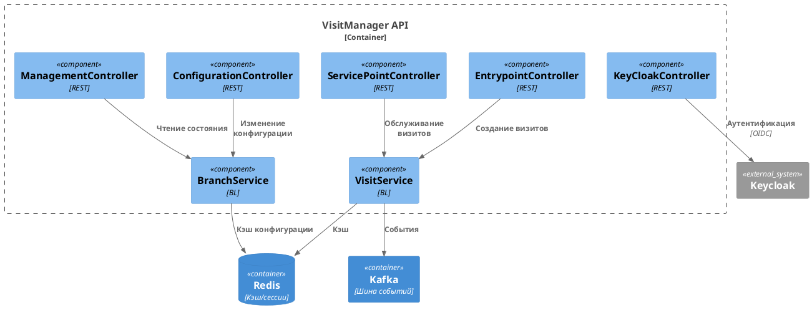
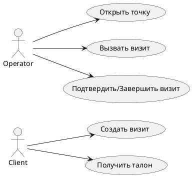
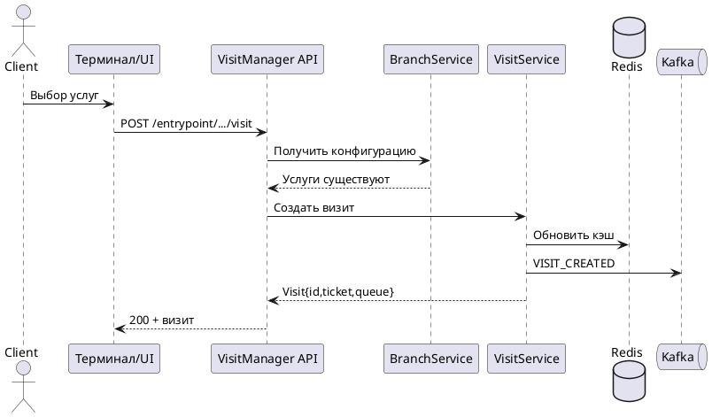

# VisitManager

Служба управления визитами и клиентопотоком, построенная на Micronaut 4.4.3 и Java 17. Сервис управляет очередями, точками обслуживания, сотрудниками и визитами клиентов в отделениях.


## 📑 Содержание
- [🧾 Обзор](#обзор)
- [⚙️ Настройка окружения](#настройка-окружения)
- [🏗️ Архитектура](#архитектура)
- [🔄 Логика работы](#логика-работы)
- [🗂️ Структура проекта](#структура-проекта)
- [👥 Инструкции по ролям](#инструкции-по-ролям)
  - [🛠️ DevOps](#devops)
  - [🏛️ Архитектор](#архитектор)
  - [📊 Аналитик](#аналитик)
  - [🧪 Тестировщик](#тестировщик)
  - [💻 Front End разработчик](#front-end-разработчик)
  - [🧰 Back End разработчик](#back-end-разработчик)
  - [🔗 Интегратор](#интегратор)
- [📡 REST API](#rest-api)
- [📦 Примеры кода](#примеры-кода)
- [📊 Диаграммы](#диаграммы)
- [🧪 Тестирование](#тестирование)
- [🌐 Переменные окружения](#переменные-окружения)
- [🔗 Полезные ссылки](#полезные-ссылки)

## 🧾 Обзор
VisitManager предоставляет REST‑интерфейсы для создания визитов, управления очередями и обслуживания клиентов. В качестве внешних систем используются Keycloak (аутентификация), Redis (кэш/сессии) и Kafka (шина событий).

## ⚙️ Настройка окружения

### Требования
- JDK 17
- Maven 3 (используется maven-wrapper)
- Подключение к Maven Central

### Сборка и запуск
```bash
# полная сборка
JAVA_TOOL_OPTIONS='-Djava.net.preferIPv4Stack=true' ./mvnw clean verify
# запуск приложения
java -jar target/visitmanager.jar
```

### Профиль `local-no-docker`
Профиль предназначен для локальной разработки без Docker и внешних сервисов.
```bash
# сборка без интеграционных тестов
JAVA_TOOL_OPTIONS='-Djava.net.preferIPv4Stack=true' ./mvnw -Plocal-no-docker clean verify
# запуск в dev-режиме
MICRONAUT_ENVIRONMENTS=local-no-docker \
JAVA_TOOL_OPTIONS='-Djava.net.preferIPv4Stack=true' ./mvnw mn:run
```
Профиль отключает Micronaut Test Resources, генерацию OpenAPI, тяжёлые интеграционные тесты и заменяет интеграции заглушками.

### Работа за прокси
Если прямой доступ к Maven недоступен, добавьте в `~/.m2/settings.xml`:
```xml
<settings xmlns="http://maven.apache.org/SETTINGS/1.0.0"
          xmlns:xsi="http://www.w3.org/2001/XMLSchema-instance"
          xsi:schemaLocation="http://maven.apache.org/SETTINGS/1.0.0 https://maven.apache.org/xsd/settings-1.0.0.xsd">
  <proxies>
    <proxy>
      <id>http</id>
      <active>true</active>
      <protocol>http</protocol>
      <host>proxy</host>
      <port>8080</port>
      <nonProxyHosts>localhost|127.0.0.1</nonProxyHosts>
    </proxy>
    <proxy>
      <id>https</id>
      <active>true</active>
      <protocol>https</protocol>
      <host>proxy</host>
      <port>8080</port>
      <nonProxyHosts>localhost|127.0.0.1</nonProxyHosts>
    </proxy>
  </proxies>
</settings>
```

## 🏗️ Архитектура
Сервис построен по слоистой архитектуре:

- **API** (`ru.aritmos.api`) — REST‑контроллеры.
- **Сервисный слой** (`ru.aritmos.service`) — бизнес‑логика.
- **Модели** (`ru.aritmos.model`) — доменные объекты.
- **Интеграции** (`ru.aritmos.clients`, `ru.aritmos.keycloack`, `ru.aritmos.events`) — взаимодействие с внешними сервисами.

Внешние компоненты: Keycloak, Redis, Kafka, PrinterService, DataBus.



## 🔄 Логика работы
1. **Создание визита** — контроллер `EntrypointController` валидирует услуги отделения и создаёт визит через `VisitService`.
2. **Обслуживание** — `ServicePointController` управляет вызовом, подтверждением, переводом и завершением визитов.
3. **Конфигурация** — `ConfigurationController` обновляет настройки отделений.
4. **Мониторинг** — `ManagementController` предоставляет сведения об отделениях, очередях и пользователях.
5. **События** — `EventService` публикует изменения визитов в Kafka и планирует отложенные события.

Подробный разбор сценариев приведён в файле [docs/use-cases.md](docs/use-cases.md).

## 🗂️ Структура проекта
```
src/
  main/java/ru/aritmos/
    api/           REST-контроллеры
    service/       бизнес-логика и правила вызова
    model/         доменные сущности (Branch, Service, Visit...)
    events/        генерация и обработка событий
    clients/       внешние REST-клиенты
    keycloack/     интеграция с Keycloak
  main/resources/  конфигурация Micronaut
docs/              дополнительная документация
scripts/           примеры сценариев
```

## 👥 Инструкции по ролям

### 🛠️ DevOps
- Используйте `docker-compose.yml` для запуска зависимостей (Redis, Kafka, Keycloak).
- Параметры среды задаются через переменные окружения и `.env.*` файлы.
- Для CI выполняйте `./mvnw clean verify` и публикуйте артефакт `visitmanager.jar`.
- Логи пишутся через Logback; для централизованного сбора можно использовать Loki (`loki.properties`).

### 🏛️ Архитектор
- Архитектура модульна: контроллеры → сервисы → модели.
- Расширение функциональности выполняется через добавление сервисов и контроллеров.
- Правила вызова и сегментации реализованы как внедряемые стратегии (`ru.aritmos.service.rules`).

### 📊 Аналитик
- Доменные объекты находятся в `ru.aritmos.model`.
- Бизнес‑процессы: создание визита, обслуживание, перевод, завершение.
- Дополнительные артефакты: `docs/REST-Examples.md`, `docs/ASCII-Overview.md`.

### 🧪 Тестировщик
- Локальные тесты: `JAVA_TOOL_OPTIONS='-Djava.net.preferIPv4Stack=true' ./mvnw -Plocal-no-docker test`.
- Для ручной проверки используйте примеры curl из раздела [REST API](#rest-api).
- Интеграционные тесты запускаются без профиля `local-no-docker` и требуют Docker.

### 💻 Front End разработчик
- Swagger UI доступен по `/swagger-ui`.
- Используйте REST API для отображения очередей, создания и обслуживания визитов.
- Аутентификация через Keycloak (OIDC). Токен передаётся в `Authorization: Bearer`.

### 🧰 Back End разработчик
- Код контроллеров в `ru.aritmos.api`.
- Бизнес‑логика — `ru.aritmos.service`.
- Перед добавлением функциональности пишите модульные тесты и обновляйте REST‑примеры.

### 🔗 Интегратор
- Внешние вызовы: `ConfigurationClient`, `PrinterClient`, `KeyCloackClient`, `DataBusClient`.
- События публикуются в Kafka (топики конфигурируются в `application.yml`).
- Для stub‑режима используйте профиль `local-no-docker`, который подменяет клиенты заглушками.

## 📡 REST API
Обзор основных контроллеров и типичных вызовов.

### ManagementController
```bash
# список отделений
curl http://localhost:8080/managementinformation/branches
# короткий список
curl http://localhost:8080/managementinformation/branches/tiny
```

### EntrypointController
```bash
# создание визита
curl -X POST \
  'http://localhost:8080/entrypoint/branches/{branchId}/entryPoints/{entryPointId}/visit' \
  -H 'Content-Type: application/json' \
  -d '["serviceId1","serviceId2"]'
```

### ServicePointController
```bash
# открыть точку обслуживания
curl -X POST 'http://localhost:8080/servicepoint/branches/{branchId}/servicePoints/{spId}/workProfiles/{wpId}/users/{user}/open'

# вызов визита и подтверждение
VISIT_ID=$(curl -s -X POST 'http://localhost:8080/servicepoint/branches/{branchId}/servicePoints/{spId}/confirmed/visits/call' | jq -r '.id')
curl -X POST "http://localhost:8080/servicepoint/branches/{branchId}/visits/servicePoints/{spId}/confirmed/confirm/${VISIT_ID}"
```

### Дополнительные примеры
- добавление заметки: `POST /servicepoint/branches/{branchId}/visits/servicePoints/{spId}/notes`
- завершение визита: `PUT /servicepoint/branches/{branchId}/visits/servicePoints/{spId}/visit/end`
- перевод в очередь: `PUT /servicepoint/branches/{branchId}/visits/servicePoints/{spId}/queue/{queueId}/visit/transferFromQueue/{visitId}`

Полный список запросов см. в `docs/curl-examples.md` и Swagger UI.

## 📦 Примеры кода

### Использование сервиса
```java
import jakarta.inject.Inject;
import ru.aritmos.service.VisitService;

class VisitFacade {
    @Inject VisitService visitService;

    Visit load(String branchId, String visitId) {
        return visitService.getVisit(branchId, visitId);
    }
}
```

### REST‑клиент Micronaut
Зависимость: `io.micronaut:micronaut-http-client`
```java
import io.micronaut.http.annotation.Post;
import io.micronaut.http.client.annotation.Client;
import jakarta.inject.Singleton;

@Client("/")
interface VisitClient {
    @Post("/entrypoint/branches/{branchId}/entryPoints/{entryPointId}/visit")
    Visit create(String branchId, String entryPointId, List<String> services);
}
```
```java
// использование клиента
Visit created = visitClient.create("001", "01", List.of("serviceId1"));
```

## 📊 Диаграммы

### Кейсы использования




### Архитектура


### Последовательность: создание визита




Дополнительные диаграммы и анализ сценариев см. в [docs/use-cases.md](docs/use-cases.md).

## 🧪 Тестирование
```bash
JAVA_TOOL_OPTIONS='-Djava.net.preferIPv4Stack=true' ./mvnw -Plocal-no-docker test
```
Профиль `local-no-docker` отключает интеграционные тесты, поэтому набор тестов ограничивается модульными тестами.

## 🌐 Переменные окружения
- `KEYCLOAK_URL`, `KEYCLOAK_REALM`, `KEYCLOAK_CLIENT_ID`
- `REDIS_HOST`, `REDIS_PORT`
- `KAFKA_SERVER`
- `PRINTER_SERVER`
- `DATABUS_SERVER`
- `OIDC_ISSUER_DOMAIN`, `OIDC_ISSUER_URL`
- Дополнительно см. `application.yml` и файлы `.env.*`.

## 🔗 Полезные ссылки
- [Micronaut Documentation](https://docs.micronaut.io/4.4.3/guide/index.html)
- [Micronaut OpenAPI](https://micronaut-projects.github.io/micronaut-openapi/latest/guide/)
- [Micronaut Security](https://micronaut-projects.github.io/micronaut-security/latest/guide/)
