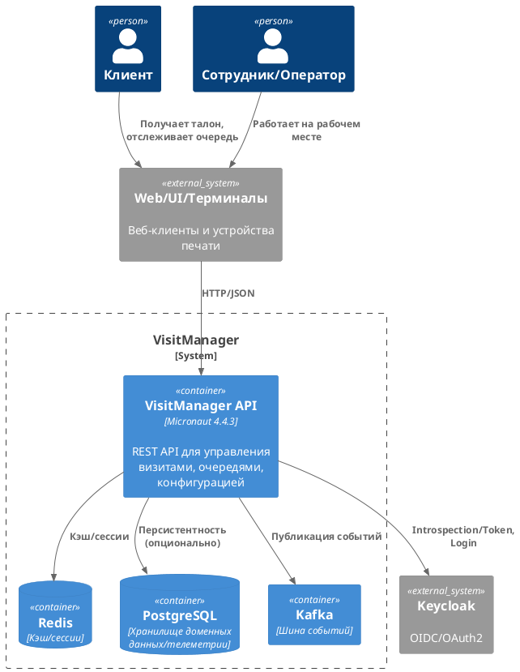
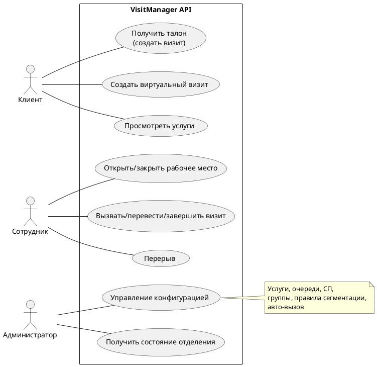
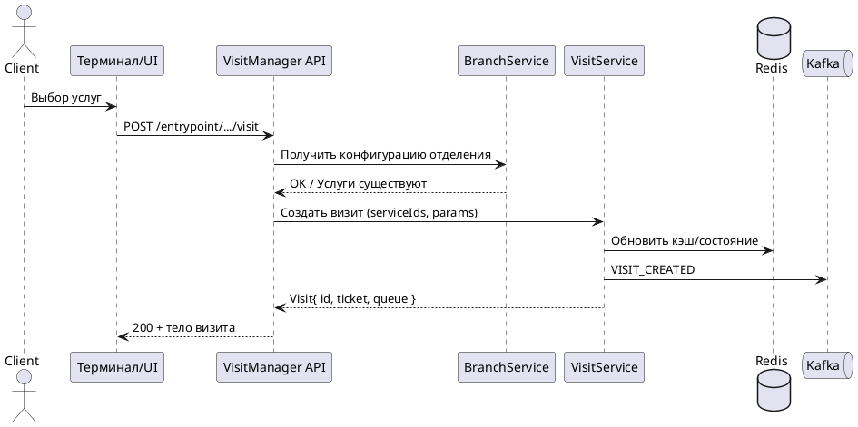
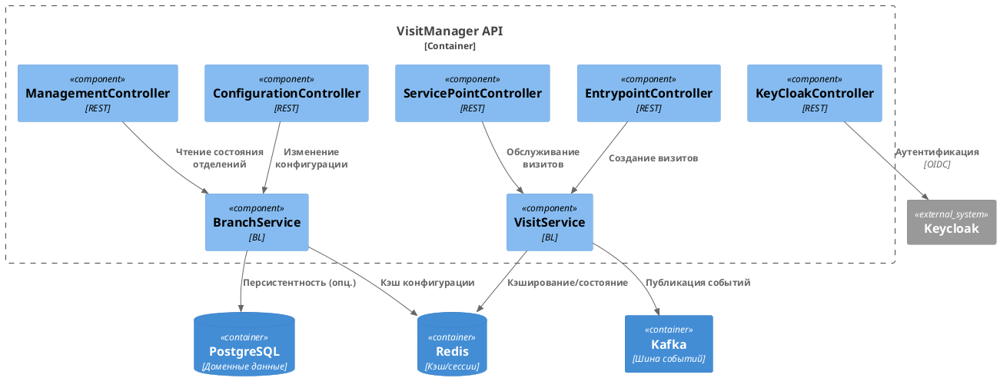

<div align="center">

# VisitManager

Служба управления визитами и клиентопотоком (Micronaut, Java 17).


</div>

## Содержание
- Введение
- Архитектура и компоненты
- Функциональные возможности
- Варианты использования
- Инструкции для разработчиков
- Руководство по развертыванию
- Аутентификация и безопасность
- REST API (обзор по контроллерам)
- Диаграммы PlantUML
- Переменные окружения
- Структура проекта

---

## Введение
VisitManager — сервис для управления визитами, очередями, точками обслуживания и сотрудниками в отделениях. Проект построен на Micronaut 4.4.3 (Java 17), использует Keycloak для аутентификации, поддерживает интеграции с Redis, PostgreSQL и Kafka.

Ключевые зависимости (см. pom.xml): Micronaut Security (JWT/OAuth2), OpenAPI, Kafka, Redis, Lombok, Logback, Keycloak 26.x.

---

## Архитектура и компоненты
Высокоуровневое описание контейнеров:



Основные пакеты и назначение:
- `ru.aritmos.api` — REST-контроллеры: зона обслуживания, ожидания, конфигурация, управление инфо, интеграция с Keycloak.
- `ru.aritmos.service` — бизнес-логика: визиты, отделения, конфигурация, услуги.
- `ru.aritmos.model` — доменные модели: Branch, Service, ServicePoint, Queue, Visit и др.
- `ru.aritmos.keycloack` — интеграция с Keycloak (клиент, модели).

Потоки данных (упрощенно):
1) Клиент/терминал создает визит —> API —> проверка конфигурации —> постановка в очередь —> событие в Kafka.
2) Сотрудник открывает рабочее место —> обслуживает визиты —> перевод между состояниями —> события в Kafka.
3) Администратор обновляет конфигурацию отделения (услуги, очереди, СП, правила сегментации).

---

## Функциональные возможности
- Управление визитами: создание (обычное/виртуальное), обновление параметров, маршрутизация по очередям.
- Зона обслуживания: открытие/закрытие рабочих мест, вызов/перевод/завершение визитов, перерывы.
- Зона ожидания: список доступных услуг (с учетом рабочих профилей), создание визитов через терминал/приемную.
- Конфигурация отделений: услуги, группы услуг, очереди, точки обслуживания, правила сегментации, причины перерывов, авто-вызов.
- Информация об отделениях: полное состояние/«облегченный» список.
- Интеграции: Keycloak (аутентификация), Kafka (события), Redis (кэш/сессии), PostgreSQL (персистентность при необходимости).

---

## Инструкции для разработчиков

Предусловия
- Java 17 (JDK 17)
- Maven 3.9+
- Docker (опционально) — Keycloak/Redis/PostgreSQL локально

Сборка и запуск
- Сборка: `mvn clean package`
- Запуск из Maven: `mvn mn:run` или `mvn exec:java -Dexec.mainClass=ru.aritmos.Application`
- Запуск JAR: `java -jar target/visitmanager-*.jar`

Конфигурация
- Переменная `ENVIRONMENT` (dev/test/prod)
- Параметры Micronaut/Keycloak/Redis/DB — в `application.yml` и переменных окружения

Тестирование
- Юнит-тесты: `mvn test`
- Интеграционные: micronaut-test-resources

Документация API
- Swagger UI: `http://localhost:8080/swagger-ui`
- OpenAPI JSON: `http://localhost:8080/swagger/visitmanager-<version>.json` (имя может отличаться)

---

## Руководство по развертыванию

Вариант 1. Нативный jar
1) Настроить переменные окружения (см. ниже).
2) Запустить зависимые сервисы (Keycloak, Redis, PostgreSQL).
3) `java -jar target/visitmanager-*.jar`.

Вариант 2. Docker (пример)
```yaml
version: "3.8"
services:
  visitmanager:
    image: visitmanager:latest
    build: .
    environment:
      - ENVIRONMENT=prod
      - KEYCLOAK_URL=http://keycloak:8080
      - KEYCLOAK_REALM=master
      - KEYCLOAK_CLIENT_ID=visitmanager
      - DATASOURCE_URL=jdbc:postgresql://postgres:5432/visitmanager
      - DATASOURCE_USERNAME=vm
      - DATASOURCE_PASSWORD=vm
      - REDIS_HOST=redis
      - REDIS_PORT=6379
    ports:
      - "8080:8080"
    depends_on:
      - keycloak
      - redis
      - postgres
  redis:
    image: redis:6.2
  postgres:
    image: postgres:14
    environment:
      - POSTGRES_DB=visitmanager
      - POSTGRES_USER=vm
      - POSTGRES_PASSWORD=vm
  keycloak:
    image: quay.io/keycloak/keycloak:26.0
    command: start-dev --http-port=8080
```

Безопасность
- Храните секреты вне репозитория (Vault/Secret Manager)
- Ограничьте Swagger UI в prod
- Используйте TLS/HTTPS

---

## Аутентификация и безопасность
- Keycloak (OIDC/OAuth2) + Micronaut Security
- Вспомогательные эндпоинты через `KeyCloakController`
- Передавайте Bearer-токен в заголовке `Authorization`

Пример получения токена
```bash
curl -X POST http://localhost:8080/keycloak \
  -H 'Content-Type: application/json' \
  -d '{"login":"user","password":"pass"}'
```

Завершение сессии пользователя
```bash
curl -X POST 'http://localhost:8080/keycloak/users/john.doe?isForced=true&reason=SECURITY'
```

---

## REST API (обзор по контроллерам)

Обзор ключевых эндпоинтов на основе `ru.aritmos.api`. Полные детали — в Swagger.

### EntrypointController (`/entrypoint`)
- POST `/branches/{branchId}/servicePoint/{servicePointId}/virtualVisit` — виртуальный визит.
- POST `/branches/{branchId}/entryPoints/{entryPointId}/visit` — создание визита (опц. печать, `segmentationRuleId`).
- POST `/branches/{branchId}/printer/{printerId}/visitWithParameters` — создание визита + печать на принтере.
- POST `/branches/{branchId}/entryPoints/{entryPointId}/visitWithParameters` — создание визита с параметрами.
- PUT `/branches/{branchId}/visits/{visitId}` — обновление параметров визита.
- GET `/branches/{branchId}/services` — доступные услуги (с учетом активных рабочих профилей).
- GET `/branches/{branchId}/services/all` — полный список услуг отделения.

Примеры
```bash
curl -X POST \
  'http://localhost:8080/entrypoint/branches/{branchId}/entryPoints/{entryPointId}/visit' \
  -H 'Content-Type: application/json' \
  -d '["<serviceId1>","<serviceId2>"]'
```

```bash
curl -X POST \
  'http://localhost:8080/entrypoint/branches/{branchId}/servicePoint/{servicePointId}/virtualVisit' \
  -H 'Content-Type: application/json' \
  -d '["<serviceId>"]'
```

### ServicePointController (`/servicepoint`)
Группы операций:
- Данные: принтеры, очереди (кратко/полно), точки обслуживания (кратко/детально), сотрудники, рабочие профили.
- Поиск по пользователю: рабочее место/пользователь по логину.
- Работа сотрудников: открытие/закрытие, перерывы, авто-вызов.
- Управление визитами: вызов, перенос, завершение, отмена, возврат в ожидание, печать и т.д.

Пример: открыть рабочее место
```bash
curl -X POST \
  'http://localhost:8080/servicepoint/branches/{branchId}/servicePoints/{servicePointId}/workProfiles/{workProfileId}/users/{userName}/open'
```

Пример: закрыть рабочее место (перерыв/форс)
```bash
curl -X POST \
  'http://localhost:8080/servicepoint/branches/{branchId}/servicePoints/{servicePointId}/close?isBreak=true&breakReason=LUNCH&isForced=false'
```

### ConfigurationController (`/configuration`)
- POST `/branches` — полное обновление конфигурации (bulk).
- POST `/branches/hardcode` — загрузка демо-конфигурации.
- PUT `/branches/{branchId}/services` — добавить/обновить услуги (`checkVisits`).
- DELETE `/branches/{branchId}/services` — удалить услуги (`checkVisits`).
- PUT `/branches/{branchId}/servicePoints` — добавить/обновить СП (`restoreVisit`, `restoreUser`).
- DELETE `/branches/{branchId}/servicePoints` — удалить СП.
- PUT `/branches/{branchId}/serviceGroups` — добавить/обновить группы услуг.
- PUT `/branches/{branchId}/segmentationRules` — добавить/обновить правила сегментации.
- PUT `/branches/{branchId}/queues` — добавить/обновить очереди (`restoreVisits`).
- DELETE `/branches/{branchId}/queues` — удалить очереди.
- GET `/branches/{branchId}/break/reasons` — причины перерывов.
- PUT `/branches/{branchId}/autocallModeOn|Off` — включить/выключить авто-вызов.

### ManagementController (`/managementinformation`)
- GET `/branches/{id}` — состояние отделения.
- GET `/branches` — карта отделений (с фильтром по `userName`).
- GET `/branches/tiny` — компактный список отделений (id+name).

### KeyCloakController (без префикса)
- POST `/keycloak` — авторизация (возврат `AuthorizationResponse`).
- POST `/keycloak/users/{login}` — завершение сессии пользователя (`isForced`, `reason`).

---

## Варианты использования

Ключевые сценарии работы сервиса (укрупненно):
- Клиент/терминал:
  - Получение талона и создание визита (обычный/виртуальный)
  - Просмотр доступных услуг филиала
- Сотрудник (оператор):
  - Открытие/закрытие рабочего места, установка перерыва
  - Вызов, перевод, завершение визитов; возврат в ожидание; печать талона
  - Включение/выключение авто-вызова
- Администратор отделения:
  - Обновление конфигурации: услуги, группы, очереди, точки обслуживания, правила сегментации
  - Получение агрегированного состояния отделения, компактных списков
- Интеграции/Инфраструктура:
  - Аутентификация через Keycloak
  - Публикация доменных событий в Kafka
  - Кэширование состояний и конфигурации в Redis
  - Персистентность доменных данных в PostgreSQL (при включении)

Диаграмма вариантов использования (упрощенно)


---

## Диаграммы PlantUML

Диаграмма последовательности: создание визита


Диаграмма компонентов (упрощенно)


---

## Переменные окружения
- `ENVIRONMENT` — окружение (dev/test/prod)
- `KEYCLOAK_URL` — базовый URL Keycloak
- `KEYCLOAK_REALM` — realm
- `KEYCLOAK_CLIENT_ID` — client-id
- `DATASOURCE_URL` — JDBC для PostgreSQL (если используется)
- `DATASOURCE_USERNAME`, `DATASOURCE_PASSWORD`
- `REDIS_HOST`, `REDIS_PORT`

Дополнительно в `application.yml`:
- `micronaut.security.oauth2.clients.keycloak.*` (techlogin, techpassword, client-id, realm, keycloakurl)

---

## Структура проекта (основное)
```
src/
  main/java/ru/aritmos/
    api/
      EntrypointController.java
      ServicePointController.java
      ConfigurationController.java
      ManagementController.java
      KeyCloakController.java
    service/
      BranchService.java
      VisitService.java
      ...
    model/
      ... доменные классы (Branch, Service, ServicePoint, Queue, Visit, ...)
    keycloack/
      ... интеграция с Keycloak
  main/resources/
    application.yml
```

---

## Полезные ссылки
- Micronaut Guide: https://docs.micronaut.io/4.4.3/guide/index.html
- OpenAPI/Swagger: https://micronaut-projects.github.io/micronaut-openapi/latest/guide/
- Kafka: https://micronaut-projects.github.io/micronaut-kafka/latest/guide/
- Security OAuth2: https://micronaut-projects.github.io/micronaut-security/latest/guide/
