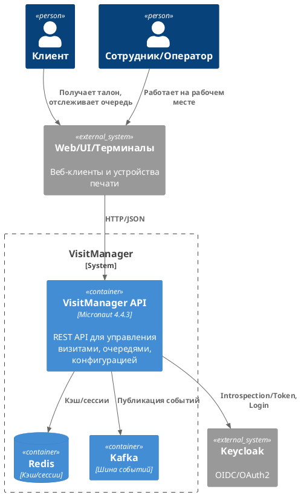
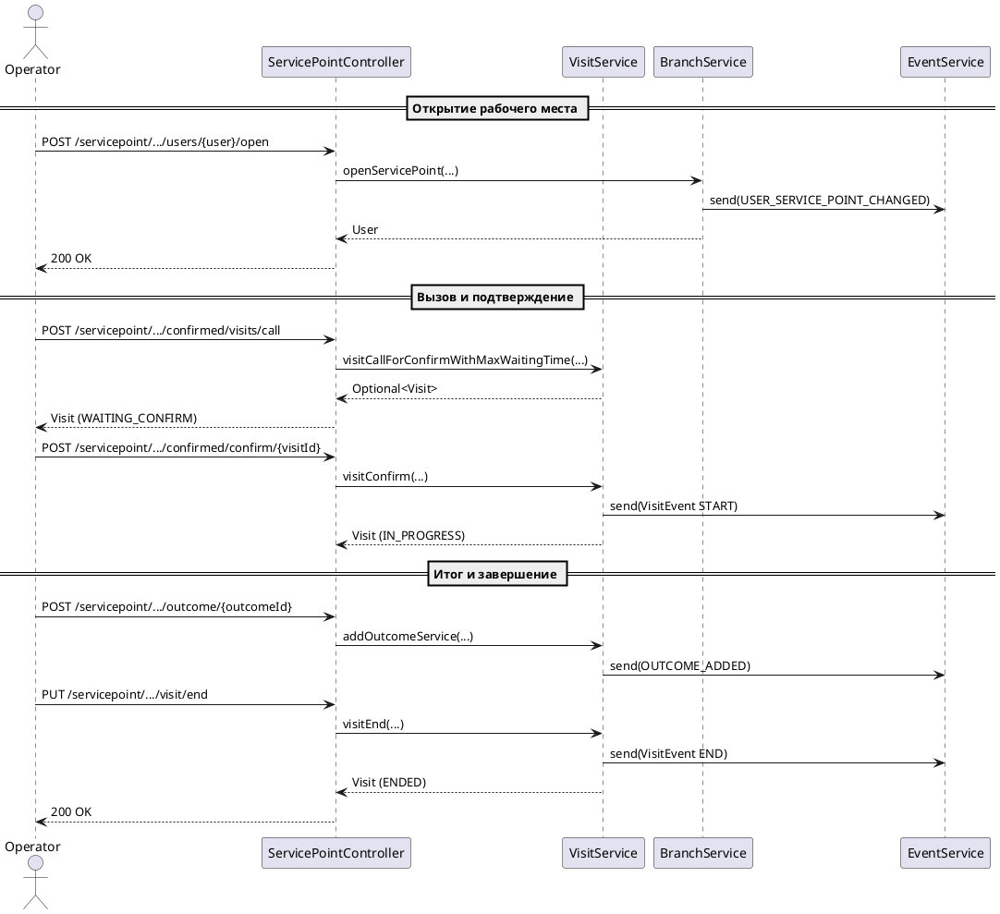
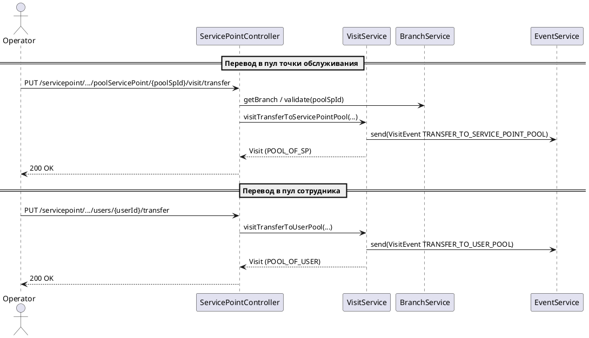
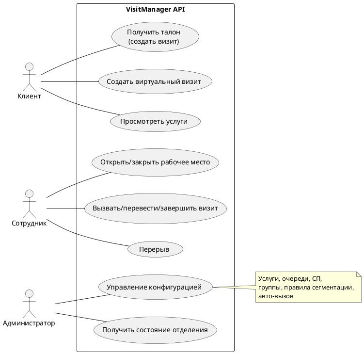
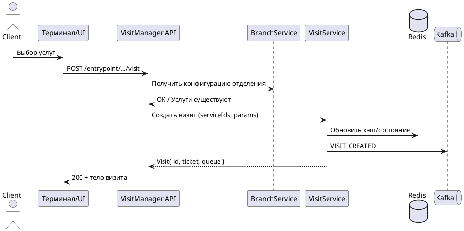
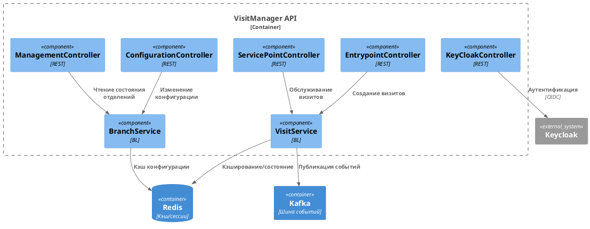

<div >

# VisitManager

Служба управления визитами и клиентопотоком (Micronaut, Java 17).


</div>

## Содержание

- Введение
- Архитектура и компоненты
- Функциональные возможности
- Варианты использования
- Инструкции для разработчиков
- Руководство по развертыванию
- Аутентификация и безопасность
- REST API (обзор по контроллерам)
- Диаграммы PlantUML
- Переменные окружения
- Структура проекта

---

## Введение

VisitManager — сервис для управления визитами, очередями, точками обслуживания и сотрудниками в отделениях. Проект
построен на Micronaut 4.4.3 (Java 17), использует Keycloak для аутентификации, поддерживает интеграции с Redis и Kafka.

Ключевые зависимости (см. pom.xml): Micronaut Security (JWT/OAuth2), OpenAPI, Kafka, Redis, Lombok, Logback, Keycloak
26.x.

---

## Архитектура и компоненты

Высокоуровневое описание контейнеров:



Основные пакеты и назначение:

- `ru.aritmos.api` — REST-контроллеры: зона обслуживания, ожидания, конфигурация, управление инфо, интеграция с
  Keycloak.
- `ru.aritmos.service` — бизнес-логика: визиты, отделения, конфигурация, услуги.
- `ru.aritmos.model` — доменные модели: Branch, Service, ServicePoint, Queue, Visit и др.
- `ru.aritmos.keycloack` — интеграция с Keycloak (клиент, модели).

Потоки данных (упрощенно):

1) Клиент/терминал создает визит —> API —> проверка конфигурации —> постановка в очередь —> событие в Kafka.
2) Сотрудник открывает рабочее место —> обслуживает визиты —> перевод между состояниями —> события в Kafka.
3) Администратор обновляет конфигурацию отделения (услуги, очереди, СП, правила сегментации).

---

## Функциональные возможности

- Управление визитами: создание (обычное/виртуальное), обновление параметров, маршрутизация по очередям.
- Зона обслуживания: открытие/закрытие рабочих мест, вызов/перевод/завершение визитов, перерывы.
- Зона ожидания: список доступных услуг (с учетом рабочих профилей), создание визитов через терминал/приемную.
- Конфигурация отделений: услуги, группы услуг, очереди, точки обслуживания, правила сегментации, причины перерывов,
  авто-вызов.
- Информация об отделениях: полное состояние/«облегченный» список.
- Интеграции: Keycloak (аутентификация), Kafka (события), Redis (кэш/сессии), PostgreSQL (персистентность при
  необходимости).
- Интеграции: Keycloak (аутентификация), Kafka (события), Redis (кэш/сессии).

---

## Инструкции для разработчиков

Предусловия

- Java 17 (JDK 17)
- Maven 3.9+
- Docker (опционально) — Keycloak/Redis/PostgreSQL локально

Сборка и запуск

- Сборка: `mvn clean package`
- Запуск из Maven: `mvn mn:run` или `mvn exec:java -Dexec.mainClass=ru.aritmos.Application`
- Запуск JAR: `java -jar target/visitmanager-*.jar`

Конфигурация

- Переменная `ENVIRONMENT` (dev/test/prod)
- Параметры Micronaut/Keycloak/Redis/DB — в `application.yml` и переменных окружения

Тестирование

- Юнит-тесты: `mvn test`
- Интеграционные: micronaut-test-resources

Документация API

- Swagger UI: `http://localhost:8080/swagger-ui`
- OpenAPI JSON: `http://localhost:8080/swagger/visitmanager-<version>.json` (имя может отличаться)

---

## Инструкции для разработчиков

### Сборка и тесты (Maven)

- Полная сборка с тестами: `./mvnw clean verify`
- Сборка без тестов: `./mvnw -DskipTests package`
- Запуск JAR: `java -jar target/visitmanager.jar`
- Запуск в dev (если подключен плагин): `./mvnw mn:run`
- Тесты: `./mvnw test`
 - Полный набор примеров curl: см. `docs/curl-examples.md`

### Быстрый сценарий (скрипты)

- Bash: `scripts/demo-quickstart.sh` — открытие СП → создание визита → вызов/confirm → итог → завершение
  - Запуск: `bash scripts/demo-quickstart.sh`
  - Переменные (опционально): `BASE, BR, SP, WP, ENTRY, USER, SVC, OUTCOME`
- PowerShell: `scripts/demo-quickstart.ps1` — аналогичный сценарий для Windows
  - Запуск: `pwsh -File scripts/demo-quickstart.ps1`
  - Переменные: те же (через `$env:...`)

### Локальная сборка/запуск без Docker и внешних сервисов

Для быстрого локального запуска без Docker/Testcontainers и без реального Keycloak/Kafka/Redis добавлен профиль `local-no-docker`.

- Сборка и проверка без интеграционных тестов: `./mvnw -Plocal-no-docker clean verify`
- Запуск в dev-режиме (Micronaut):
  - Linux/macOS: `MICRONAUT_ENVIRONMENTS=local-no-docker ./mvnw mn:run`
  - Windows PowerShell: `$env:MICRONAUT_ENVIRONMENTS='local-no-docker'; ./mvnw mn:run`

Что делает профиль `local-no-docker`:
- отключает Micronaut Test Resources (не требуется Docker);
- отключает генерацию OpenAPI для ускорения локальной сборки;
- исключает тяжёлые интеграционные тесты (`EntrypointTest`, `*IT.java`, `*ITCase.java`);
- выключает Kafka‑слушателя и подменяет интеграции заглушками:
  - `KeyCloackClient` → стаб `LocalNoDockerKeycloakStub` (без сетевых вызовов);
  - `DataBusClient` → стаб `LocalNoDockerDataBusClientStub` (события «отправляются» локально);
- отключает Redis/Kafka на уровне конфигурации (`application-local-no-docker.yml`).

Важно: профиль `local-no-docker` предназначен только для локальной разработки. Для интеграционных тестов и стендов используйте полный `verify` и Docker.

### Быстрые примеры curl (local-no-docker)

- Проверка API и списка отделений
  - `curl http://localhost:8080/managementinformation/branches`
  - `curl "http://localhost:8080/managementinformation/branches?userName=psokolov"`
- Детали отделения (демо)
  - `curl http://localhost:8080/managementinformation/branches/37493d1c-8282-4417-a729-dceac1f3e2b4`
- Короткий список отделений
  - `curl http://localhost:8080/managementinformation/branches/tiny`
- Создание визита через точку входа (демо‑значения)
  - `curl -X POST \
    'http://localhost:8080/entrypoint/branches/37493d1c-8282-4417-a729-dceac1f3e2b4/entryPoints/2/visit' \
    -H 'Content-Type: application/json' \
    -d '["c3916e7f-7bea-4490-b9d1-0d4064adbe8b"]'`
- Swagger UI
  - `http://localhost:8080/swagger-ui/`

Примеры для зоны обслуживания (демо-идентификаторы из профиля local-no-docker)

- Открыть точку обслуживания для пользователя
  - `curl -X POST 'http://localhost:8080/servicepoint/branches/37493d1c-8282-4417-a729-dceac1f3e2b4/servicePoints/a66ff6f4-4f4a-4009-8602-0dc278024cf2/workProfiles/d5a84e60-e605-4527-b065-f4bd7a385790/users/psokolov/open'`

- Вызов визита с ожиданием подтверждения (макс. ожидание) и подтверждение прихода
  - Вызов: `curl -s -X POST 'http://localhost:8080/servicepoint/branches/37493d1c-8282-4417-a729-dceac1f3e2b4/servicePoints/a66ff6f4-4f4a-4009-8602-0dc278024cf2/confirmed/visits/call'`
  - Получить `visitId`: `VISIT_ID=$(curl -s -X POST 'http://localhost:8080/servicepoint/branches/37493d1c-8282-4417-a729-dceac1f3e2b4/servicePoints/a66ff6f4-4f4a-4009-8602-0dc278024cf2/confirmed/visits/call' | jq -r '.id')`
  - Подтверждение: `curl -X POST "http://localhost:8080/servicepoint/branches/37493d1c-8282-4417-a729-dceac1f3e2b4/visits/servicePoints/a66ff6f4-4f4a-4009-8602-0dc278024cf2/confirmed/confirm/${VISIT_ID}"`

- Повторный вызов (re-call) визита в режиме подтверждения
  - `curl -X POST "http://localhost:8080/servicepoint/branches/37493d1c-8282-4417-a729-dceac1f3e2b4/visits/servicePoints/a66ff6f4-4f4a-4009-8602-0dc278024cf2/confirmed/recall/${VISIT_ID}"`

- Добавить заметку к текущему визиту
  - `curl -X POST 'http://localhost:8080/servicepoint/branches/37493d1c-8282-4417-a729-dceac1f3e2b4/visits/servicePoints/a66ff6f4-4f4a-4009-8602-0dc278024cf2/notes' -H 'Content-Type: text/plain; charset=utf-8' --data 'Краткая заметка по визиту'`

- Добавить итог услуги к текущему визиту (пример outcomeId из демо)
  - `curl -X POST 'http://localhost:8080/servicepoint/branches/37493d1c-8282-4417-a729-dceac1f3e2b4/visits/servicePoints/a66ff6f4-4f4a-4009-8602-0dc278024cf2/outcome/462bac1a-568a-4f1f-9548-1c7b61792b4b'`

- Завершить обслуживание
  - `curl -X PUT 'http://localhost:8080/servicepoint/branches/37493d1c-8282-4417-a729-dceac1f3e2b4/visits/servicePoints/a66ff6f4-4f4a-4009-8602-0dc278024cf2/visit/end'`

- Отложить визит (postpone) или вернуть в очередь (put back)
  - Postpone: `curl -X PUT 'http://localhost:8080/servicepoint/branches/37493d1c-8282-4417-a729-dceac1f3e2b4/servicePoints/a66ff6f4-4f4a-4009-8602-0dc278024cf2/postpone'`
  - Put back: `curl -X PUT 'http://localhost:8080/servicepoint/branches/37493d1c-8282-4417-a729-dceac1f3e2b4/servicePoints/a66ff6f4-4f4a-4009-8602-0dc278024cf2/visit/put_back?returnTimeDelay=60'`

- Закрыть точку обслуживания (без выхода из системы)
  - `curl -X POST 'http://localhost:8080/servicepoint/branches/37493d1c-8282-4417-a729-dceac1f3e2b4/servicePoints/a66ff6f4-4f4a-4009-8602-0dc278024cf2/close?isBreak=false'`

- Выход пользователя из системы с закрытием точки
  - `curl -X POST 'http://localhost:8080/servicepoint/branches/37493d1c-8282-4417-a729-dceac1f3e2b4/servicePoints/a66ff6f4-4f4a-4009-8602-0dc278024cf2/logout?isForced=true&reason=USER_SESSION_KILLED'`

Примеры перевода визита (transfer)

- Перевести визит в другую очередь (в конец)
  - `curl -X PUT "http://localhost:8080/servicepoint/branches/37493d1c-8282-4417-a729-dceac1f3e2b4/visits/servicePoints/a66ff6f4-4f4a-4009-8602-0dc278024cf2/queue/c211ae6b-de7b-4350-8a4c-cff7ff98104e/visit/transferFromQueue/${VISIT_ID}?isAppend=true&transferTimeDelay=0"`
- Перевести визит в другую очередь на позицию 0
  - `curl -X PUT "http://localhost:8080/servicepoint/branches/37493d1c-8282-4417-a729-dceac1f3e2b4/visits/servicePoints/a66ff6f4-4f4a-4009-8602-0dc278024cf2/queue/c211ae6b-de7b-4350-8a4c-cff7ff98104e/visit/transferFromQueue/${VISIT_ID}?index=0&transferTimeDelay=0"`
- Перевести визит из очереди в пул точки обслуживания (в конец пула)
  - `curl -X PUT "http://localhost:8080/servicepoint/branches/37493d1c-8282-4417-a729-dceac1f3e2b4/visits/servicePoints/a66ff6f4-4f4a-4009-8602-0dc278024cf2/poolServicePoint/099c43c1-40b5-4b80-928a-1d4b363152a8/visits/${VISIT_ID}/transferFromQueue?isAppend=true&transferTimeDelay=0"`
- Перевести визит из очереди в пул точки обслуживания на позицию 0
  - `curl -X PUT "http://localhost:8080/servicepoint/branches/37493d1c-8282-4417-a729-dceac1f3e2b4/visits/servicePoints/a66ff6f4-4f4a-4009-8602-0dc278024cf2/poolServicePoint/099c43c1-40b5-4b80-928a-1d4b363152a8/visits/${VISIT_ID}/transferFromQueueWithIndex?index=0&transferTimeDelay=0"`
- Внешняя служба (ресепшен/MI): перевод визита в очередь
  - `curl -X PUT \
    'http://localhost:8080/servicepoint/branches/37493d1c-8282-4417-a729-dceac1f3e2b4/queue/c211ae6b-de7b-4350-8a4c-cff7ff98104e/visits/${VISIT_ID}/externalService/transfer?isAppend=true&transferTimeDelay=0' \
    -H 'Content-Type: application/json' \
    -d '{"source":"reception"}'`
- Внешняя служба: перевод визита в пул точки обслуживания
  - `curl -X PUT \
    'http://localhost:8080/servicepoint/branches/37493d1c-8282-4417-a729-dceac1f3e2b4/servicePoint/a66ff6f4-4f4a-4009-8602-0dc278024cf2/pool/visits/${VISIT_ID}/externalService/transfer?isAppend=true&transferTimeDelay=0' \
    -H 'Content-Type: application/json' \
    -d '{"source":"reception"}'`
- Вернуть вызванный визит обратно в очередь
  - `curl -X PUT "http://localhost:8080/servicepoint/branches/37493d1c-8282-4417-a729-dceac1f3e2b4/visits/${VISIT_ID}/put_back?returnTimeDelay=60"`

Примеры работы с пулом сотрудника

- Получить `userId` по логину (например, psokolov)
  - `USER_ID=$(curl -s 'http://localhost:8080/servicepoint/branches/37493d1c-8282-4417-a729-dceac1f3e2b4/users/user/psokolov' | jq -r '.id')`
- Перевести визит из очереди в пул сотрудника (в конец пула)
  - `curl -X PUT "http://localhost:8080/servicepoint/branches/37493d1c-8282-4417-a729-dceac1f3e2b4/users/${USER_ID}/visits/${VISIT_ID}?isAppend=true&transferTimeDelay=0"`
- Перевести визит из очереди в пул сотрудника на позицию 0
  - `curl -X PUT "http://localhost:8080/servicepoint/branches/37493d1c-8282-4417-a729-dceac1f3e2b4/users/${USER_ID}/visits/${VISIT_ID}/position/0?transferTimeDelay=0"`
- Перевести текущий визит оператора из СП в пул сотрудника
  - `curl -X PUT "http://localhost:8080/servicepoint/branches/37493d1c-8282-4417-a729-dceac1f3e2b4/servicePoints/a66ff6f4-4f4a-4009-8602-0dc278024cf2/users/${USER_ID}/transfer?transferTimeDelay=0"`
- Вернуть текущий визит из СП в пул сотрудника с задержкой возврата 60с
  - `curl -X PUT "http://localhost:8080/servicepoint/branches/37493d1c-8282-4417-a729-dceac1f3e2b4/servicePoints/a66ff6f4-4f4a-4009-8602-0dc278024cf2/users/${USER_ID}/put_back?returnTimeDelay=60"`

Примеры работы с пулом точки обслуживания

- Перевести текущий визит из СП в пул точки (в конец пула)
  - `curl -X PUT "http://localhost:8080/servicepoint/branches/37493d1c-8282-4417-a729-dceac1f3e2b4/visits/servicePoints/a66ff6f4-4f4a-4009-8602-0dc278024cf2/poolServicePoint/099c43c1-40b5-4b80-928a-1d4b363152a8/visit/transfer?transferTimeDelay=0"`
- Вернуть текущий визит из СП в пул точки с задержкой 60с
  - `curl -X PUT "http://localhost:8080/servicepoint/branches/37493d1c-8282-4417-a729-dceac1f3e2b4/visits/servicePoints/a66ff6f4-4f4a-4009-8602-0dc278024cf2/poolServicePoint/099c43c1-40b5-4b80-928a-1d4b363152a8/visit/put_back?returnTimeDelay=60"`

## Руководство по развертыванию (Docker)

## Кейсы обслуживания (сценарии)

Ниже — типичные сценарии работы оператора. Все примеры совместимы с профилем `local-no-docker`.

- Открытие рабочего места
  - Оператор выбирает точку и рабочий профиль.
  - API: POST `/servicepoint/branches/{branchId}/servicePoints/{servicePointId}/workProfiles/{workProfileId}/users/{userName}/open`

- Вызов посетителя
  - Авто‑вызов (по правилам ожидания/жизни визита) или ручной/“из списка”.
  - API: POST `/servicepoint/branches/{branchId}/servicePoints/{servicePointId}/confirmed/visits/call` (с подтверждением) или `/servicepoint/branches/{branchId}/servicePoints/{servicePointId}/call`

- Подтверждение прихода
  - После вызова в режиме подтверждения оператор фиксирует факт прихода.
  - API: POST `/servicepoint/branches/{branchId}/visits/servicePoints/{servicePointId}/confirmed/confirm/{visitId}`

- Повторный вызов (re‑call)
  - Если посетитель не подошёл, можно повторить вызов.
  - API: POST `/servicepoint/branches/{branchId}/visits/servicePoints/{servicePointId}/confirmed/recall/{visitId}`

- Переводы визита
  - Между очередями: PUT `/servicepoint/branches/{branchId}/visits/servicePoints/{servicePointId}/queue/{queueId}/visit/transferFromQueue/{visitId}`
  - В пул точки: PUT `/servicepoint/branches/{branchId}/visits/servicePoints/{servicePointId}/poolServicePoint/{poolServicePointId}/visits/{visitId}/transferFromQueue`
  - В пул сотрудника: PUT `/servicepoint/branches/{branchId}/users/{userId}/visits/{visitId}`
  - Внешней службой (ресепшен/MI):
    - В очередь: PUT `/servicepoint/branches/{branchId}/queue/{queueId}/visits/{visitId}/externalService/transfer`
    - В пул точки: PUT `/servicepoint/branches/{branchId}/servicePoint/{servicePointId}/pool/visits/{visitId}/externalService/transfer`

- Возвраты визита
  - Возврат вызванного визита в очередь: PUT `/servicepoint/branches/{branchId}/visits/{visitId}/put_back?returnTimeDelay=60`
  - Возврат текущего визита из точки в очередь: PUT `/servicepoint/branches/{branchId}/servicePoints/{servicePointId}/visit/put_back?returnTimeDelay=60`
  - Возврат текущего визита в пул точки: PUT `/servicepoint/branches/{branchId}/visits/servicePoints/{servicePointId}/poolServicePoint/{poolServicePointId}/visit/put_back?returnTimeDelay=60`

- Итоги и фактические услуги
  - Итог услуги: POST `/servicepoint/branches/{branchId}/visits/servicePoints/{servicePointId}/outcome/{outcomeId}`
  - Фактическая услуга + итог: POST `/servicepoint/branches/{branchId}/visits/servicePoints/{servicePointId}/deliveredService/{deliveredServiceId}/outcome/{outcomeId}`
  - Заметки по визиту: POST `/servicepoint/branches/{branchId}/visits/servicePoints/{servicePointId}/notes`

- Завершение обслуживания
  - Нормальное завершение: PUT `/servicepoint/branches/{branchId}/visits/servicePoints/{servicePointId}/visit/end`
  - Принудительное завершение (с причиной): тот же эндпоинт с `?isForced=true&reason=...`

- Перерывы и закрытие точки
  - Закрыть точку без выхода: POST `/servicepoint/branches/{branchId}/servicePoints/{servicePointId}/close?isBreak=false`
  - Перерыв (закрыть точку с флагом `isBreak` и `breakReason`): `/close?isBreak=true&breakReason=<...>`
  - Выход (logout): POST `/servicepoint/branches/{branchId}/servicePoints/{servicePointId}/logout?isForced=false`

Примечания
- Для демонстрации используйте идентификаторы из раздела “Быстрые примеры curl (local-no-docker)”.
- Для прод/стендов требуется корректная интеграция с Keycloak/Kafka/Redis и реальные идентификаторы сущностей.

## Ошибки и их причины

- 404 NOT_FOUND
  - Branch not found — неверный `branchId`
  - Service point not found — неверный `servicePointId`
  - Queue not found — неверный `queueId`
  - Visit not found — неверный `visitId`
- 403 FORBIDDEN / 401
  - User not logged in in service point — вызов/операция без открытого рабочего места
  - Work profile not found — неверный `workProfileId` при открытии/смене профиля
  - User doesn't have permissions to access branch — нет прав доступа к отделению (роль/branchPrefix)
- 409 CONFLICT
  - The service point is already busy — попытка открыть уже занятую точку
  - ServicePoint already closed — попытка закрыть уже закрытую точку
- 400 BAD_REQUEST
  - Некорректные параметры запроса (позиция/флаги/формат тела)
- 500 INTERNAL_SERVER_ERROR
  - Системные ошибки интеграций/ошибки сериализации

Диагностика
- Проверяйте логи (`logback.xml` настроен, уровни можно повысить в `application.yml`)
- События шины: `EventService` публикует `ENTITY_CHANGED`, `BUSINESS_ERROR`, `SYSTEM_ERROR`, `VisitEvent ...`
- Для dev профиля `local-no-docker` внешние вызовы подменены заглушками, поэтому 5xx реже связаны с сетью

## Демо идентификаторы (local-no-docker)

- Отделение (branch): `37493d1c-8282-4417-a729-dceac1f3e2b4` (Клиника на Тверской)
- Точки обслуживания (servicePoint):
  - Основная: `a66ff6f4-4f4a-4009-8602-0dc278024cf2` (Каб. 121)
  - Доп.: `099c43c1-40b5-4b80-928a-1d4b363152a8` (Каб. 101), `090bd53d-96ba-466b-9845-d64e81894964` (Каб. 114),
    `f9e60eaf-b4af-4bf8-8d64-e70d2e949829` (Каб. 120), `043536cc-62bb-43df-bdc6-d0b9df9ff961` (Каб. 102 Касса)
- Рабочие профили (workProfile):
  - Хирург: `d5a84e60-e605-4527-b065-f4bd7a385790`
  - Офтальмолог: `76e4d31e-1787-476a-9668-9ff5c50c6855`
- Очереди (queue):
  - Хирург: `55da9b66-c928-4d47-9811-dbbab20d3780`
  - Офтальмолог: `c211ae6b-de7b-4350-8a4c-cff7ff98104e`
  - В кассу: `8eee7e6e-345a-4f9b-9743-ff30a4322ef5`
- Услуги (service):
  - Хирург: `c3916e7f-7bea-4490-b9d1-0d4064adbe8b`
  - Офтальмолог: `569769e8-3bb3-4263-bd2e-42d8b3ec0bd2`
  - Травматолог: `856e8e77-aa8e-4feb-b947-566f6164e46f`
  - Касса: `9a6cc8cf-c7c4-4cfd-90fc-d5d525a92a66`
- Итоги и фактические услуги:
  - Итог «Запись на повторный приём»: `462bac1a-568a-4f1f-9548-1c7b61792b4b`
  - Итог «Получена»: `8dc29622-cd87-4384-85a7-04b66b28dd0f`
  - DS «Консультация»: `35d73fdd-1597-4d94-a087-fd8a99c9d1ed`
  - DS «Подготовка к операции»: `daa17035-7bd7-403f-a036-6c14b81e666f`
- Точка входа (entryPoint): `2`, принтер: `eb7ea46d-c995-4ca0-ba92-c92151473214`

### Управление режимом авто‑вызова (пример)

- Включить авто‑вызов: `curl -X PUT 'http://localhost:8080/servicepoint/branches/37493d1c-8282-4417-a729-dceac1f3e2b4/servicePoins/a66ff6f4-4f4a-4009-8602-0dc278024cf2/startAutoCall'`
- Отключить авто‑вызов: `curl -X PUT 'http://localhost:8080/servicepoint/branches/37493d1c-8282-4417-a729-dceac1f3e2b4/servicePoins/a66ff6f4-4f4a-4009-8602-0dc278024cf2/cancelAutoCall'`
- Смена рабочего профиля: `curl -X PUT 'http://localhost:8080/servicepoint/branches/37493d1c-8282-4417-a729-dceac1f3e2b4/servicePoints/a66ff6f4-4f4a-4009-8602-0dc278024cf2/workProfiles/d5a84e60-e605-4527-b065-f4bd7a385790'`

## Диаграмма последовательности (PlantUML)



### Диаграмма: перевод визита в пул точки/сотрудника



Примечание: если `jq` недоступен на Windows, используйте PowerShell:
- `(Invoke-RestMethod -Method Post -Uri 'http://localhost:8080/.../confirmed/visits/call').id`
- или: `((Invoke-WebRequest -Method Post -Uri 'http://...').Content | ConvertFrom-Json).id`

Вариант 1. Нативный jar

1) Настроить переменные окружения (см. ниже).
2) Запустить зависимые сервисы (Keycloak, Redis).
3) `java -jar target/visitmanager-*.jar`.

В проекте есть готовые compose-файлы и Dockerfile. Ниже подробное описание каждого файла, переменных и сценариев
запуска.

Обзор файлов

- `Dockerfile` — сборка образа приложения (многоэтапная: builder Maven + рантайм JDK 17).
- `docker-compose.yml` — запуск из готового реестрового образа + локальный Redis.
- `docker-compose-main.yml` — обертка, которая подключает `docker-compose.yml` и объявляет внешнюю сеть
  `aritmosplatform-backend`.
- `docker-compose.local.yml` — локальная разработка: билд образа из Dockerfile, запуск Redis, публикация порта 8080,
  расширенные переменные.
- `.env.*` — примеры/профили переменных окружения (не храните секреты в VCS).

Dockerfile (полное описание)

- Билд-стейдж: `FROM maven:3.9.9-eclipse-temurin-17 AS builder`
    - Копирует весь проект в `/app` и выполняет `mvn clean package -Dmaven.test.skip=true`.
    - Результат: `target/visitmanager.jar`.
- Рантайм-стейдж: `FROM bellsoft/liberica-openjdk-alpine:17`
    - Копирует `visitmanager.jar` в `app.jar`.
    - Открывает порт `8080` и запускает приложение `ENTRYPOINT ["java","-jar","app.jar"]`.
- Примечание: в Dockerfile есть закомментированные альтернативы (jlink/Alpine) и пример ENV — они не активны.

docker-compose.yml (прод/тест из реестра)

- services.visitmanager
    - `image`: `registry.aritmosplatform.ru/aritmosplatform/visitmanager:${ENVIRONMENT}`
    - `hostname`: `visitmanager`
    - `environment` (ключевые):
        - `REDIS_SERVER=redis://visitmanager-redis:6379/6`
        - `DATABUS_SERVER=http://databus:8080`
        - `CONFIG_SERVER=http://localhost:8081`
        - `PRINTER_SERVER=http://192.168.3.29:8084` (пример)
        - `OIDC_ISSUER_DOMAIN=http://keycloak:8080/realms/aritmos_platform`
        - `OIDC_ISSUER_URL=http://keycloak:8080`
        - `OAUTH_CLIENT_ID=${CLIENT_ID}` / `OAUTH_CLIENT_SECRET=${CLIENT_SECRET}`
        - `KEYCLOAK_TECHLOGIN=${LOGIN_ADMIN}` / `KEYCLOAK_TECHPASSWORD=${PASSWORD_ADMIN}`
        - `KAFKA_SERVER=kafka:9092`
        - `LOKI_SERVER=http://loki:3100/loki/api/v1/push`
    - `env_file`: `./.env` — подстановка переменных.
    - `expose`: 8080, 9092, 9093, 9094, 8082 (для связи внутри сети).
    - `ports`: `8080:8080` — публикация API наружу.
    - `networks`: `aritmosplatform-backend`, `visitmanager-network`.
    - `depends_on`: `visitmanager-redis`.
    - `restart: always`.
- services.visitmanager-redis
    - `image: redis:latest`
    - `hostname: visitmanager-redis`
    - `environment`: `REDIS_PASSWORD`, `REDIS_PORT=6379`, `REDIS_DATABASES=16` (берутся из `.env`).
    - `expose`: 6379 (и 9092 указано, но не требуется — оставлено как есть).
    - `networks`: `visitmanager-network`.
    - `volumes`: именованный том `redis_data:/data`.
    - `healthcheck`: `redis-cli --raw incr ping` с интервалом 10s.
    - `restart: always`.
- volumes: `redis_data` (local).
- networks: `visitmanager-network` (bridge).

docker-compose-main.yml (внешняя сеть)

- `include: - docker-compose.yml` — агрегирует базовый compose.
- `networks.aritmosplatform-backend` — объявляет bridge-сеть, через которую сервис общается с внешними компонентами (
  Keycloak, Kafka, Loki, Databus и т.д.).

docker-compose.local.yml (локальная разработка)

- services.visitmanager
    - `build`: из `Dockerfile` (context `./`).
    - `image`: `aritmos/visitmanager:0.8` (тег локального образа).
    - `container_name`: `visitmanager`.
    - `ports`: `8080:8080`.
    - `expose`: 8080, 9092, 9093, 9094, 8082.
    - `networks`: `aritmosplatform-backend` (внешняя сеть должна существовать заранее).
    - `depends_on`: `visitmanager-redis` (с `condition: service_healthy`).
    - `environment`: аналогичны `docker-compose.yml`, но значения заданы явно для локального окружения.
    - `restart: always`.
- services.visitmanager-redis
    - `image: redis:latest`
    - `container_name: visitmanager-redis`
    - `expose`: 6379
    - `volumes`: монтирование локальных путей для данных/конфига Redis (замените `/path/to/local/...` на ваши пути).
    - `environment`: `REDIS_PASSWORD`, `REDIS_PORT=6379`, `REDIS_DATABASES=16`.
    - `healthcheck`: как в базовом файле.
    - `restart: always`.
- networks
    - `aritmosplatform-backend`: `external: true` — сеть должна быть создана заранее (
      `docker network create aritmosplatform-backend`).

Запуск и управление

- Прод/тест из реестра:
    - `docker compose -f docker-compose-main.yml --env-file .env up -d`
- Локальная разработка (с билдом):
    - `docker compose -f docker-compose.local.yml up -d --build`
- Остановка: `docker compose -f <file> down`
- Перезапуск сервиса: `docker compose -f <file> restart visitmanager`
- Логи: `docker compose -f <file> logs -f visitmanager`
- Инспекция сети: `docker network ls`, `docker network inspect <network>`

Сети и порты

Переменные окружения (.env)

- Используйте `.env` для безопасной подстановки значений (см. список ниже).
- Не коммитьте реальные секреты: используйте `.env.local`/`.env.dev` в локальной среде и секреты в CI/CD/оркестраторе в проде.

Основные переменные окружения (примеры и соответствия):

- `MICRONAUT_ENVIRONMENTS` — активные профили Micronaut (например, `local-no-docker`)
- `REDIS_SERVER` — URI Redis (по умолчанию в `application.yml`: `redis://192.168.8.45:7379`)
- `KAFKA_SERVER` — адрес Kafka bootstrap servers (по умолчанию: `192.168.8.45:29092`)
- `LOKI_SERVER` — URL приёмника Loki (`http://.../loki/api/v1/push`)
- `DATABUS_SERVER` — URL шины данных → `micronaut.application.dataBusUrl`
- `CONFIG_SERVER` — URL конфигурационного сервиса → `micronaut.application.configurationURL`
- `PRINTER_SERVER` — URL сервиса печати → `micronaut.application.printerServiceURL`
- `OIDC_ISSUER_URL` / `OIDC_ISSUER_DOMAIN` — базовые URL Keycloak (issuer)
- `OAUTH_CLIENT_ID` / `OAUTH_CLIENT_SECRET` — OAuth2 client id/secret
- `KEYCLOAK_TECHLOGIN` / `KEYCLOAK_TECHPASSWORD` — сервисный логин/пароль для Keycloak API

Подстановка переменных выполнена в `application.yml` через `${VAR:
 DEFAULT}`. Значения из `.env` и окружения перекрывают дефолты.

Внешние зависимости (ожидаемые эндпоинты)

- Keycloak: `http://keycloak:8080` (realm `aritmos_platform`)
- Kafka: `kafka:9092`
- Loki: `http://loki:3100` (push API `/loki/api/v1/push`)
- Databus: `http://databus:8080`
- Config Server: `http://localhost:8081` (или ваш адрес)
- Printer Server: `http://192.168.3.29:8084` (пример)

Исходные файлы Docker

Dockerfile

```dockerfile
#Перед этим нужно поменять версию в pom.xml на 17
#FROM amazoncorretto:17.0.4-alpine3.15 AS builder
#ADD [".\\", "/src"]
#WORKDIR /src
#COPY pom.xml .
#COPY src ./src
FROM maven:3.9.9-eclipse-temurin-17 AS builder
COPY . /app
WORKDIR /app


#ENV REDIS_SERVER="redis://redis:6379"
#ENV REDIS_SERVER_TEST="redis://localhost:6379"
#ENV DATABUS_SERVER="http://192.168.8.45:8082"
#ENV CONFIG_SERVER="http://localhost:8081"
#ENV PRINTER_SERVER="http://192.168.3.33:8084"
#ENV OIDC_ISSUER_DOMAIN="http://192.168.8.45:9090/realms/Aritmos"
#ENV OIDC_ISSUER_URL="http://192.168.8.45:9090"
#ENV OAUTH_CLIENT_ID="myclient"
#ENV KEYCLOAK_TECHLOGIN="visitmanager"
#ENV KEYCLOAK_TECHPASSWORD="visitmanager"
#RUN sed -i 's/\r$//' mvnw
#RUN --mount=type=cache,target=/root/.m2 ./mvnw clean package -Dmaven.test.skip=true
RUN mvn clean package -Dmaven.test.skip=true


#FROM amazoncorretto:17.0.4-alpine3.15 AS packager
#RUN apk add --no-cache binutils
#ENV JAVA_MINIMAL="/opt/java-minimal"
#RUN $JAVA_HOME/bin/jlink \
#                  --verbose \
#                  --add-modules \
#                      java.base,java.sql,java.naming,java.desktop,java.management,java.security.jgss,jdk.zipfs,jdk.unsupported \
#                  --compress 2 --strip-debug --no-header-files --no-man-pages \
#                  --output "$JAVA_MINIMAL"

#FROM alpine:3.16.2
#ENV JAVA_HOME=/opt/java-minimal
#ENV PATH="$PATH:$JAVA_HOME/bin"
#ENV REDIS_SERVER="redis://redis:6379"
#ENV REDIS_SERVER_TEST="redis://localhost:6379"
#ENV DATABUS_SERVER="http://192.168.8.45:8082"
#ENV CONFIG_SERVER="http://localhost:8081"
#ENV PRINTER_SERVER="http://192.168.3.33:8084"
#ENV OIDC_ISSUER_DOMAIN="http://192.168.8.45:9090/realms/Aritmos"
#ENV OIDC_ISSUER_URL="http://192.168.8.45:9090"
#ENV OAUTH_CLIENT_ID="myclient"
#ENV KEYCLOAK_TECHLOGIN="visitmanager"
#ENV KEYCLOAK_TECHPASSWORD="visitmanager"
#ENV KAFKA_SERVER="192.168.8.45:9094"
#ENV LOKI_SERVER="http://192.168.3.13:3100/loki/api/v1/push"
#COPY --from=packager "$JAVA_HOME" "$JAVA_HOME"
FROM bellsoft/liberica-openjdk-alpine:17
COPY --from=builder "/app/target/visitmanager.jar" "app.jar"
EXPOSE 8080
ENTRYPOINT ["java","-jar","app.jar"]
```

docker-compose.yml

```yaml
services:

  visitmanager:
    image: registry.aritmosplatform.ru/aritmosplatform/visitmanager:${ENVIRONMENT}
    hostname: visitmanager
    environment:
      - REDIS_SERVER=redis://visitmanager-redis:6379/6
      - DATABUS_SERVER=http://databus:8080
      - CONFIG_SERVER=http://localhost:8081
      #- PRINTER_SERVER=http://printerservice:8084
      - PRINTER_SERVER=http://192.168.3.29:8084
      - OIDC_ISSUER_DOMAIN=http://keycloak:8080/realms/aritmos_platform
      - OAUTH_CLIENT_ID=${CLIENT_ID}
      - KEYCLOAK_TECHLOGIN=${LOGIN_ADMIN}
      - KEYCLOAK_TECHPASSWORD=${PASSWORD_ADMIN}
      - OIDC_ISSUER_URL=http://keycloak:8080
      - KAFKA_SERVER=kafka:9092
      - LOKI_SERVER=http://loki:3100/loki/api/v1/push
      - OAUTH_CLIENT_SECRET=${CLIENT_SECRET}
    env_file: ./.env
    expose:
      - '8080'
      - '9094'
      - '9092'
      - '9093'
      - '8082'
    ports:
      - "8080:8080"
    networks:
      - aritmosplatform-backend
      - visitmanager-network
    depends_on:
      - visitmanager-redis
    #      visitmanager-redis:
    #        condition: service_healthy
    restart: always

  visitmanager-redis:
    image: redis:latest
    hostname: visitmanager-redis
    environment:
      - REDIS_PASSWORD=${REDIS_PASSWORD}
      - REDIS_PORT=6379
      - REDIS_DATABASES=16
    env_file: ./.env
    expose:
      - '6379'
      - '9092'
    networks:
      - visitmanager-network
    restart: always
    # ports:
    #   - "6379:6379"
    volumes:
      - redis_data:/data
    healthcheck:
      interval: 10s
      timeout: 5s
      retries: 5
      test: [ "CMD", "redis-cli", "--raw", "incr", "ping" ]

volumes:
  redis_data:
    external: false

networks:
  visitmanager-network:
    driver: bridge
```

docker-compose-main.yml

```yaml
include:
  - docker-compose.yml

networks:
  aritmosplatform-backend:
    driver: bridge
```

docker-compose.local.yml

```yaml
services:

  visitmanager:
    expose:
      - '8080'
      - '9094'
      - '9092'
      - '9093'
      - '8082'
    networks:
      - aritmosplatform-backend
    container_name: visitmanager
    ports:
      - "8080:8080"
    build:
      context: ./
      dockerfile: Dockerfile
    image: aritmos/visitmanager:0.8
    depends_on:
      visitmanager-redis:
        condition: service_healthy
    environment:
      - REDIS_SERVER=redis://visitmanager-redis:6379/6
      - DATABUS_SERVER=http://databus:8080
      - CONFIG_SERVER=http://localhost:8081
      #- PRINTER_SERVER=http://printerservice:8084
      - PRINTER_SERVER=http://192.168.3.29:8084
      - OIDC_ISSUER_DOMAIN=http://keycloak:8080/realms/aritmos_platform
      - OAUTH_CLIENT_ID=myclient
      - KEYCLOAK_TECHLOGIN=admin
      - KEYCLOAK_TECHPASSWORD=LtlVjhjp!23
      - OIDC_ISSUER_URL=http://keycloak:8080
      - KAFKA_SERVER=kafka:9092
      - LOKI_SERVER=http://loki:3100/loki/api/v1/push
      - OAUTH_CLIENT_SECRET=HKdkHNfaMWWsDqFa6a4q3kcNVkRjN0Wv
      - KEYCLOAK_REALM=aritmos_platform
    restart: always
  visitmanager-redis:
    expose:
      - '6379'
      - '9092'
    healthcheck:
      interval: 10s
      timeout: 5s
      retries: 5
      test: [ "CMD", "redis-cli", "--raw", "incr", "ping" ]
    networks:
      - aritmosplatform-backend
    image: redis:latest
    container_name: visitmanager-redis
    restart: always
    # ports:
    #   - "6379:6379"
    volumes:
      - /path/to/local/dаta:/root/redis
      - /path/to/local/redis.conf:/usr/local/etc/redis/redis.conf
    environment:
      - REDIS_PASSWORD=my-password
      - REDIS_PORT=6379
      - REDIS_DATABASES=16
networks:
  aritmosplatform-backend:
    external:
      name: aritmosplatform-backend
```

    environment:
      - ENVIRONMENT=prod
      - KEYCLOAK_URL=http://keycloak:8080
      - KEYCLOAK_REALM=master
      - KEYCLOAK_CLIENT_ID=visitmanager
      - REDIS_HOST=redis
      - REDIS_PORT=6379
    ports:
      - "8080:8080"
    depends_on:
      - keycloak
      - redis

redis:
image: redis:6.2
keycloak:
image: quay.io/keycloak/keycloak:26.0
command: start-dev --http-port=8080

```

Безопасность
- Храните секреты вне репозитория (Vault/Secret Manager)
- Ограничьте Swagger UI в prod
- Используйте TLS/HTTPS

---

## Аутентификация и безопасность
- Keycloak (OIDC/OAuth2) + Micronaut Security
- Вспомогательные эндпоинты через `KeyCloakController`
- Передавайте Bearer-токен в заголовке `Authorization`

Пример получения токена
```bash
curl -X POST http://localhost:8080/keycloak \
  -H 'Content-Type: application/json' \
  -d '{"login":"user","password":"pass"}'
```

Завершение сессии пользователя

```bash
curl -X POST 'http://localhost:8080/keycloak/users/john.doe?isForced=true&reason=SECURITY'
```

---

## REST API (обзор по контроллерам)

Обзор ключевых эндпоинтов на основе `ru.aritmos.api`. Полные детали — в Swagger.

### EntrypointController (`/entrypoint`)

- POST `/branches/{branchId}/servicePoint/{servicePointId}/virtualVisit` — виртуальный визит.
- POST `/branches/{branchId}/entryPoints/{entryPointId}/visit` — создание визита (опц. печать, `segmentationRuleId`).
- POST `/branches/{branchId}/printer/{printerId}/visitWithParameters` — создание визита + печать на принтере.
- POST `/branches/{branchId}/entryPoints/{entryPointId}/visitWithParameters` — создание визита с параметрами.
- PUT `/branches/{branchId}/visits/{visitId}` — обновление параметров визита.
- GET `/branches/{branchId}/services` — доступные услуги (с учетом активных рабочих профилей).
- GET `/branches/{branchId}/services/all` — полный список услуг отделения.

Примеры

```bash
curl -X POST \
  'http://localhost:8080/entrypoint/branches/{branchId}/entryPoints/{entryPointId}/visit' \
  -H 'Content-Type: application/json' \
  -d '["<serviceId1>","<serviceId2>"]'
```

```bash
curl -X POST \
  'http://localhost:8080/entrypoint/branches/{branchId}/servicePoint/{servicePointId}/virtualVisit' \
  -H 'Content-Type: application/json' \
  -d '["<serviceId>"]'
```

### ServicePointController (`/servicepoint`)

Группы операций:

- Данные: принтеры, очереди (кратко/полно), точки обслуживания (кратко/детально), сотрудники, рабочие профили.
- Поиск по пользователю: рабочее место/пользователь по логину.
- Работа сотрудников: открытие/закрытие, перерывы, авто-вызов.
- Управление визитами: вызов, перенос, завершение, отмена, возврат в ожидание, печать и т.д.

Пример: открыть рабочее место

```bash
curl -X POST \
  'http://localhost:8080/servicepoint/branches/{branchId}/servicePoints/{servicePointId}/workProfiles/{workProfileId}/users/{userName}/open'
```

Пример: закрыть рабочее место (перерыв/форс)

```bash
curl -X POST \
  'http://localhost:8080/servicepoint/branches/{branchId}/servicePoints/{servicePointId}/close?isBreak=true&breakReason=LUNCH&isForced=false'
```

### ConfigurationController (`/configuration`)

- POST `/branches` — полное обновление конфигурации (bulk).
- POST `/branches/hardcode` — загрузка демо-конфигурации.
- PUT `/branches/{branchId}/services` — добавить/обновить услуги (`checkVisits`).
- DELETE `/branches/{branchId}/services` — удалить услуги (`checkVisits`).
- PUT `/branches/{branchId}/servicePoints` — добавить/обновить СП (`restoreVisit`, `restoreUser`).
- DELETE `/branches/{branchId}/servicePoints` — удалить СП.
- PUT `/branches/{branchId}/serviceGroups` — добавить/обновить группы услуг.
- PUT `/branches/{branchId}/segmentationRules` — добавить/обновить правила сегментации.
- PUT `/branches/{branchId}/queues` — добавить/обновить очереди (`restoreVisits`).
- DELETE `/branches/{branchId}/queues` — удалить очереди.
- GET `/branches/{branchId}/break/reasons` — причины перерывов.
- PUT `/branches/{branchId}/autocallModeOn|Off` — включить/выключить авто-вызов.

### ManagementController (`/managementinformation`)

- GET `/branches/{id}` — состояние отделения.
- GET `/branches` — карта отделений (с фильтром по `userName`).
- GET `/branches/tiny` — компактный список отделений (id+name).

### KeyCloakController (без префикса)

- POST `/keycloak` — авторизация (возврат `AuthorizationResponse`).
- POST `/keycloak/users/{login}` — завершение сессии пользователя (`isForced`, `reason`).

---

## Варианты использования

Ключевые сценарии работы сервиса (укрупненно):

- Клиент/терминал:
    - Получение талона и создание визита (обычный/виртуальный)
    - Просмотр доступных услуг филиала
- Сотрудник (оператор):
    - Открытие/закрытие рабочего места, установка перерыва
    - Вызов, перевод, завершение визитов; возврат в ожидание; печать талона
    - Включение/выключение авто-вызова
- Администратор отделения:
    - Обновление конфигурации: услуги, группы, очереди, точки обслуживания, правила сегментации
    - Получение агрегированного состояния отделения, компактных списков
- Интеграции/Инфраструктура:
    - Аутентификация через Keycloak
    - Публикация доменных событий в Kafka
    - Кэширование состояний и конфигурации в Redis

Диаграмма вариантов использования (упрощенно)



---

## Диаграммы PlantUML

Диаграмма последовательности: создание визита



Диаграмма компонентов (упрощенно)



---

## Переменные окружения

- `ENVIRONMENT` — окружение (dev/test/prod)
- `KEYCLOAK_URL` — базовый URL Keycloak
- `KEYCLOAK_REALM` — realm
- `KEYCLOAK_CLIENT_ID` — client-id
- `REDIS_HOST`, `REDIS_PORT`

Используемые в docker-compose переменные (и параметры) сервиса

- `REDIS_SERVER` — строка подключения Redis (например: `redis://visitmanager-redis:6379/6`)
- `DATABUS_SERVER` — URL Databus (например: `http://databus:8080`)
- `CONFIG_SERVER` — URL сервера конфигурации (например: `http://localhost:8081`)
- `PRINTER_SERVER` — URL сервиса печати (например: `http://printerservice:8084` или IP)
- `OIDC_ISSUER_DOMAIN` — Issuer для OIDC (например: `http://keycloak:8080/realms/aritmos_platform`)
- `OIDC_ISSUER_URL` — базовый URL Keycloak (например: `http://keycloak:8080`)
- `OAUTH_CLIENT_ID`, `OAUTH_CLIENT_SECRET` — OAuth2 клиент
- `KEYCLOAK_TECHLOGIN`, `KEYCLOAK_TECHPASSWORD` — техническая учетная запись
- `KAFKA_SERVER` — адрес брокера Kafka (например: `kafka:9092`)
- `LOKI_SERVER` — URL push API Loki (например: `http://loki:3100/loki/api/v1/push`)
- `REDIS_PASSWORD` — пароль Redis (используется контейнером `visitmanager-redis` из `.env`)

Дополнительно в `application.yml`:

- `micronaut.security.oauth2.clients.keycloak.*` (techlogin, techpassword, client-id, realm, keycloakurl)

---

## Структура проекта (основное)

```
src/
  main/java/ru/aritmos/
    api/
      EntrypointController.java
      ServicePointController.java
      ConfigurationController.java
      ManagementController.java
      KeyCloakController.java
    service/
      BranchService.java
      VisitService.java
      ...
    model/
      ... доменные классы (Branch, Service, ServicePoint, Queue, Visit, ...)
    keycloack/
      ... интеграция с Keycloak
  main/resources/
    application.yml
```

---

## Полезные ссылки

- Micronaut Guide: https://docs.micronaut.io/4.4.3/guide/index.html
- OpenAPI/Swagger: https://micronaut-projects.github.io/micronaut-openapi/latest/guide/
- Kafka: https://micronaut-projects.github.io/micronaut-kafka/latest/guide/
- Security OAuth2: https://micronaut-projects.github.io/micronaut-security/latest/guide/
