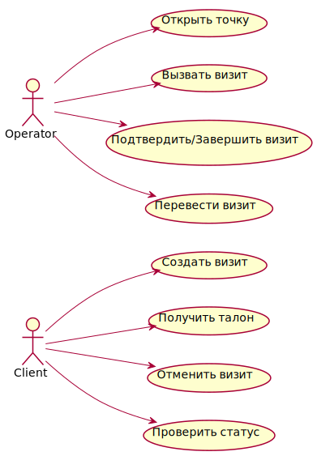

# Кейсы использования VisitManager

## 🧾 Клиент

| Сценарий | Описание | Ожидаемый результат |
|---|---|---|
| ✅ Создание визита | Клиент выбирает услуги и отправляет запрос на создание визита. | Визит создан, возвращён номер талона. |
| ⚠️ Невалидная услуга | Клиент отправляет несуществующий идентификатор услуги. | Ошибка 404, визит не создаётся. |
| ⚠️ Очередь переполнена | В выбранной очереди достигнут лимит. | Ошибка 409, предложена другая очередь. |
| ✅ Отмена визита | Клиент отменяет ранее созданный визит. | Визит удалён, номер талона освобождён. |
| ✅ Статус визита | Клиент запрашивает текущий статус визита. | Возвращены данные по визиту. |
| ✅ Печать талона | Клиент запрашивает печать талона при создании визита. | Талон отправлен на принтер. |
| ✅ Визит с параметрами | Клиент передаёт дополнительные параметры (пол, возраст). | Визит создан с параметрами. |
| ❌ Отмена чужого визита | Клиент пытается отменить визит другого пользователя. | Ошибка 403 Forbidden. |

## 🧑‍💼 Оператор

| Сценарий | Описание | Ожидаемый результат |
|---|---|---|
| ✅ Открытие точки | Оператор открывает сервис-поинт. | Точка доступна для вызова посетителей. |
| ✅ Вызов визита | Оператор вызывает следующий визит. | Визит закреплён за оператором. |
| ✅ Подтверждение/завершение | Оператор подтверждает завершение обслуживания. | Визит помечен завершённым. |
| ⚠️ Нет визитов | Оператор вызывает визит при пустой очереди. | Ответ 204 или сообщение об отсутствии визитов. |
| ✅ Перевод визита | Оператор переводит визит в другую очередь или к оператору. | Визит перенаправлен согласно запросу. |
| ⚠️ Ошибка перевода | Перевод визита невозможен (нет очереди/оператора). | Ошибка 400 или 409. |
| ✅ Закрытие точки | Оператор завершает работу сервис-поинта. | Точка становится недоступной. |
| ✅ Перевод в пул ТО | Оператор отправляет визит в пул сервис-точек. | Визит доступен другим операторам. |
| ❌ Повторное завершение | Оператор пытается завершить уже завершённый визит. | Ошибка 409 Conflict. |

## 🔐 Аутентификация

| Сценарий | Описание | Ожидаемый результат |
|---|---|---|
| ✅ Валидный токен | Запрос с корректным JWT токеном. | Доступ разрешён. |
| ❌ Просроченный токен | Токен истёк. | Ответ 401 Unauthorized. |
| ❌ Отсутствие токена | Запрос без заголовка Authorization. | Ответ 401 Unauthorized. |
| ❌ Недостаточно прав | Токен без необходимой роли. | Ответ 403 Forbidden. |
| ❌ Неверная подпись | Токен повреждён или подписан другим ключом. | Ответ 401 Unauthorized. |
| ❌ Отозванный токен | Токен был отозван сервером авторизации. | Ответ 401 Unauthorized. |
| ❌ Неизвестный издатель | Токен выписан другим Identity Provider. | Ответ 401 Unauthorized. |

Диаграмма кейсов использования:

- [Исходник PlantUML](diagrams/use-cases.puml)

