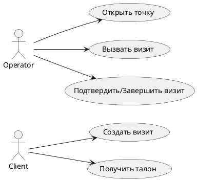

# Кейсы использования VisitManager

## 🧾 Клиент

| Сценарий | Описание | Ожидаемый результат |
|---|---|---|
| ✅ Создание визита | Клиент выбирает услуги и отправляет запрос на создание визита. | Визит создан, возвращён номер талона. |
| ⚠️ Невалидная услуга | Клиент отправляет несуществующий идентификатор услуги. | Ошибка 404, визит не создаётся. |
| ⚠️ Очередь переполнена | В выбранной очереди достигнут лимит. | Ошибка 409, предложена другая очередь. |

## 🧑‍💼 Оператор

| Сценарий | Описание | Ожидаемый результат |
|---|---|---|
| ✅ Открытие точки | Оператор открывает сервис-поинт. | Точка доступна для вызова посетителей. |
| ✅ Вызов визита | Оператор вызывает следующий визит. | Визит закреплён за оператором. |
| ✅ Подтверждение/завершение | Оператор подтверждает завершение обслуживания. | Визит помечен завершённым. |
| ⚠️ Нет визитов | Оператор вызывает визит при пустой очереди. | Ответ 204 или сообщение об отсутствии визитов. |

## 🔐 Аутентификация

| Сценарий | Описание | Ожидаемый результат |
|---|---|---|
| ✅ Валидный токен | Запрос с корректным JWT токеном. | Доступ разрешён. |
| ❌ Просроченный токен | Токен истёк. | Ответ 401 Unauthorized. |
| ❌ Отсутствие токена | Запрос без заголовка Authorization. | Ответ 401 Unauthorized. |

Диаграмма кейсов использования:

