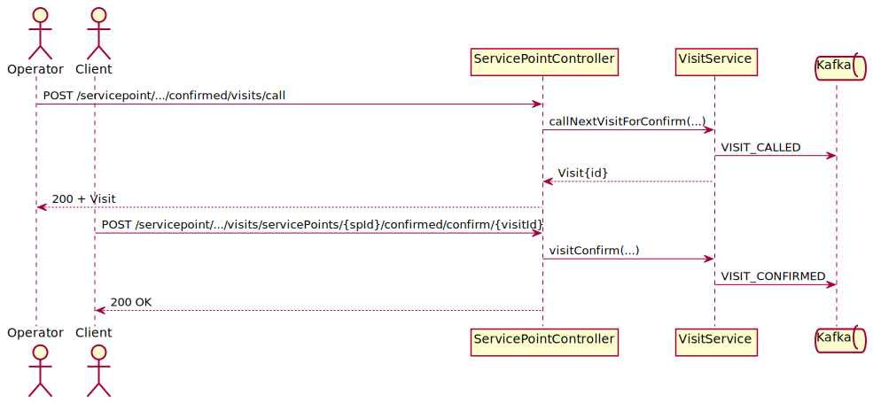
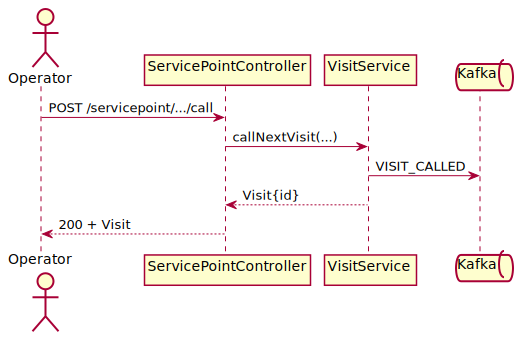
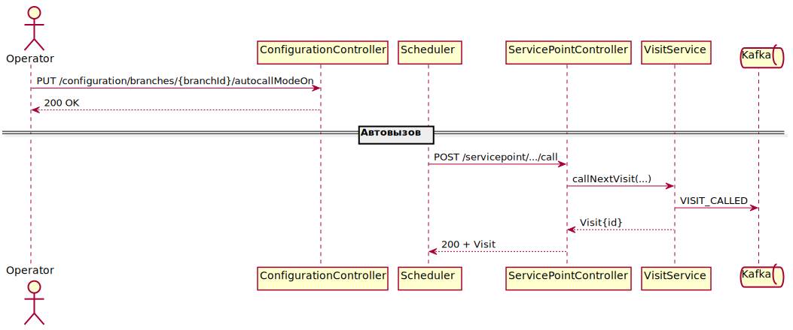
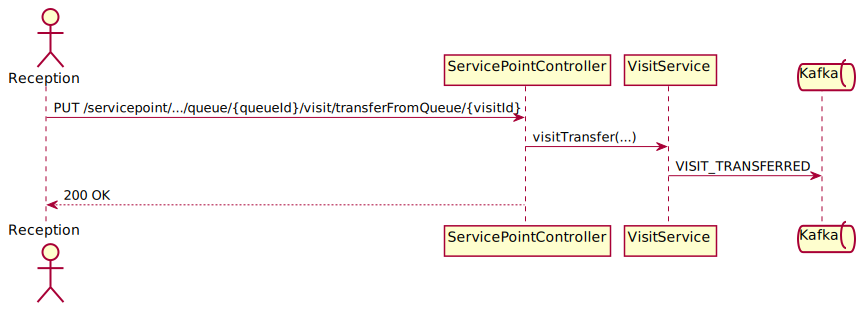

# Кейсы использования VisitManager

## 🧾 Клиент

| Сценарий | Описание | Ожидаемый результат |
|---|---|---|
| ✅ Создание визита | Клиент выбирает услуги и отправляет запрос на создание визита. | Визит создан, возвращён номер талона. |
| ⚠️ Невалидная услуга | Клиент отправляет несуществующий идентификатор услуги. | Ошибка 404, визит не создаётся. |
| ⚠️ Очередь переполнена | В выбранной очереди достигнут лимит. | Ошибка 409, предложена другая очередь. |
| ✅ Отмена визита | Клиент отменяет ранее созданный визит. | Визит удалён, номер талона освобождён. |
| ✅ Статус визита | Клиент запрашивает текущий статус визита. | Возвращены данные по визиту. |
| ✅ Печать талона | Клиент запрашивает печать талона при создании визита. | Талон отправлен на принтер. |
| ✅ Визит с параметрами | Клиент передаёт дополнительные параметры (пол, возраст). | Визит создан с параметрами. |
| ✅ Визит на несколько услуг | Клиент выбирает несколько услуг в одном запросе. | Визит создан со всеми выбранными услугами. |
| ⚠️ Пустой список услуг | Клиент отправляет запрос без услуг. | Ошибка 400, визит не создаётся. |
| ❌ Отмена чужого визита | Клиент пытается отменить визит другого пользователя. | Ошибка 403 Forbidden. |

## 🧑‍💼 Оператор

| Сценарий | Описание | Ожидаемый результат |
|---|---|---|
| ✅ Открытие точки | Оператор открывает сервис-поинт. | Точка доступна для вызова посетителей. |
| ✅ Вызов визита с подтверждением | Оператор вызывает следующий визит и ожидает подтверждения клиента. | Визит закреплён за оператором после подтверждения. |
| ✅ Вызов визита без подтверждения | Оператор вызывает визит без обязательного подтверждения. | Визит сразу закреплён за оператором. |
| ✅ Черри пик визита | Оператор вручную выбирает визит, минуя порядок очереди. | Выбранный визит вызван вне очереди. |
| ✅ Подтверждение/завершение | Оператор подтверждает завершение обслуживания. | Визит помечен завершённым. |
| ⚠️ Нет визитов | Оператор вызывает визит при пустой очереди. | Ответ 204 или сообщение об отсутствии визитов. |
| ✅ Перевод визита | Оператор переводит визит в другую очередь или к оператору. | Визит перенаправлен согласно запросу. |
| ✅ Возврат визита в очередь | Оператор возвращает визит обратно в очередь из своей работы. | Визит снова доступен для вызова. |
| ✅ Повторный вызов переведённого визита | После перевода и возврата визит вызывается ещё раз. | Визит успешно вызван повторно. |
| ⚠️ Ошибка перевода | Перевод визита невозможен (нет очереди/оператора). | Ошибка 400 или 409. |
| ✅ Автовызов клиента | На сервис-поинте включён режим автовызова; при появлении свободного оператора и нового визита система автоматически вызывает клиента по правилу наибольшего ожидания. | Визит закреплён за оператором без ручного вызова. |
| ✅ Автовызов с подтверждением | Автовызов вызывает визит, ожидая подтверждения клиента. | Визит закреплён за оператором после подтверждения. |
| ✅ Автовызов без подтверждения | Автовызов закрепляет визит сразу без ожидания подтверждения. | Визит закреплён за оператором автоматически. |
| ✅ Закрытие точки | Оператор завершает работу сервис-поинта. | Точка становится недоступной. |
| ✅ Перевод в пул ТО | Оператор отправляет визит в пул сервис-точек. | Визит доступен другим операторам. |
| ❌ Повторное завершение | Оператор пытается завершить уже завершённый визит. | Ошибка 409 Conflict. |

### 📋 Сценарий работы сотрудника

1. **Старт смены.** Сотрудник открывает рабочее место и вызывает первый визит.
2. **Фактические услуги.** Добавляются фактические услуги (*delivered services*), для них фиксируются итоги (*outcome delivered services*), затем задаётся итог обслуженной услуги (*outcome service*).
3. **Варианты визитов.** Один из последующих визитов переводится в другую очередь, другой завершается без фактических услуг.
4. **Перерыв.** Рабочее место закрывается с флагом перерыва (причина: «обед»), позже сотрудник открывает его вновь и продолжает работу.
5. **Завершение смены.** По окончании всех визитов рабочее место закрывается (reason: «конец смены»).


## 🔐 Аутентификация

| Сценарий | Описание | Ожидаемый результат |
|---|---|---|
| ✅ Валидный токен | Запрос с корректным JWT токеном. | Доступ разрешён. |
| ❌ Просроченный токен | Токен истёк. | Ответ 401 Unauthorized. |
| ❌ Отсутствие токена | Запрос без заголовка Authorization. | Ответ 401 Unauthorized. |
| ❌ Недостаточно прав | Токен без необходимой роли. | Ответ 403 Forbidden. |
| ❌ Неверная подпись | Токен повреждён или подписан другим ключом. | Ответ 401 Unauthorized. |
| ❌ Отозванный токен | Токен был отозван сервером авторизации. | Ответ 401 Unauthorized. |
| ❌ Неизвестный издатель | Токен выписан другим Identity Provider. | Ответ 401 Unauthorized. |

## 🛎️ Приёмная

| Сценарий | Описание | Ожидаемый результат |
|---|---|---|
| ✅ Регистрация визита | Сотрудник ресепшена оформляет визит, выбирая услуги клиента. | Клиент получает номер талона. |
| ✅ Отмена визита | По просьбе клиента визит удаляется через ресепшен. | Номер талона освобождён, клиент уведомлён. |
| ⚠️ Переполненная очередь | Попытка регистрации при заполненной очереди. | Ошибка 409 и предложение альтернатив. |
| ⚠️ Недоступная услуга | Выбранная услуга временно недоступна. | Ошибка 404 или 409, визит не создан. |
| ✅ Перевод визита | Сотрудник ресепшена переносит визит в другую очередь или к конкретному оператору. | Визит отображается в новой очереди или у выбранного оператора. |
| ✅ Печать талона | При регистрации запрошена печать талона. | Талон отправлен на принтер. |

Подробный путь клиента описан в [client-journey.md](client-journey.md).

Диаграмма кейсов использования:


- [Исходник PlantUML](diagrams/use-cases.puml)

### Диаграммы последовательности REST API

- Вызов визита с подтверждением —  ([puml](diagrams/sequence-call-confirmed.puml))
- Вызов визита без подтверждения —  ([puml](diagrams/sequence-call-direct.puml))
- Автовызов клиента —  ([puml](diagrams/sequence-auto-call.puml))
- Перевод визита из приёмной —  ([puml](diagrams/sequence-reception-transfer.puml))
- Рабочая смена оператора —  ([puml](diagrams/employee-workflow.puml))
## 🔗 Последовательности REST запросов

В примерах ниже используются идентификаторы из конфигурации приложения:

- `BRANCH_ID=37493d1c-8282-4417-a729-dceac1f3e2b4` — «Клиника на Тверской»
- `SERVICE_POINT_ID=a66ff6f4-4f4a-4009-8602-0dc278024cf2` — «Каб. 121»
- `WORK_PROFILE_ID=d5a84e60-e605-4527-b065-f4bd7a385790` — «Хирург»
- `QUEUE_ID=c211ae6b-de7b-4350-8a4c-cff7ff98104e` — «Офтальмолог»
- `ENTRY_POINT_ID=2` — «Точка регистрации №2»
- `PRINTER_ID=eb7ea46d-c995-4ca0-ba92-c92151473614` — «Intro17»
- `SERVICE_ID=c3916e7f-7bea-4490-b9d1-0d4064adbe8b` — «Хирург»
- `VISIT_ID=15b4ea29-7f49-45e1-8e6d-e848d6e76d5a` — пример идентификатора визита

### 🧾 Клиент

1. **Создание визита**

   `POST /entrypoint/branches/37493d1c-8282-4417-a729-dceac1f3e2b4/entryPoints/2/visit?printTicket=true`

   Тело: `["c3916e7f-7bea-4490-b9d1-0d4064adbe8b"]`

   → `200 OK`, возвращает созданный визит с номером талона.

2. **Отмена визита**

   `DELETE /servicepoint/branches/37493d1c-8282-4417-a729-dceac1f3e2b4/visits/15b4ea29-7f49-45e1-8e6d-e848d6e76d5a`

   → `204 No Content`, визит удалён.

3. **Статус визита**

   `GET /servicepoint/branches/37493d1c-8282-4417-a729-dceac1f3e2b4/visits/15b4ea29-7f49-45e1-8e6d-e848d6e76d5a`

   → `200 OK`, возвращает данные визита.

4. **Визит с параметрами**

   `POST /entrypoint/branches/37493d1c-8282-4417-a729-dceac1f3e2b4/entryPoints/2/visitWithParameters?printTicket=false`

   Тело:

   ```json
   {"serviceIds":["c3916e7f-7bea-4490-b9d1-0d4064adbe8b"],"parameters":{"sex":"male","age":"33"}}
   ```

   → `200 OK`, визит создан с параметрами.

5. **Невалидная услуга** – тот же запрос, но с неверным `SERVICE_ID` → `404 Not Found`.

6. **Очередь переполнена** – тот же запрос, когда очередь `c211ae6b-de7b-4350-8a4c-cff7ff98104e` («Офтальмолог») заполнена → `409 Conflict`.

7. **Печать талона** – параметр `printTicket=true` при создании визита отправляет талон на `PRINTER_ID` («Intro17») → `200 OK`.

8. **Отмена чужого визита** – `DELETE` с чужим `VISIT_ID` → `403 Forbidden`.

### 🧑‍💼 Оператор

1. **Открытие точки**

   `POST /servicepoint/branches/37493d1c-8282-4417-a729-dceac1f3e2b4/servicePoints/a66ff6f4-4f4a-4009-8602-0dc278024cf2/workProfiles/d5a84e60-e605-4527-b065-f4bd7a385790/users/ivanov/open` — профиль «Хирург»

   → `200 OK`, сервис-поинт «Каб. 121» открыт.

2. **Вызов визита с подтверждением**

   `POST /servicepoint/branches/37493d1c-8282-4417-a729-dceac1f3e2b4/servicePoints/a66ff6f4-4f4a-4009-8602-0dc278024cf2/confirmed/call/visit`

   → `200 OK`, визит ожидает подтверждения клиента.

3. **Вызов визита без подтверждения**

   `POST /servicepoint/branches/37493d1c-8282-4417-a729-dceac1f3e2b4/servicePoints/a66ff6f4-4f4a-4009-8602-0dc278024cf2/call`

   → `200 OK`, визит сразу закреплён за оператором.

4. **Подтверждение/завершение**

   `POST /servicepoint/branches/37493d1c-8282-4417-a729-dceac1f3e2b4/visits/servicePoints/a66ff6f4-4f4a-4009-8602-0dc278024cf2/confirmed/confirm/15b4ea29-7f49-45e1-8e6d-e848d6e76d5a`

   → `200 OK`, визит завершён.

5. **Нет визитов** – вызов `POST .../call` при пустой очереди → `204 No Content`.

6. **Перевод визита**

   `PUT /servicepoint/branches/37493d1c-8282-4417-a729-dceac1f3e2b4/visits/servicePoints/a66ff6f4-4f4a-4009-8602-0dc278024cf2/queue/c211ae6b-de7b-4350-8a4c-cff7ff98104e/visit/transferFromServicePoint?isAppend=true&transferTimeDelay=0`

   → `200 OK`, визит переведён в очередь «Офтальмолог».

7. **Ошибка перевода** – тот же запрос с неверным `QUEUE_ID` → `400/409`.

8. **Автовызов клиента** – `PUT /configuration/branches/37493d1c-8282-4417-a729-dceac1f3e2b4/autocallModeOn` включает режим в отделении «Клиника на Тверской»; далее визиты вызываются автоматически → `200 OK`.

9. **Закрытие точки**

   `POST /servicepoint/branches/37493d1c-8282-4417-a729-dceac1f3e2b4/servicePoints/a66ff6f4-4f4a-4009-8602-0dc278024cf2/close`

   → `200 OK`, сервис-поинт закрыт.

10. **Перевод в пул ТО**

    `PUT /servicepoint/branches/37493d1c-8282-4417-a729-dceac1f3e2b4/visits/servicePoints/a66ff6f4-4f4a-4009-8602-0dc278024cf2/poolServicePoint/a66ff6f4-4f4a-4009-8602-0dc278024cf2/visit/transfer?transferTimeDelay=0`

    → `200 OK`, визит перемещён в пул сервис-точек.

11. **Повторное завершение** – повторный `POST .../confirmed/confirm/{VISIT_ID}` → `409 Conflict`.

12. **Рабочая смена оператора**

    1. `POST /servicepoint/branches/$BRANCH_ID/servicePoints/$SERVICE_POINT_ID/workProfiles/$WORK_PROFILE_ID/users/$USER_NAME/open`
    2. `POST /servicepoint/branches/$BRANCH_ID/servicePoints/$SERVICE_POINT_ID/call` — визит №1
    3. `POST /servicepoint/branches/$BRANCH_ID/visits/servicePoints/$SERVICE_POINT_ID/deliveredservice/$DELIVERED_SERVICE_ID` — добавление фактической услуги
    4. `POST /servicepoint/branches/$BRANCH_ID/visits/servicePoints/$SERVICE_POINT_ID/deliveredService/$DELIVERED_SERVICE_ID/outcome/$OUTCOME_ID` — итог фактической услуги
    5. `POST /servicepoint/branches/$BRANCH_ID/visits/servicePoints/$SERVICE_POINT_ID/outcome/$OUTCOME_ID` — итог обслуженной услуги
    6. `POST /servicepoint/branches/$BRANCH_ID/visits/servicePoints/$SERVICE_POINT_ID/confirmed/confirm/$VISIT_ID`
    7. `PUT /servicepoint/branches/$BRANCH_ID/visits/servicePoints/$SERVICE_POINT_ID/visit/end?reason=услуга_оказана`
    8. `POST /servicepoint/branches/$BRANCH_ID/servicePoints/$SERVICE_POINT_ID/call` — визит №2
    9. `PUT /servicepoint/branches/$BRANCH_ID/visits/servicePoints/$SERVICE_POINT_ID/queue/$QUEUE_ID/visit/transferFromServicePoint?isAppend=true&transferTimeDelay=0`
    10. `POST /servicepoint/branches/$BRANCH_ID/servicePoints/$SERVICE_POINT_ID/call` — визит №3
    11. `POST /servicepoint/branches/$BRANCH_ID/visits/servicePoints/$SERVICE_POINT_ID/outcome/$OUTCOME_ID`
    12. `POST /servicepoint/branches/$BRANCH_ID/visits/servicePoints/$SERVICE_POINT_ID/confirmed/confirm/$VISIT_ID`
    13. `PUT /servicepoint/branches/$BRANCH_ID/visits/servicePoints/$SERVICE_POINT_ID/visit/end?reason=услуга_оказана`
    14. `POST /servicepoint/branches/$BRANCH_ID/servicePoints/$SERVICE_POINT_ID/close?isBreak=true&breakReason=обед`
    15. `POST /servicepoint/branches/$BRANCH_ID/servicePoints/$SERVICE_POINT_ID/open`
    16. `POST /servicepoint/branches/$BRANCH_ID/servicePoints/$SERVICE_POINT_ID/close?reason=конец_смены`

### 🔐 Аутентификация

Примеры запросов к `GET /entrypoint/branches/37493d1c-8282-4417-a729-dceac1f3e2b4/services`:

- валидный токен в заголовке `Authorization: Bearer <token>` → `200 OK`;
- просроченный токен → `401 Unauthorized`;
- отсутствие заголовка → `401 Unauthorized`;
- токен без роли → `403 Forbidden`;
- повреждённый токен → `401 Unauthorized`;
- отозванный токен → `401 Unauthorized`;
- неизвестный издатель → `401 Unauthorized`.

### 🛎️ Приёмная

1. **Регистрация визита**

   `POST /entrypoint/branches/37493d1c-8282-4417-a729-dceac1f3e2b4/entryPoints/2/visit?printTicket=true`

   Тело: `["c3916e7f-7bea-4490-b9d1-0d4064adbe8b"]`

   → `200 OK`, клиент получает номер талона.

2. **Отмена визита**

   `DELETE /servicepoint/branches/37493d1c-8282-4417-a729-dceac1f3e2b4/visits/15b4ea29-7f49-45e1-8e6d-e848d6e76d5a`

   → `204 No Content`, визит удалён.

3. **Переполненная очередь** – регистрация визита при заполненной очереди `c211ae6b-de7b-4350-8a4c-cff7ff98104e` («Офтальмолог») → `409 Conflict`.

4. **Недоступная услуга** – регистрация с некорректным `SERVICE_ID` → `404/409`.

5. **Перевод визита**

   `PUT /servicepoint/branches/37493d1c-8282-4417-a729-dceac1f3e2b4/visits/servicePoints/a66ff6f4-4f4a-4009-8602-0dc278024cf2/queue/c211ae6b-de7b-4350-8a4c-cff7ff98104e/visit/transferFromServicePoint?isAppend=true&transferTimeDelay=0`

   → `200 OK`, визит перенаправлен в очередь «Офтальмолог».

6. **Печать талона** – параметр `printTicket=true` при регистрации отправляет талон на `PRINTER_ID` («Intro17») → `200 OK`.

